# git工具使用笔记

## 1. git介绍
Git是目前世界上最先进的分布式版本控制系统。
工作原理 / 流程：

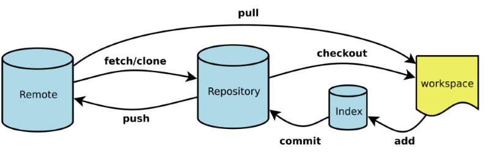

Workspace：工作区
Index / Stage：暂存区
Repository：仓库区（或本地仓库）
Remote：远程仓库

## 2. 安装并使用git

### 2.1 填写用户名和邮箱为标识
安装完成后，还需要最后一步设置，在命令行输入如下：

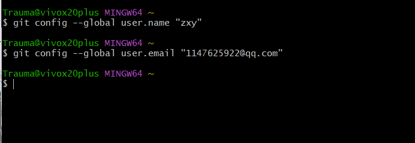

因为Git是分布式版本控制系统，所以需要填写用户名和邮箱作为一个标识。

### 2.2 创建版本库
在F盘->acode下新建一个task3版本库，通过 git init命令将该目录变成git可以管理的仓库。

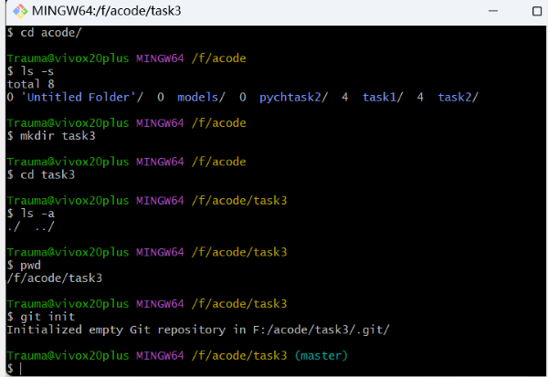

### 2.3 将文件加入版本库中
首先在task3文件夹下，新建README.md文件，然后使用命令 git add readme.txt添加到暂存区里面去，用命令 git commit告诉Git，把文件提交到仓库

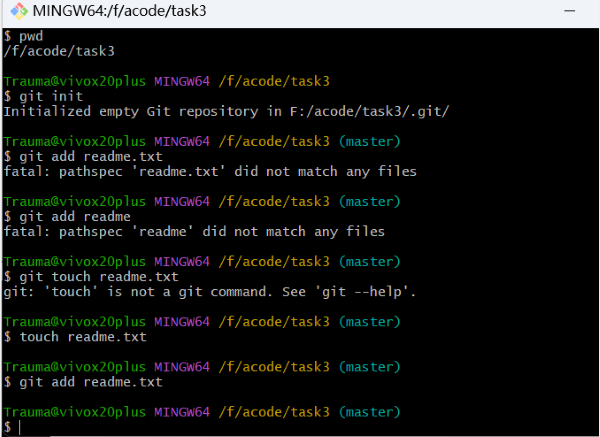

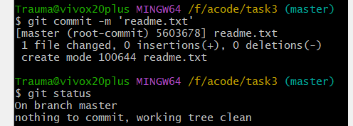

在readme.md中添加2222222，使用git diff readme.txt查看readme.md到底修改了什么内容

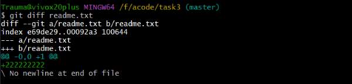

### 2.4 版本回退
继续对readme.txt文件进行修改，再增加一行内容为33333333333333，继续执行命令如下，并使用命令 git log 查看历史记录

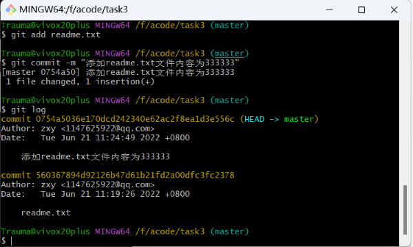

### 2.5 理解工作区与暂存区的区别

**工作区：** 就是你在电脑上看到的目录，比如目录下testgit里的文件(.git隐藏目录版本库除外)。或者以后需要再新建的目录文件等等都属于工作区范畴。
**版本库(Repository)：** 工作区有一个隐藏目录.git,这个不属于工作区，这是版本库。其中版本库里面存了很多东西，其中最重要的就是stage(暂存区)，还有Git为我们自动创建了第一个分支master,以及指向master的一个指针HEAD。

在readme.txt再添加一行内容为4444444，接着在目录下新建一个文件为test.txt 内容为test，我们先用命令 git status来查看下状态，如下：

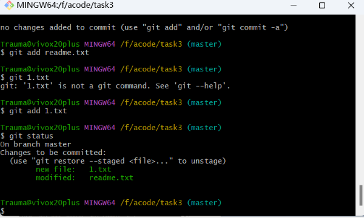

使用git add 命令把2个文件都添加到暂存区中，再使用git status来查看下状态，并使用git commit一次性提交到分支上

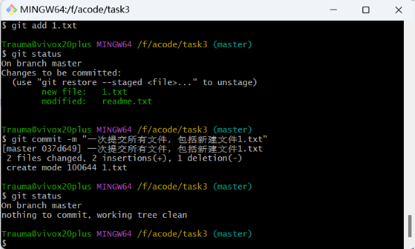

## 3. 远程仓库
先注册github账号，设置本地Git仓库和github仓库之间的传输的SSH加密

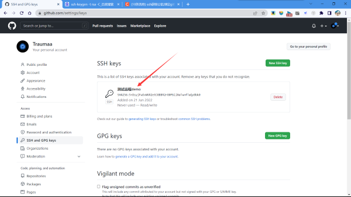

创建新的仓库，把一个已有的本地仓库与之关联，然后，把本地仓库的内容推送到GitHub仓库。

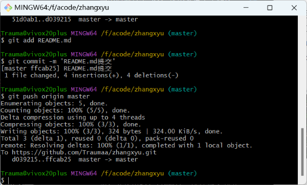

推送成功

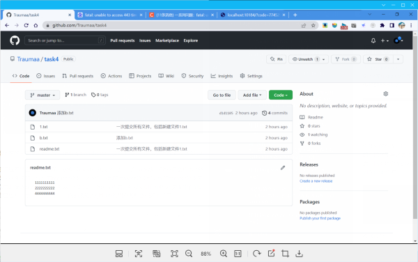