# WEEK1：神经网络与深度学习

### 1.1神经网络基础

 符号定义
- $x$：表示一个$n_x$维特征的输入样本数据，维度为$(n_x，1)$；
- $y$：表示输出结果，取值为(0，1)；
- $(x^{(i)},y^{(i)})$：表示第i组数据，可能是训练数据，也可能是测试数据；
- $X=[x^{(1)},x^{(2)},…,x^{(m)}]$：表示所有的训练数据集的输入值，放在一个$n_x\times m$的矩阵中，其中$m$为样本数目；
- $Y=[y^{(1)},y^{(2)},…,y^{(m)}]$：对应表示所有训练集的输出值，维度为$1\times m$

#### 1.1.1 逻辑回归(Logistic Regression)

该算法适用于二分类问题

对于二元分类问题，给一个输入特征向量$X$，可能对应一张图片，通过这张图片识别是否是一只猫，需要一个算法能够输出预测$\hat{y}$，$\hat{y}$是对于实际值$y$的估计。

如果$n_x$维向量$w$来表示逻辑回归的一个参数（$w$实际是特征的权重），另一个参数$b$是一个实数（表示偏差），如果让$\hat{y}=w^Tx+b$，形成一个关于$x$的线性函数，这对于二元分类问题来讲不是一个好的算法，因为$\hat{y}$应该在0到1之间，而$w^Tx+b$可能要比1大的多，或者甚至为负值。

因此在逻辑回归中，可以将上式作为**sigmoid**函数的自变量，将线性函数转换为非线性函数，**sigmoid**函数将值域变换到了(0,1)。

**sigmoid**函数公式：$\sigma(z)={1\over 1+e^{-z}}$

#### 1.1.2 逻辑回归的代价函数（Logistic Regression Cost Function）

**损失函数：**
损失函数又叫做误差函数，用来衡量算法的预测值和实际值的偏差情况。

**Loss function：**$L(\hat{y},y)$
逻辑回归中通常不使用平方损失函数，其优化目标不是凸优化。

在逻辑回归中用到的损失函数是**交叉熵损失函数：**$L(\hat{y},y)=-y\log(\hat{y})-(1-y)\log(1-\hat{y})$

损失函数是在**单个训练样本**中定义的，它衡量的是算法在单个训练样本中表现如何，为了衡量算法在**全部训练样本**上的表现如何，需要定义一个算法的代价函数。

代价函数：
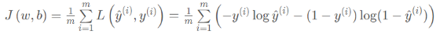

**为什么需要代价函数：** 为了训练逻辑回归模型的参数$w$和$b$，需要一个代价函数，通过调整参数$w$和$b$来降低代价函数。

#### 1.1.3 梯度下降法（Gradient Descent）
**梯度下降法的作用：** 在训练集上通过最小化代价函数J ( w , b ) J(w,b)J(w,b)来训练参数w ww和b bb， 前提是必须定义代价函数为凸函数。

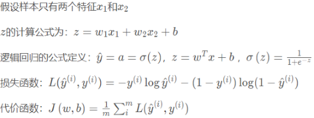

**单个样本的梯度下降**

假设现在只考虑**单个样本$x^{(i)}$** 的情况，**单个样本的代价函数**定义如下：$J(w,b)=(a^{(i)},y^{(i)})=-y^{(i)}\log a^(i)-(1-y^{(i)})\log (1-a^(i))$

下面计算代价函数$L(a,y)$的导数：

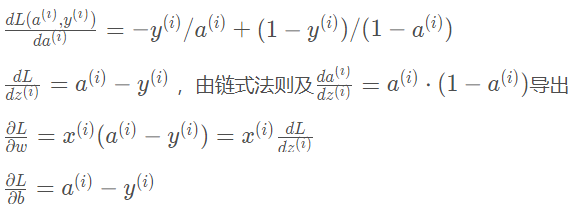

然后更新模型参数

$w:w=w-\alpha\frac{\partial J(w,b)}{\partial w}$，$b:b=b-\alpha\frac{\partial J(w,b)}{\partial b}$

**m个样本的梯度下降**

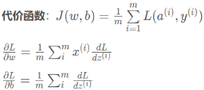
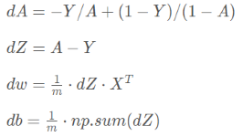
然后更新参数模型

$w:w=w-\alpha dw$，$b:b=b-\alpha db$

### 1.2 浅层神经网络(Shallow neural networks)

#### 1.2.1 神经网络的表示（Neural Network Representation）

上图中有输入特征$x_1,x_2,x_3$,他们被竖直地堆叠起来，叫做神经网络的输入层。$a$代表激活的意思，意味着网络中不同层的值会传递到它们后面的层中，可以统一将输入层记为$a^{[0]}$。

下一层是隐藏层，激活值记为

最后只有一个结点的层被称为**输出层**，负责产生预测值，取值为$a^{[2]}$。在神经网络中，使用上标指出这些值来自哪一层

在计算网络的层数时，输入层不算入总层数内，上图为两层的神经网络。

各层也有与之相关联的参数。

#### 1.2.2 计算一个神经网络的输出

神经网络中每个神经元内部类似于一个逻辑回归的计算

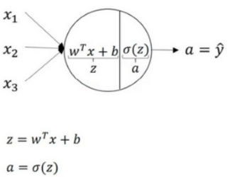

因此隐藏层的计算如下

如果通过向量化将神经网络中的一层神经元参数纵向堆积起来，例如隐藏层中的w ww纵向堆积起来变成一个$(4,3)$的矩阵，用符号$W^{[1]}$表示，则可以表示为：
$Z^{[1]}=W^{[1]}A^{[0]}+B^{[1]}, A^{[1]}=\sigma(Z^{[1]})$

输入层的计算可以表示为相同的形式：
$Z^{[2]}=W^{[2]}A^{[1]}+B^{[2]}, A^{[2]}=\sigma(Z^{[2]})$

对于$m$个样本的计算，此时$A^{[0]}.shape=(3,m),W^{[1]}.shape=(4,3),Z^{[1]}.shape=(4,m),A^{[2]}.shape=(4,m),W^{[2]}.shape=(1,4),Z^{[2]}.shape=(1,m)$，通过矩阵运算，此时$m$个预测值横向堆叠存储在A^{[2]}中。

#### 1.2.3 激活函数

使用一个神经网络时，需要决定使用哪种激活函数用隐藏层上，哪种用在输出节点上。有时不同的激活函数效果会更好

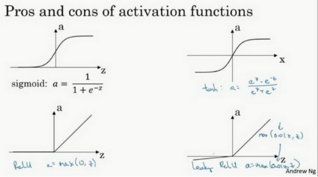

**sigmoid函数：**
- $a=\sigma(z)={1\over 1+e^{-z}}$

**tanh函数：**
- $a=\tanh(z)={{e^z-e^{-z}}\over e^z+e^{-z}}$
- **tanh函数**是**sigmoid函数**的向下平移和伸缩后的结果。对它进行了变形后，穿过了(0.0)点，并且值域介于+1和-1之间。实验表明在隐藏层上使用**tanh函数**效果总是优于**sigmoid函数**。因为其函数值域为(-1,1)，均值更接近零，这会让下一层的学习简单一些。
- 例外是：在二分类的问题中，对于输出层，因为$y$的值是0或1，所以想让$\hat{y}$的数值介于0和1之间，而不是在-1和+1之间。需要使用**sigmoid激活函数**。

- **sigmoid函数**和**tanh函数**两者共同的缺点是，在z zz特别大或者特别小的情况下，导数的梯度或者函数的斜率会变得特别小，最后就会接近于0，导致降低梯度下降的速度。

**修正线性单元函数ReLu：**

- $a=\max(0.z)$
- 采用ReLU 的神经元只需要进行加、乘和比较的操作，计算上更加高效。
- 相比于Sigmoid 型函数的两端饱和，ReLU 函数为左饱和函数，且在𝑥 > 0时导数为1，在一定程度上缓解了神经网络的梯度消失问题，加速梯度下降的收敛速度。

**Leaky Relu函数**

- $a=\max(\gamma z,z)$，$\gamma$一般为较小值如0.01
- **Relu**进入负半区的时候，梯度为0，神经元此时不会训练，产生所谓的稀疏性，而**Leaky ReLu**不会有这问题

#### 1.2.4 为什么需要非线性激活函数？

如果只用线性激活函数，那么神经网络只是把输入线性组合再输出。如：

对于深度网络，如果只使用线性激活函数那么无论神经网络有多少层，整体复杂度相当于只有一层，因此无法模拟比较复杂的函数。

#### 1.2.5 激活函数的导数

**sigmoid函数：**

**Tanh函数：**

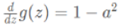

**ReLU函数：**

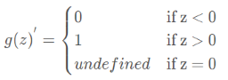

**Leaky ReLU：**

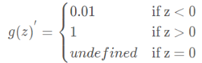

#### 1.2.6 随机初始化

对于一个神经网络，如果把权重w都初始化为0，那么梯度下降将不会起作用。

对于上图的神经网络，假设$W^{[1]},b^{[1]},w^{2]},b^{[2]}$初始化为0，则$a^{[1]}_1和a^{[1]}_2$相等，反向传播时，导致$dz^{[1]}_1$和$dz^{[1]}_2$也会一样，那么这两个隐含单元就会完全一样，最终经过每次训练的迭代，这两个隐含单元仍然是同一个函数，这导致同一隐藏层所有神经元的输出都一致，因此在同一层放多个神经元变得没有意义。

所以必须随机的初试化神经网络参数的值，以打破这种对称性。

### 1.3 深层神经网络
#### 1.3.1 前向传播和反向传播（Forward and backward propagation）

对一个L层的神经网络(带输入层)
**前向传播：**

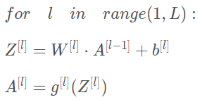

输入上一层的激活值$A^{[l-1]}$，输出都是$A^{[l]}$，需要为反向传播缓存：$A^{[l]},Z^{[l]},W^{[l]},b^{[l]}$；

**反向传播：**

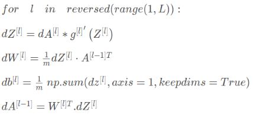

#### 1.3.2 为什么使用深层表示
深层的网络隐藏单元数量相对较少，隐藏层层数较多，如果浅层的网络想要达到同样的计算结果则需要指数级增长的单元数量才能达到。

以逻辑门为例，如果允许一个异或的树图，对应网络的深度是$O(log(n))$，那么节点的数量并不会很大。

但是如果不能使用多隐层的神经网络的话，那么要计算异或关系函数就需要这一隐层（上图右方框部分）的单元数呈指数增长才行。隐藏层单元数目为$O(2^n)$
