# WEEK10：ROS实验_服务通信

## 10.1 服务通信理论模型

服务通信较之于话题通信更简单些，理论模型如下图所示，该模型中涉及到三个角色:

- ROS master(管理者)
- Server(服务端)
- Client(客户端)


ROS Master 负责保管 Server 和 Client 注册的信息，并匹配话题相同的 Server 与 Client ，帮助 Server 与 Client 建立连接，连接建立后，Client 发送请求信息，Server 返回响应信息。

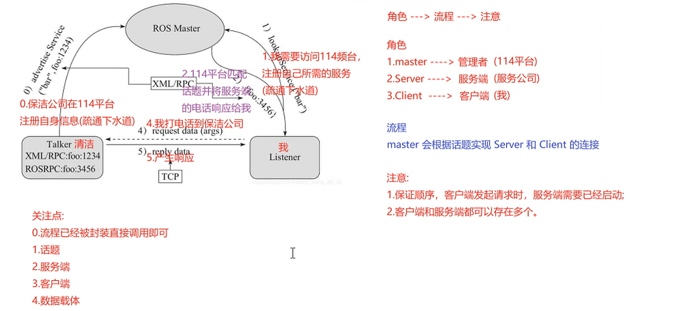

整个流程由以下步骤实现:

1. **Server注册**
Server 启动后，会通过RPC在 ROS Master 中注册自身信息，其中包含提供的服务的名称。ROS Master 会将节点的注册信息加入到注册表中。
2. **Client注册**
Client 启动后，也会通过RPC在 ROS Master 中注册自身信息，包含需要请求的服务的名称。ROS Master 会将节点的注册信息加入到注册表中。
3. **ROS Master实现信息匹配**
ROS Master 会根据注册表中的信息匹配Server和 Client，并通过 RPC 向 Client 发送 Server 的 TCP 地址信息。
4. **Client发送请求**
Client 根据步骤2 响应的信息，使用 TCP 与 Server 建立网络连接，并发送请求数据。
5. **Server发送响应**
Server 接收、解析请求的数据，并产生响应结果返回给 Client。

>注意:
1.客户端请求被处理时，需要保证服务器已经启动；
2.服务端和客户端都可以存在多个。

## 10.2 服务通信自定义srv

**需求:**
>服务通信中，客户端提交两个整数至服务端，服务端求和并响应结果到客户端，请创建服务器与客户端通信的数据载体。

**流程:**

srv 文件内的可用数据类型与 msg 文件一致，且定义 srv 实现流程与自定义 msg 实现流程类似:

1. 按照固定格式创建srv文件

2. 编辑配置文件

3. 编译生成中间文件

### 10.2.1 定义srv文件

服务通信中，数据分成两部分，请求与响应，在 srv 文件中请求和响应使用---分割，具体实现如下:

功能包下新建 srv 目录，添加 xxx.srv 文件，内容:
```
# 客户端请求时发送的两个数字
int32 num1
int32 num2
---
# 服务器响应发送的数据
int32 sum
```

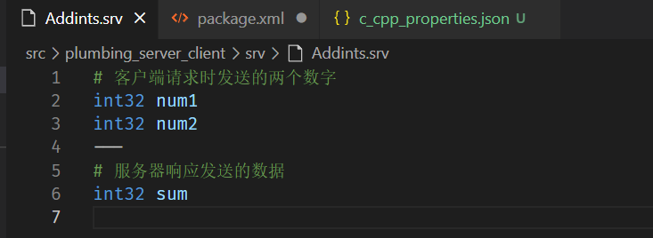


### 10.2.2 编辑配置文件

**package.xml**中添加编译依赖与执行依赖
```
  <build_depend>message_generation</build_depend>
  <exec_depend>message_runtime</exec_depend>
  <!-- 
  exce_depend 以前对应的是 run_depend 现在非法
  -->
```

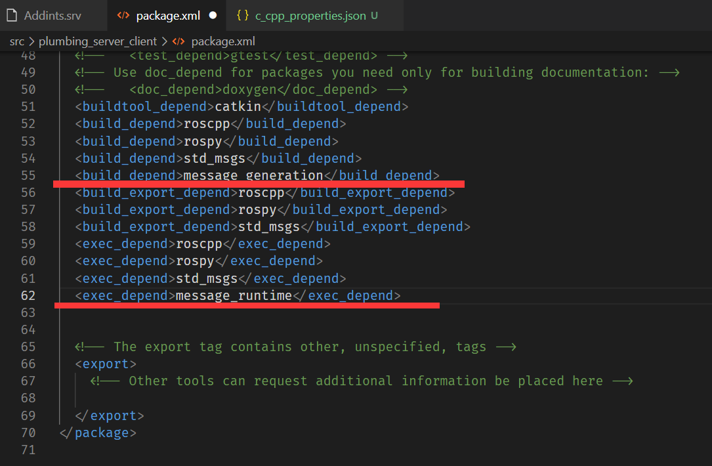


**CMakeLists.txt**编辑 srv 相关配置
```
find_package(catkin REQUIRED COMPONENTS
  roscpp
  rospy
  std_msgs
  message_generation
)
# 需要加入 message_generation,必须有 std_msgs
```

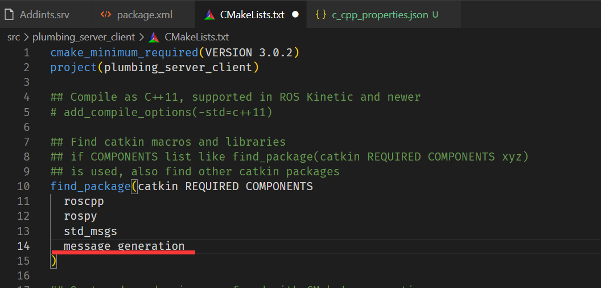


```
add_service_files(
  FILES
  AddInts.srv
)
```

```
generate_messages(
  DEPENDENCIES
  std_msgs
)
```
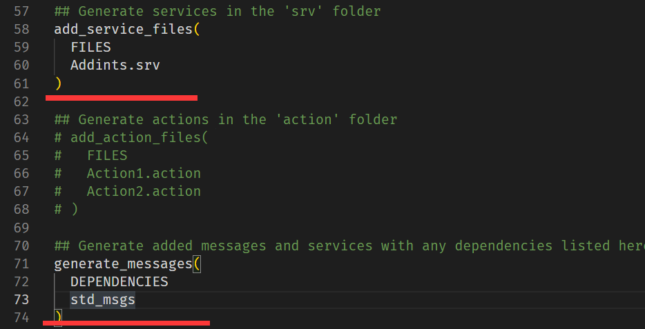

>注意: 官网没有在 catkin_package 中配置 message_runtime,经测试配置也可以

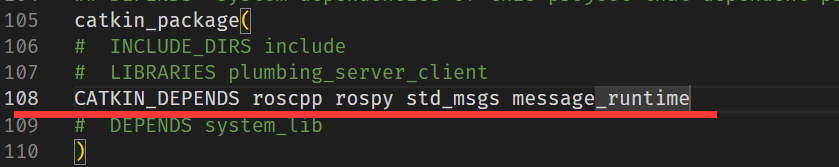

### 10.2.3 编译

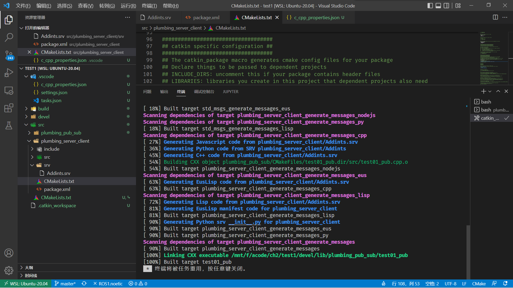

编译成功

### 10.2.4 生成c++和python所需头文件

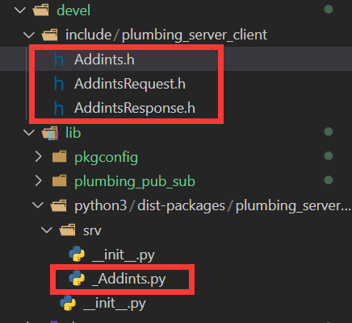

## 10.3 服务通信自定义srv调用A(C++)

**需求:**
>编写服务通信，客户端提交两个整数至服务端，服务端求和并响应结果到客户端。


**流程:**

1. 编写服务端实现；
2. 编写客户端实现；
3. 编辑配置文件；
4. 编译并执行。

### 10.3.1 服务器端

代码如下：
```c++
/*
    需求: 
        编写两个节点实现服务通信，客户端节点需要提交两个整数到服务器
        服务器需要解析客户端提交的数据，相加后，将结果响应回客户端，
        客户端再解析

    服务器实现:
        1.包含头文件
        2.初始化 ROS 节点
        3.创建 ROS 句柄
        4.创建 服务 对象
        5.回调函数处理请求并产生响应
        6.由于请求有多个，需要调用 ros::spin()

*/
#include "ros/ros.h"
#include "plumbing_server_client/Addints.h"

// bool 返回值由于标志是否处理成功
bool doReq(plumbing_server_client::Addints::Request& req,
          plumbing_server_client::Addints::Response& resp){
    int num1 = req.num1;
    int num2 = req.num2;

    ROS_INFO("服务器接收到的请求数据为:num1 = %d, num2 = %d",num1, num2);

    //逻辑处理
    if (num1 < 0 || num2 < 0)
    {
        ROS_ERROR("提交的数据异常:数据不可以为负数");
        return false;
    }

    //如果没有异常，那么相加并将结果赋值给 resp
    resp.sum = num1 + num2;
    return true;


}

int main(int argc, char *argv[])
{
    setlocale(LC_ALL,"");
    // 2.初始化 ROS 节点
    ros::init(argc,argv,"Addints_Server");
    // 3.创建 ROS 句柄
    ros::NodeHandle nh;
    // 4.创建 服务 对象
    ros::ServiceServer server = nh.advertiseService("Addints",doReq);
    ROS_INFO("服务已经启动....");
    //     5.回调函数处理请求并产生响应
    //     6.由于请求有多个，需要调用 ros::spin()
    ros::spin();
    return 0;
}
```

### 10.3.2 客户端

代码如下：
```c++
/*
    需求: 
        编写两个节点实现服务通信，客户端节点需要提交两个整数到服务器
        服务器需要解析客户端提交的数据，相加后，将结果响应回客户端，
        客户端再解析

    服务器实现:
        1.包含头文件
        2.初始化 ROS 节点
        3.创建 ROS 句柄
        4.创建 客户端 对象
        5.请求服务，接收响应

*/
// 1.包含头文件
#include "ros/ros.h"
#include "plumbing_server_client/Addints.h"

int main(int argc, char *argv[])
{
    setlocale(LC_ALL,"");

    // 调用时动态传值,如果通过 launch 的 args 传参，需要传递的参数个数 +3
    if (argc != 3)
    // if (argc != 5)//launch 传参(0-文件路径 1传入的参数 2传入的参数 3节点名称 4日志路径)
    {
        ROS_ERROR("请提交两个整数");
        return 1;
    }


    // 2.初始化 ROS 节点
    ros::init(argc,argv,"Addints_Client");
    // 3.创建 ROS 句柄
    ros::NodeHandle nh;
    // 4.创建 客户端 对象
    ros::ServiceClient client = nh.serviceClient<plumbing_server_client::Addints>("Addints");
    //等待服务启动成功
    //方式1
    ros::service::waitForService("Addints");
    //方式2
    // client.waitForExistence();
    // 5.组织请求数据
    plumbing_server_client::Addints ai;
    ai.request.num1 = atoi(argv[1]);
    ai.request.num2 = atoi(argv[2]);
    // 6.发送请求,返回 bool 值，标记是否成功
    bool flag = client.call(ai);
    // 7.处理响应
    if (flag)
    {
        ROS_INFO("请求正常处理,响应结果:%d",ai.response.sum);
    }
    else
    {
        ROS_ERROR("请求处理失败....");
        return 1;
    }

    return 0;
}
```

### 10.3.3 配置 CMakeLists.txt

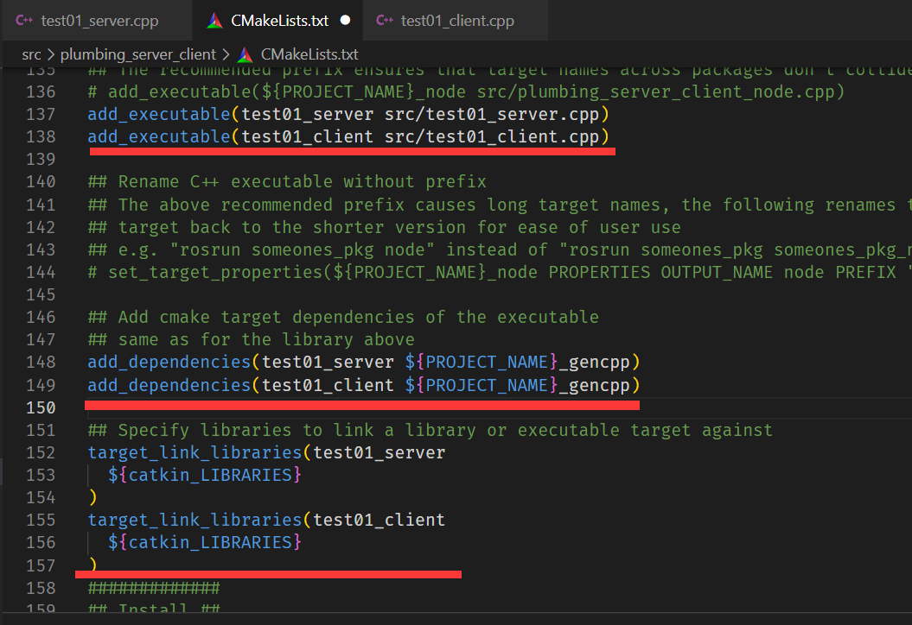

配置完成

### 10.3.4 执行

**流程:**

- 需要先启动服务:rosrun 包名 服务

- 然后再调用客户端 :rosrun 包名 客户端 参数1 参数2


**结果:**

会根据提交的数据响应相加后的结果。

**注意:**
>如果先启动客户端，那么会导致运行失败

启动roscore

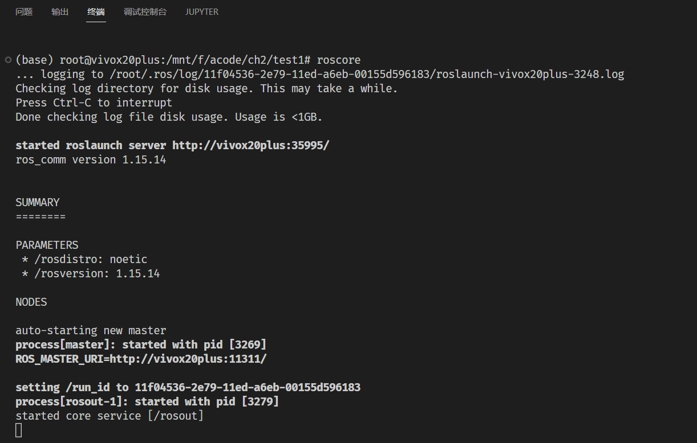

启动服务器端和客户端

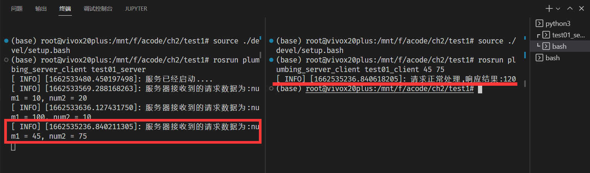

输出成功

计算图如下：

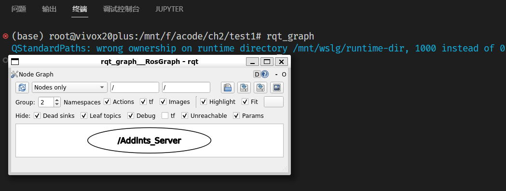

