# WEEK2 改善深层神经网络：超参数调试、正则化以及优化

## 2.1 深度学习的实践层面

### 2.1.1 训练，验证，测试集（Train / Dev / Test sets）

- 对于小数据量(100，1000或者1万条数据)，常见做法是70%训练集，30%测试集。如果设置了验证集，也可以按照60%训练集，20%验证集和20%测试集来划分。

- 对于百万级别数据量，验证集和测试集占数据总量的比例会趋向于变得更小。因为验证集的目的就是验证不同的算法，检验哪种算法更有效，因此，验证集只要足够大到能评估不同的算法，并迅速判断出哪种算法更有效。可能不需要拿出20%的数据作为验证集。同样地，根据最终选择的分类器，测试集的主要目的是正确评估分类器的性能。可以训练集占98%，验证集和测试集各占1%。对于数据量过百万的应用，训练集可以占到99.5%，验证和测试集各占0.25%，或者验证集占0.4%，测试集占0.1%。

- **确保验证集和测试集的数据来自同一分布**

### 2.1.2  偏差，方差

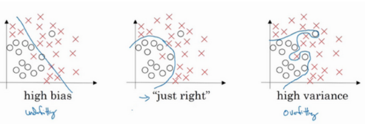

- **欠拟合：偏差高，弱模型**
- **过拟合：偏差低，方差高，强模型**

### 2.1.3 机器学习基础

初始模型训练完成后，首先要知道算法的偏差，如果偏差较高，试着评估训练集或训练数据的性能。如果偏差的确很高，甚至无法拟合训练集，那么要做的就是选择一个新的网络，==比如含有更多隐藏层或者隐藏单元的网络，或者花费更多时间来训练网络，或者尝试更先进的优化算法。==

一旦偏差降低到可以接受的数值，检查方差有没有问题，为了评估方差，需要查看验证集性能，如果方差高，最好的解决办法就是采用==更多数据==，如果无法获得更多数据，也可以尝试通过==正则化==来减少过拟合

总之需要不断重复尝试，直到找到一个低偏差，低方差的模型

### 2.1.4 正则化（Regularization）

正则化是机器学习中一种常用的技术，其主要目的是控制模型复杂度，减小过拟合。最基本的正则化方法是在原目标（代价）函数 中添加惩罚项，对复杂度高的模型进行“惩罚”。

#### 2.1.4.1 范数

范数（Norm）是一个表示向量“长度”的函数，常见的范数函数为$Lp$范数，$p=1，2，\cdots\infty$

$Lp=p\sqrt{\sum_{1}^nx_i^p},x=x_1,x_2,x_3,\cdots，x_n$

**L-1范数：** 向量中所有元素的绝对值之和。可用于去除没有取值的信息，又称稀疏规则算子。

**L-2范数：** 欧式距离。可用于优化正则化项，避免过拟合。

#### 2.1.4.2 在神经网络中实现L2​正则化

使用L2范数时，为方便后续处理，对L2范数进行平方。

在代价函数中添加正则项：${{\lambda \over{2m}}\sum_1^L\rVert W^{[l]}\rVert_2}^2$，$\lambda$是正则化参数。

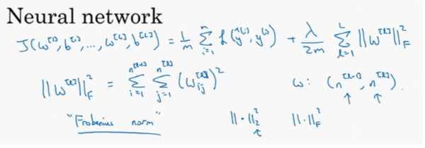

在**backprop**中

  $\mathrm{d}W^{[l]}={{{1}\over m}\mathrm{d}Z^{[l]}} \cdot A^{[l-1]T}+{\lambda \over m}W^{[l]}$

  更新参数时，

  $W^{[l]}=W^{[l]}-\mathrm{d}W^{[l]}={{1\over m}\mathrm{d}Z^{[l]}\cdot A^{[l-1]T}+(1-{\lambda \over m})W^{[l]}}$

该正则项说明，不论$W^{[l]}$是什么，都试图让它变的更小，因此$L2$范数正则化也被称为“权重衰减”。

#### 2.1.4.3 为什么L2​正则化有利于预防过拟合


添加正则项可以避免数据权值矩阵过大。

直观上理解如果正则化$\lambda$设置的足够大，权重矩阵$W$被设置为接近0的值，就是把多隐藏单元的权重设为0，于是基本上消除了这些隐藏单元的影响。在这种情况，这个被大大简化了的神经网络会变成一个很小的网络，小到如同一个逻辑回归单元，可是深度却很大，它会使这个网络从过度拟合的状态更接近高偏差状态。

但是$\lambda$会存在一个中间值于是会有一个接近 **“Just Right”** 的中间状态。

从另一种角度看，假设用的是双曲线激活函数。

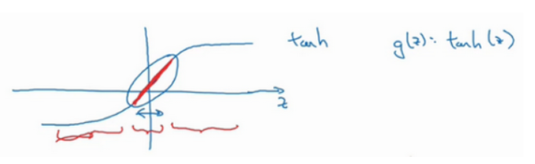

$g(z)$表示$\tanh(z)$，如果$z$非常小，就位于就位于双曲正切函数的线性部分，而$z$如果变得更大或者更小，激活函数开始变得非线性。

如果$W$很小，相对来说，$z$也会接近0。如果$z$的值最终在图上圈中范围内，$g(z)$大致呈线性，和线性回归函数一样，因此整个模型被简化了。

### 2.1.5 dropout 正则化

除了 L2 regularization 之外，还有另外一种防止过拟合的有效方法：Dropout

Dropout 是指在深度学习网络的训练过程中，对于每层的神经元，按照一定的概率将其暂时从网络中丢弃。也就是说，每次训练时，每一层都有部分神经元不工作，起到简化复杂网络模型的效果，从而避免发生过拟合。

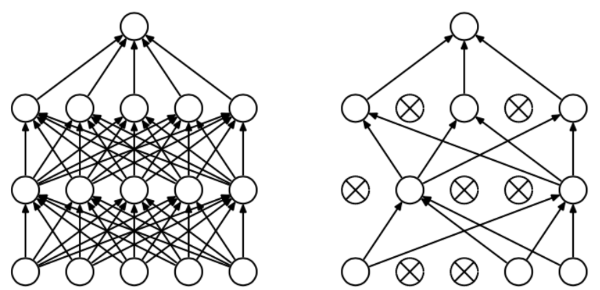

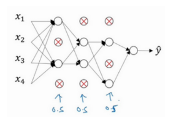

对于图中的网络，dropout会遍历网络的每一层，并设置消除神经网络中节点的概率。假设网络中的每一层，每个节点得以保留和消除的概率都是0.5，设置完节点概率会消除一些节点，然后删除掉从该节点进出的连线，最后得到一个节点更少，规模更小的网络，然后用backprop方法进行训练。

#### 2.1.5.1 如何实施dropout？inverted dropout（反向随机失活）

对于一个四层网络，首先定义向量$d$，$d$表示网络第三层的dropout向量：

```python
d3 = np.random.rand(a3.shape[0],a3.shape[1])
```

设置该层的keep-prob，表示该层任一隐藏单元被保留的概率，
```d3 = d3<keep_prob``` $d$是一个布尔型数组，乘法运算依然有效，python会把true和false翻译为1和0。

接下来要对$a$进行随机失活操作，让$d$中0元素对应的$a$元素归零

```a3=np.multiply(a3,d3)```

最后还要用$a$除以除以keep-prob参数，保证$z$期望值不变

```a3 = a3/keep_prob```

#### 2.1.5.2 dropout是怎样起作用的

直观上理解：dropout导致单个神经元不依赖于任何一个上一层神经元的输出，因为该神经元的输入可能随时被清除，因此该神经元不会给任何一个输入太多权重，因为它可能会被删除，所以该神经元会分配给其所有输入一点权重，通过传播所有权重，dropout将产生收缩权重的平方范数的效果，和$L2$正则化类似。实施dropout的结果是它会压缩权重，并完成一些预防过拟合的外层正则化。

实施dropout的另一个细节是，不同层的keep-prob也可以变化。如果某些层比其它层更容易发生过拟合，可以把keep-prob值设置得更低

dropout一大缺点就是代价函数$J$不再被明确定义

### 2.1.6 其他正则化方法

1. 数据扩增
   假设需要拟合猫咪图片分类器，如果扩增数据代价高，可以通过水平翻转图片，随意裁剪图片，增大数据集，来额外生成假训练数据

   

2. 早停止early stopping
   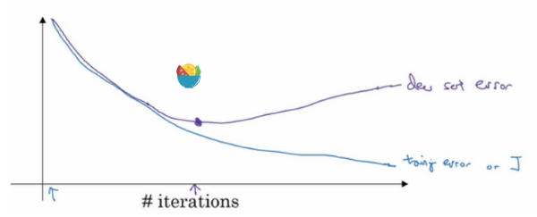

   随着训练代数增加，验证集误差通常会先呈下降趋势，然后在某个节点处开始上升，early stopping的作用是提早停止训练神经网络，以得到一个偏差和方差都可以接受的模型。


### 2.1.7 归一化输入（Normalizing inputs）

在训练神经网络时，标准化输入可以提高训练的速度。标准化输入就是对训练数据集进行归一化的操作，即将原始数据减去其均值 μ 后，再除以其方差$\sigma^2$：

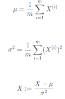

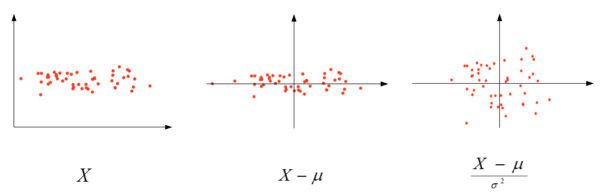

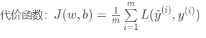

如果特征值在不同范围，假如$x$取值范围从1到1000，特征$x_2$的取值范围从0到1，结果是参数$w_1$和$w_2$值的范围或比率将会非常不同.

而如果归一化特征，代价函数平均起来看更对称，如果在非归一化的代价函数上运行梯度下降法，必须使用一个非常小的学习率。因为如果是在这个位置，梯度下降法可能需要多次迭代过程，直到最后找到最小值。但如果函数是一个更圆的球形轮廓，那么不论从哪个位置开始，梯度下降法都能够更直接地找到最小值，可以在梯度下降法中使用较大步长，而不需要反复执行。

### 2.1.8 梯度消失/梯度爆炸（Vanishing / Exploding gradients）

在神经网络尤其是深度神经网络中存在可能存在这样一个问题：梯度消失和梯度爆炸。意思是当训练一个 层数非常多的神经网络时，计算得到的梯度可能非常小或非常大，甚至是指数级别的减小或增大。这样会让训练过程变得非常困难。

举个例子来说明，假设一个多层的每层只包含两个神经元的深度神经网络模型，如下图所示：

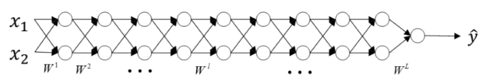

为了简化复杂度，便于分析，我们令各层的激活函数为线性函数，即$g(Z)=Z$。且忽略各层常数项$b$的影响，令 $b$ 全部为零。那么，该网络的预测输$\hat{Y}$为：

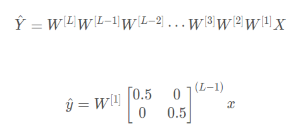

假定后面 W 的权重想同，通过指数的作用，略大于 1 的会变得特别大，略小于 1 的会接近 0，由此引发梯度爆炸和梯度消失问题。当层数很大时，出现数值爆炸或消失。同样，这种情况也会引起梯度呈现同样的指数型增大或减小的变化。L 非常大时，例如 L=150，则梯度会非常大或非常小，**引起每次更新的步进长度过大或者过小，这让训练过程十分困难。**

### 2.1.9 神经网络的权重初始化（Weight Initialization for Deep NetworksVanishing / Exploding gradients）

下面介绍如何改善 Vanishing and Exploding gradients 这类问题，方法是对权重 w 进行一些初始化处理。

深度神经网络模型中，以单个神经元为例，该层（l）的输入个数为n，其输出为：

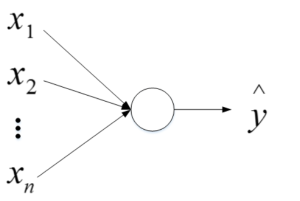

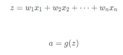

这里忽略了常数项 b。为了让 z 不会过大或者过小，思路是让 w 与 n 有关，且 n 越大，w 应该越小才好。这样能够保证 z 不会过大。一种方法是在初始化 w 时，令其方差为$1 \over n$，相应的 python 伪代码为：
```python
w[l] = np.random.randn(n[l],n[l-1])*np.sqrt(1/n[l-1]) 
```

如果激活函数是 tanh，一般选择上面的初始化方法。

如果激活函数是ReLU，权重w的初始化一般令其方差为$2 \over n$：
```python
w[l] = np.random.randn(n[l],n[l-1])*np.sqrt(2/n[l-1]) 
```

除此之外，Yoshua Bengio 提出了另外一种初始化 w 的方法，令其方差为$2 \over {n^{(l-1)}n^{l}} $：
```python
w[l] = np.random.randn(n[l],n[l-1])*np.sqrt(2/n[l-1]*n[l]) 
```

## 2.2 2.2优化算法 (Optimization algorithms)

### 2.2.1 Mini-batch 梯度下降（Mini-batch gradient descent）

如果样本数量很大，对整个训练集执行梯度下降法处理速度会很慢。可以把训练集分割为小的子集mini-batch训练，引入大括号来代表不同的mini-batch，所以有$X^{\{t\}}$和$Y^{\{t\}}$，这样在执行中一次只对一个mini-batch进行处理

如果训练集分成了5000个mini-batch，使用batch梯度下降法，一次遍历训练集只能做一个梯度下降，使用mini-batch梯度下降法，一次遍历训练集，能做5000个梯度下降。

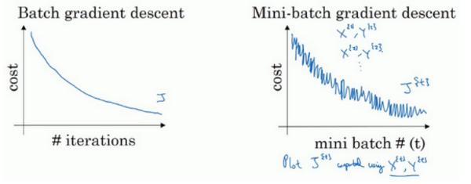

使用batch梯度下降法时，每次迭代都需要历遍整个训练集，几乎每次迭代成本都会下降，如果$J$在某次迭代中增加了，可能是因为学习率太大。

使用mini-batch梯度下降法，则并不是每次迭代都是下降的。

需要决定的变量之一是mini-batch的大小m，如果mini-batch的大小等于$m$，就是batch梯度下降法，假设mini-batch大小为1，就叫做随机梯度下降法

一般的mini-batch大小为64到512，取决于应用方向以及训练集的大小，mini-batch大小一般是2的$n$次方。之所以这样设置的原因是计算机存储数据一般是 2 的幂，这样设置可以提高运算速度。

### 2.2.2 指数加权平均数

以温度为例

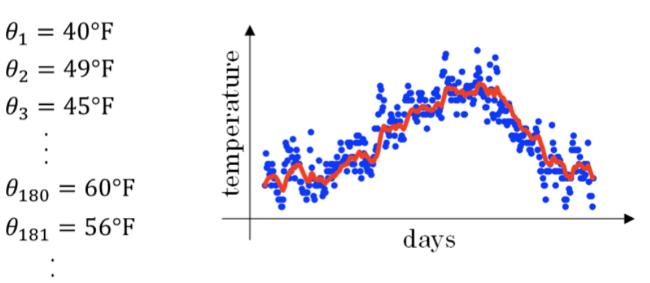

这种滑动平均算法称为指数加权平均（exponentially weighted average）。根据之前的推导公式，其一般形式为：

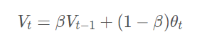

$\beta$设得低则曲线能够更快适应变化。

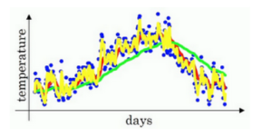

指数加权平均的偏差修正：
因为在计算移动平均的时候，初始化$v_0=0$，所以$v_1=0.02\theta_1$，前几天的温度会小很多。

因此需要使用$v_t \over {1-\beta^t}$代替$v_t$作为指数加权平均的修正值。

### 2.2.3 动量梯度下降法（Gradient descent with Momentum）

>动量梯度下降法通过指数加权平均处理，减小纵轴的震荡，可以用稍大的学习率更快到达最低点。

动量梯度下降法(Momentum)，运行速度几乎总是快于标准的梯度下降算法.简该算法的基本思想是计算梯度的指数加权平均数，并利用该梯度更新权重

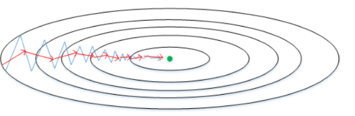

原始的梯度下降算法如上图蓝色折线所示。在梯度下降过程中，梯度下降的振荡较大，尤其对于 W、b 之间数值范围差别较大的情况。此时每一点处的梯度只与当前方向有关，产生类似折线的效果，前进缓慢。而如果对梯度进行指数加权平均，这样使当前梯度不仅与当前方向有关，还与之前的方向有关，这样处理让梯度前进方向更加平滑，减少振荡，能够更快地到达最小值处。

权重 W 和常数项 b 的指数加权平均表达式如下：

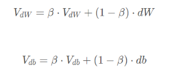

==通过指数加权平均，纵向的分量基本可以抵消，原因是锯齿状存在一上一下的配对向量，方向基本反向。==

### 2.2.4 RMSprop算法

RMSprop算法，全称是root mean square prop算法，也可以加速梯度下降

每次迭代训练过程中，其权重 W 和常数项 b 的更新表达式为：

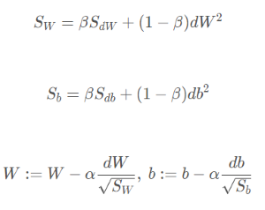

其原理是：因为需要减缓纵轴方向b的学习，同时加快横轴方向w的学习，即希望$S_{dW}$会相对较小，所以要除以一个较小的数，而希望$S_{db}$又较大，这里要除以较大的数字，这样就可以减缓纵轴上的变化。又因为斜率在$b$方向特别大，所以$db$较大，$dW$较小，所以$S_db$也会较大，而相比之下，$dW$会小一些，因此$S_{dW}$会小一些，结果就是纵轴上的更新要被一个较大的数相除，就能消除摆动，而水平方向的更新则被较小的数相除。

### 2.2.5 Adam 优化算法(Adam optimization algorithm)

Adam优化算法基本是将Momentum和RMSprop结合在一起，其算法流程为：

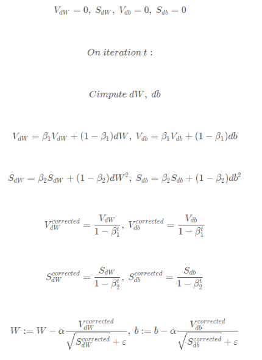

Adam 算法包含了几个超参数，分别是：$\alpha,\beta_1,\beta_2,\varepsilon$。其中，$\beta_1$通常设置为0.9，$\beta_2$通常设置成0.999，$\varepsilon$通常设置成$10^{-8}$。一般只需要对$\beta_1,\beta_2$进行调试。

实际应用中，Adam 算法结合了动量梯度下降和 RMSprop 各自的优点，使得神经网络训练速度大大提高。

### 2.2.6 学习率衰减(Learning rate decay)

从经验上看，学习率在一开始要保持大些来保证收敛速度，在收敛到最优
点附近时要小些以避免来回振荡.

比较简单的学习率调整可以通过学习率衰减（Learning Rate Decay）的方式来实现，也称为学习率退火（Learning Rate Annealing）：$a={1 \over {1+decayrate*epoch-num}}a_0$(decay-rate称为衰减率，是一个超参数，epoch-num为代数，$\alpha_0为初始学习率)

指数衰减：$a=\beta^{epoch-num}a_0$（其中$\beta$为衰减率）

### 2.2.7 局部最优的问题

>局部最优化问题并不像人的直观感受一样，维度更高时梯度为零的点更像是马鞍状而不是想象的局部最优

在使用梯度下降算法不断减小 cost function 时，可能会得到局部最优解（local optima）而不是全局最优解（global optima）。之前我们对局部最优解的理解是形如碗状的凹槽，如下图左边所示。但是在神经网络中，local optima 的概念发生了变化。准确地来说，大部分梯度为零的 “最优点” 并不是这些凹槽处，而是形如右边所示的马鞍状，称为 saddle point。也就是说，梯度为零并不能保证都是 convex（极小值），也有可能是 concave（极大值）。特别是在神经网络中参数很多的情况下，所有参数梯度为零的点很可能都是右边所示的马鞍状的 saddle point，而不是左边那样的 local optimum。

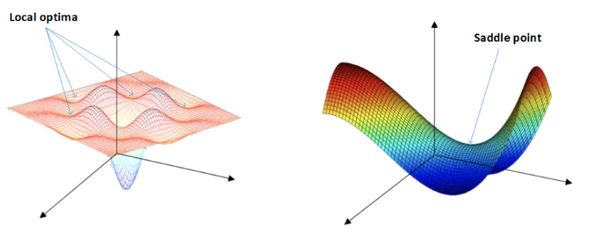

类似马鞍状的 plateaus 会降低神经网络学习速度。Plateaus 是梯度接近于零的平缓区域，如下图所示。在 plateaus 上梯度很小，前进缓慢，到达 saddle point 需要很长时间。到达 saddle point 后，由于随机扰动，梯度一般能够沿着图中绿色箭头，离开 saddle point，继续前进，只是在 plateaus 上花费了太多时间。

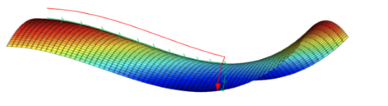

总的来说，关于 local optima，有两点总结：
- **只要选择合理的强大的神经网络，一般不太可能陷入 local optima**
- **Plateaus 可能会使梯度下降变慢，降低学习速度**

值得一提的是，上文介绍的动量梯度下降，RMSprop，Adam 算法都能有效解决 plateaus 下降过慢的问题，大大提高神经网络的学习速度。