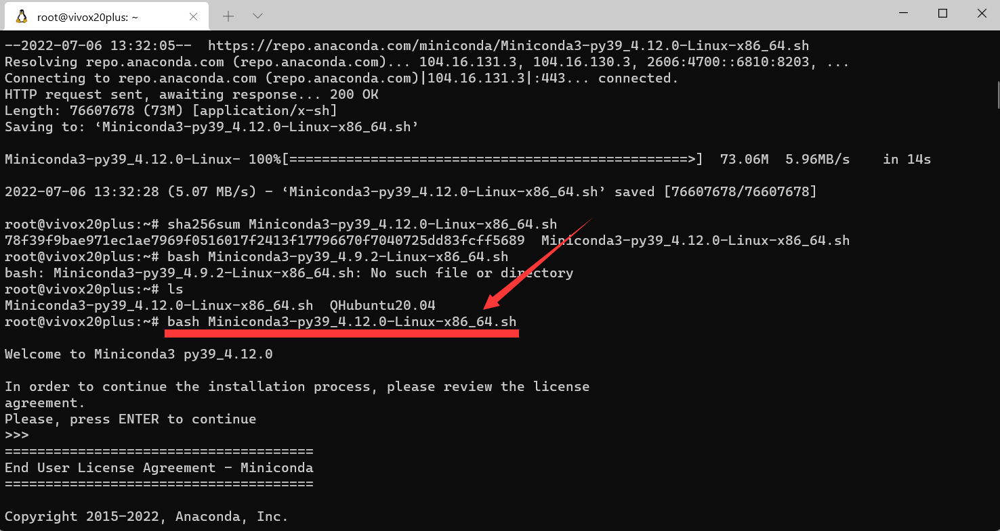
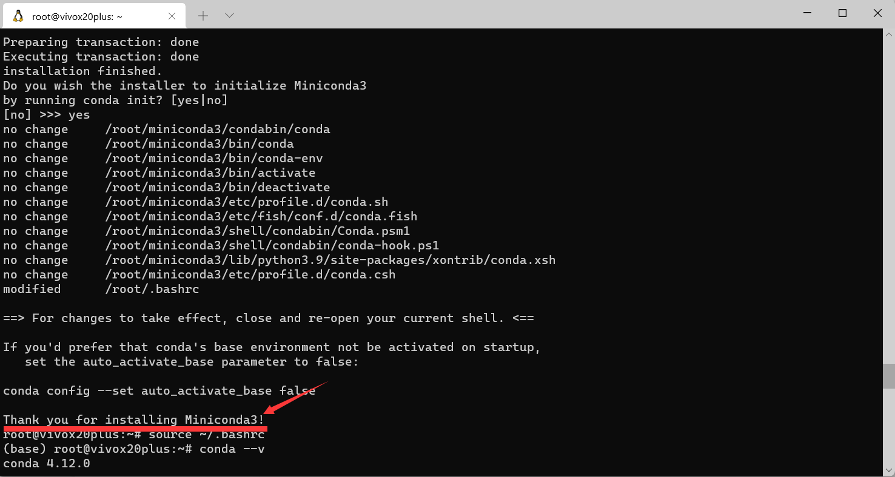
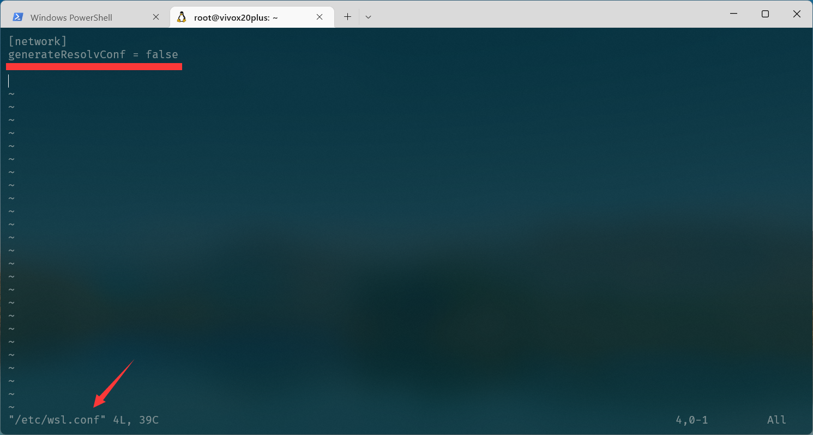
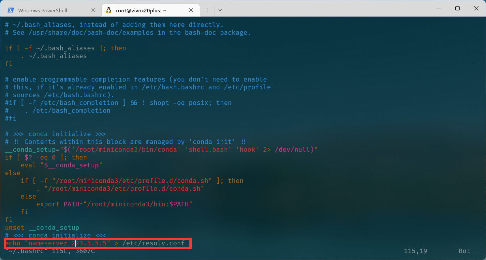
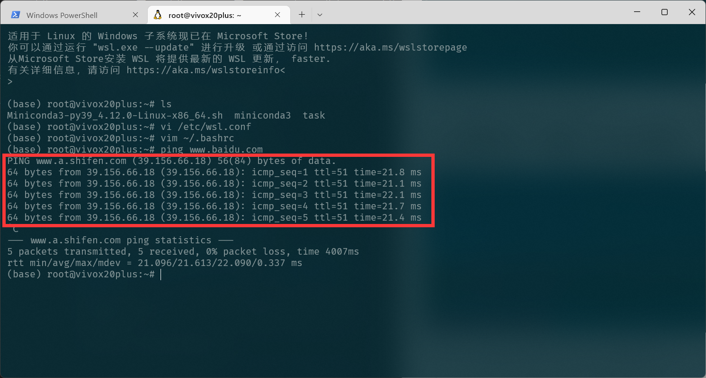
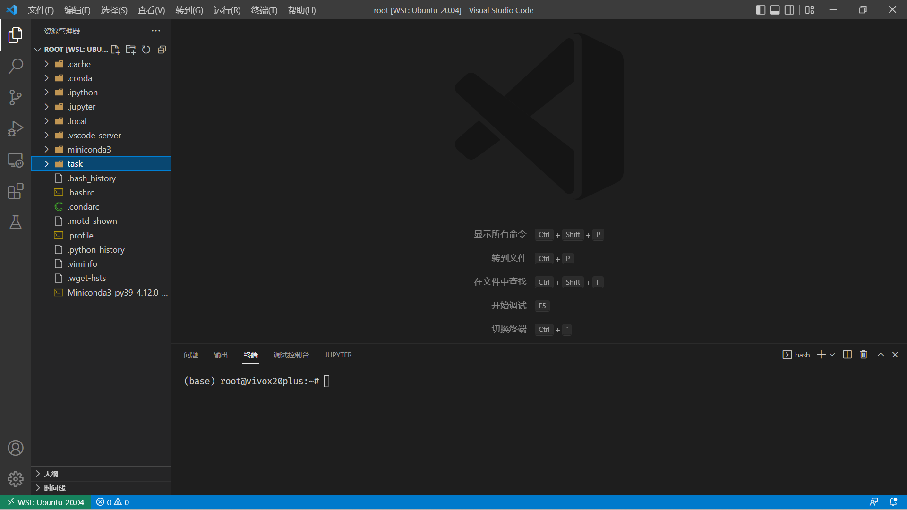
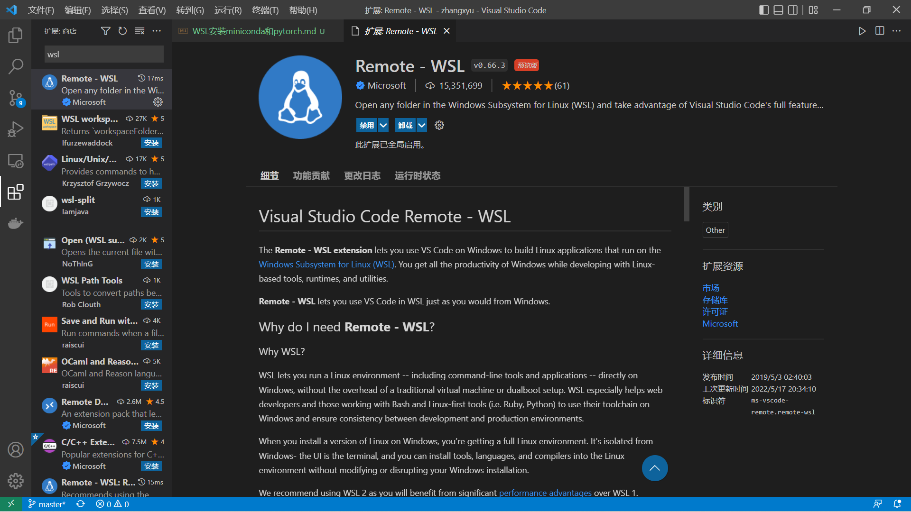
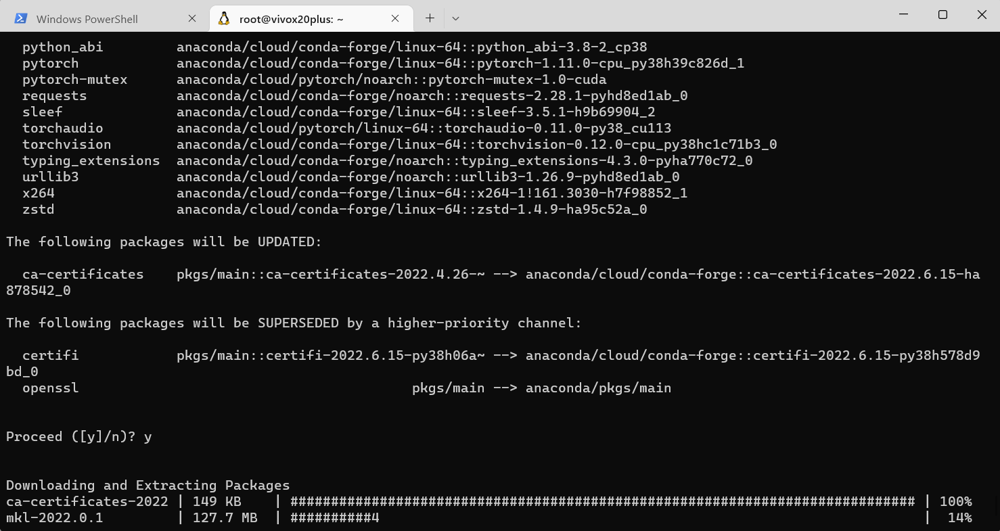
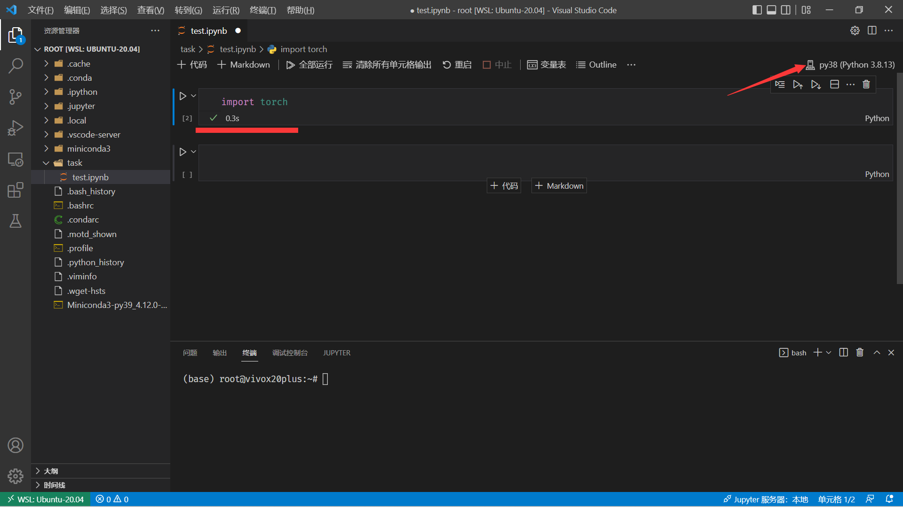

# Ubuntu20.04安装miniconda和pytorch

## 1.安装miniconda
本次环境搭建总体来说不太顺利，此文档用来记录一些遇到的问题。

### 1.1 下载并解压安装包

### 1.2 安装miniconda完成

### 1.3 遇到的问题

下载安装包时一直提示 **Temporary failure in name resolution.**

使用ping命令也是报该错误，查了百度说是修改 **/etc/resolv.conf**文件，添加一个DNS服务器地址即可。

照做以后，发现每次重启，**/etc/resolv.conf**文件都会被覆盖，依旧无法联网QAQ

最后查了很长时间，总算解决该问题，步骤如下：

### 1.3.1 添加/etc/wsl.conf文件

在 **/etc/wsl.conf**文件中添加如下两行

防止 **/etc/resolv.conf**文件每次自动生成

### 1.3.2 重启WSL，修改 ~/.bashrc文件

添加**echo "nameserver 223.5.5.5" > /etc/resolv.conf**

此条命令是将nameserver 223.5.5.5自动写入/etc/resolv.conf文件

修改完成后，总算可以ping通QAQ

## 2. 安装jupyter和pytorch

由于miniconda没有预装jupyter（至于为何不安装anaconda，主要是我在windows环境下使用的就是anaconda，隔三岔五报错，本人深受其害，所以望而生畏QAQ），所以采用vscode＋jupyter的方式

### 2.1 安装vscode

输入 **code .** 可以直接安装

.png)

安装完成后，会自动打开vscode

### 2.2 安装WSL拓展

### 2.3 安装pytorch

安装pytorch时遇到了无法下载的问题，找了好久才通过 **1.3** 的方法解决

下载过程如下

下载好库以后，使用vscode中的jupyter进行测试

此时出现需要下载 **ipykernel** 的提示，下载完成后，通过vscode右上角切换环境进行测试

测试成功