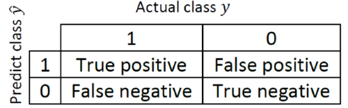
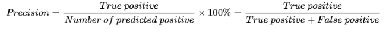
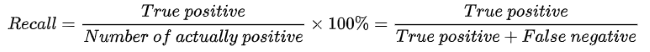
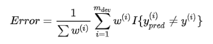
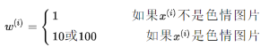
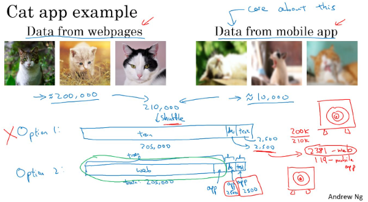
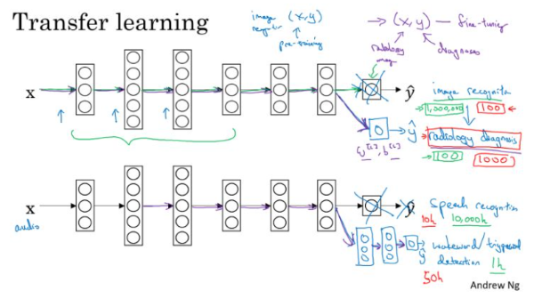
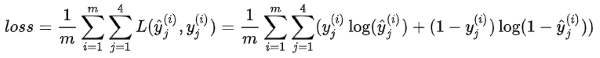
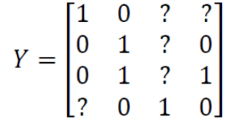

# WEEK3 结构化机器学习项目
## 3.1 正交化

正交化或正交性是一种系统设计属性，其确保修改算法的指令或部分不会对系统的其他部分产生或传播副作用。 相互独立地验证使得算法变得更简单，减少了测试和开发的时间。

当在监督学习模型中，以下的4个假设需要真实且是相互正交的：

1. **系统在训练集上表现的好？**
- 否则，使用更大的神经网络、更好的优化算法
2. **系统在开发集上表现的好？**
- 否则，使用正则化、更大的训练集
3. **系统在测试集上表现的好？**
- 否则，使用更大的开发集
4. **在真实的系统环境中表现的好？**
- 否则，修改开发测试集、修改代价函数

## 3.2 单一数字评估指标

在训练机器学习模型的时候，无论是调整超参数，还是尝试更好的优化算法，为问题设置一个单一数字评估指标，可以更好更快的评估模型。

### 3.2.1 Example1

下面是分别训练的两个分类器的Precision、Recall以及F1 score

由上表可以看出，以**Precision**为指标，则分类器A的分类效果好；以**Recall**为指标，则分类器B的分类效果好。所以在有两个及以上判定指标的时候，我们很难决定出A好还是B好。

这里以Precision和Recall为基础，构成一个综合指标F1 Score，那么我们利用F1 Score便可以更容易的评判出分类器A的效果更好。

**指标介绍：**

在二分类问题中，通过预测我们得到下面的真实值 $y$ 和预测值 $\hat{y}$ 的的表：

- **Precision（查准率）：**
  
    

    假设在是否为猫的分类问题中，查准率代表：所有模型预测为猫的图片中，确实为猫的概率。

- **Recall（查全率）：**

    

    假设在是否为猫的分类问题中，查全率代表：真实为猫的图片中，预测正确的概率。
- **F1 Score：**

    

    相当与查准率和查全率的一个特别形式的平均指标。

### 3.2.2 Example2

下面是另外一个问题，多种分类器在不同的国家中的分类错误率结果：

模型在各个地区有不同的表现，这里用地区的平均值来对模型效果进行评估，转换为单一数字评估指标，就可以很容易的得出表现最好的模型。

## 3.3 满足和优化指标

假设有三个不同的分类器性能表现如下：

此时对于某一问题，对模型的效果有一定的要求，如要求模型准确率尽可能的高，运行时间在$100ms$以内。这里以Accuracy为优化指标，以Running time为满足指标，我们可以从中选出B是满足条件的最好的分类器。

一般的，如果要考虑N个指标，则选择一个指标为优化指标，其他N-1个指标都是满足指标：

## 3.4  训练、开发、测试集

训练、开发、测试集选择设置的一些规则和意见：

- 训练、开发、测试集的设置会对产品带来非常大的影响；
- 在选择**开发集**和**测试集**时要使二者来自同一分布，且从所有数据中随机选取；
- 所选择的开发集和测试集中的数据，要与未来想要或者能够得到的数据类似，即模型数据和未来数据要具有相似性；
- 设置的测试集只要足够大，使其能够在过拟合的系统中给出高方差的结果就可以，也许10000左右的数目足够；
- 设置开发集只要足够使其能够检测不同算法、不同模型之间的优劣差异就可以，百万大数据中$1\%$的大小就足够；

## 3.5 改变开发、测试集和评估指标

在针对某一问题我们设置开发集和评估指标后，这就像把目标定在某个位置，后面的过程就聚焦在该位置上。但有时候在这个项目的过程中，可能会发现目标的位置设置错了，所以要移动改变我们的目标。

### 3.5.1 Example1

假设有两个猫的图片的分类器：

**评估指标：分类错误率**

- 算法A：$3\%$错误率
- 算法B：$5\%$错误率

这样来看，算法A的表现更好。但是在实际的测试中，算法A可能因为某些原因，将很多色情图片分类成了猫。所以当我们在线上部署的时候，算法A会给爱猫人士推送更多更准确的猫的图片（因为其误差率只有$3\%$），但同时也会给用户推送一些色情图片，这是不能忍受的。所以，虽然算法A的错误率很低，但是它却不是一个好的算法。

这个时候我们就需要改变开发集、测试集或者评估指标。

假设开始我们的评估指标如下：

该评估指标对色情图片和非色情图片一视同仁，但是我们希望，分类器不会错误将色情图片标记为猫。

修改的方法，在其中加入权重$\omega^{(i)}$

其中：

这样通过设置权重，当算法将色 情图片分类为猫时，误差项会快速变大。

总结来说就是：如果评估指标无法正确评估算法的排名，则需要重新定义一个新的评估指标。

### 3.5.2 Example2

同样针对**Example1**中的两个不同的猫图片的分类器A和B。

但实际情况是对，我们一直使用的是网上下载的高质量的图片进行训练；而当部署到手机上时，由于图片的清晰度及拍照水平的原因，当实际测试算法时，会发现算法B的表现其实更好。

如果在训练开发测试的过程中得到的模型效果比较好，但是在实际应用中自己所真正关心的问题效果却不好的时候，就需要改变开发、测试集或者评估指标。

**Guideline：**

1. 定义正确的评估指标来更好的给分类器的好坏进行排序；
2. 优化评估指标。

## 3.6 与人类表现做比较

### 3.6.1 可避免偏差

假设针对两个问题分别具有相同的训练误差和交叉验证误差，如下所示：

对于左边的问题，人类的误差为$1\%$，对于右边的问题，人类的误差为$7.5\%$

对于某些任务如计算机视觉上，人类能够做到的水平和**贝叶斯误差**相差不远。（这里贝叶斯误差指最好的分类器的分类误差，也就是说没有分类器可以做到$100\%$正确）。这里将人类水平误差近似为贝叶斯误差。

- 左边的例子：$8\%$与$1\%$差距较大
  主要着手**减小误差**，即减小训练集误差和人类水平误差之间的差距，来提高模型性能。

- 右边的例子：$8\%$与$7.5\%$接近
  主要着手**减少方差**，即减少开发集误差和测试集误差之间的差距，来提高模型性能。

### 3.6.2 理解人类表现

如医学图像分类问题上，假设有下面几种分类的水平：

1. 普通人：$3\%$错误率
2. 普通医生：$1\%$错误率
3. 专家：$0.7\%$错误率
4. 专家团队：$0.5\%$错误率

在减小误诊率的背景下，人类水平误差在这种情形下应定义为：$0.5\%$错误率

如果在为了部署系统或者做研究分析的背景下，也许超过一名普通医 生即可，即人类水平误差在这种情形下应定义为：$1\%$错误率；

**总结：**
对人类水平误差有一个大概的估计，可以让我们去估计贝叶斯误差，这样可以让我们更快的做出决定：**减少偏差**还是**减少方差**。

而这个决策技巧通常都很有效果，直到系统的性能开始超越人类，那么我们对贝叶斯误差的估计就不再准确了，再从减少偏差和减少方差方面提升系统性能就会比较困难了。

## 3.7 改善模型的表现

**基本假设：**
- 模型在训练集上有很好的表现；
- 模型推广到开发和测试集啥会给你也有很好的表现。

**减少可避免偏差**
- 训练更大的模型
- 训练更长时间、训练更好的优化算法（Momentum、RMSprop、Adam）
- 寻找更好的网络架构（RNN、CNN）、寻找更好的超参数

**减少方差**
- 收集更多的数据
- 正则化（L2、dropout、数据增强）
- 寻找更好的网络架构（RNN、CNN）、寻找更好的超参数

## 3.8 误差分析

当我们在训练一个模型的时候，如一个猫和狗分类模型，最终得到了$90\%$的精确度，即有$10\%$的错误率。所以我们需要对模型的一些部分做相应调整，才能更好地提升分类的精度。

如果不加分析去做，可能几个月的努力对于提升精度并没有作用。所以一个好的误差分析的流程就相当重要。

**收集错误样例：**
在开发集（测试集）中，获取大约100个错误标记的例子，并统计其中有多少个是狗。
- 假设一种情况是100个数据中，有5个样例是狗，那么如果我们对数据集的错误标记做努力去改进模型的精度，那么可以提升的上限就是$5\%$，即仅仅可以达到$9.5\%$的错误率，这有时称为**性能上限**。
- 另外一种假设是100个数据中，有50多个样例是狗，那么这种情况下，我们去改进数据集的错误标记，就是一个比较值得的改进方向，可以将模型的精确度提升至$95\%$。

**并行分析：**
- 修改那些被分类成猫的狗狗图片标签；
- 修改那些被错误分类的大型猫科动物，如：狮子，豹子等；
- 提升模糊图片的质量。

为了并行的分析，建立表格来进行。以单个错误分类样本为对象，分析每个样本错误分类的原因。

最后，统计错误类型的百分比，这个分析步骤可以给我们一个粗略的估计，让我们大致确定是否值得去处理每个不同的错误类型。

## 3.9 清除错误标记的样本

下面还是以猫和狗分类问题为例子，来进行分析。如下面的分类中的几个样本：

**情况一：**

深度学习算法对训练集中的随机误差具有相当的鲁棒性。

只要我们标记出错的例子符合随机误差，如：做标记的人不小心错误，或按错分类键。那么像这种随机误差导致的标记错误，一般来说不管这些误差可能也没有问题。

只要我们标记出错的例子符合随机误差，如：做标记的人不小心错误，或按错分类键。那么像这种随机误差导致的标记错误，一般来说不管这些误差可能也没有问题。

**情况二：**

虽然深度学习算法对随机误差具有很好的鲁棒性，但是对于系统误差就不是这样了。

如果做标记的人一直把如例子中的白色的狗标记成猫，那么最终导致我们的分类器就会出现错误。

**dev、test集中错误标记的情况：**

如果在开发集和测试集中出现了错误标记的问题，我们可以在误差分析的过程中，增加错误标记这一原因，再对错误的数据进行分析，得出修正这些标记错误的价值。

**修正开发、测试集上错误样例：**
- 对开发集和测试集上的数据进行检查，确保他们来自于相同的分布。使得我们以开发集为目标方向，更正确地将算法应用到测试集上。
- 考虑算法分类错误的样本的同时也去考虑算法分类正确的样本。（通常难度比较大，很少这么做）
- 训练集和开发/测试集来自不同的分布。

## 3.10 搭建系统
- 设置开发、测试集和优化指标（确定方向）；
- 快速地建立基本的系统；
- 使用偏差方差分析、误差分析去确定后面步骤的优先步骤。

总的来说，如果我们想建立自己的深度学习系统，我们就需要做到：快速的建立自己的基本系统，并进行迭代。而不是想的太多，在一开始就建立一个非常复杂，难以入手的系统。

## 3.11 不同分布上的训练和测试

在深度学习的时代，因为需求的数据量非常大，现在很多的团队，使用的训练数据都是和开发集和测试集来自不同的分布。

下面是一些处理训练集和测试集存在差异的最佳的做法。以前一周中的猫的分类问题为例：

我们可以从网上获取大量的高清晰的猫的图片去做分类，如200000张，但是只能获取少量利用手机拍摄的不清晰的图片，如10000张。但是我们系统的目的是应用到手机上做分类。

也就是说，我们的训练集和开发集、测试集来自于不同的分布。

**方法一：**

将两组数据合并到一起，总共得到21万张图片样本。将这些样本随机分配到训练、开发、测试集中。
- 好处：三个集合中的数据均来自于同一分布；
- 坏处：我们设立开发集的目的是瞄准目标，而现在我们的目标绝大部分是为了去优化网上获取的高清晰度的照片，而不是我们真正的目标。

该方法不是一个好的方法，不推荐。

方法二：

训练集均是来自网上下载的20万张高清图片，当然也可以加上5000张手机非高清图片；对于开发和测试集都是手机非高清图片。

- 好处：开发集全部来自手机图片，瞄准目标；
- 坏处：训练集和开发、测试集来自不同的分布。

从长期来看，这样的分布能够给我们带来更好的系统性能。

## 3.12 不同分布上的偏差和方差

通过估计学习算法的偏差和方差，可以帮助我们确定接下来应该优先努力的方向。但是当我们的训练集和开发、测试集来自不同的分布时，分析偏差和方差的方式就有一定的不同。

**方差和分布原由分析**

以猫分类为例，假设以人的分类误差$0\%$作为贝叶斯误差。若我们模型的误差为：
- Training error：$1\%$
- Dev error：$10\%$

如果我们的训练集和开发、测试集来自相同的分布，那么我们可以说模型存在很大的方差问题。但如果数据来自不同的分布，那么我们就不能下这样的定论了。

那么我们如何去确定是由于分布不匹配的问题导致开发集的误差，还是由于算法中存在的方差问题所致？

**设立“训练开发集”**

训练开发集，其中的数据和训练数据来自同一分布，但是却不用于训练过程。

如果最终，我们的模型得到的误差分别为：
- Training error：$1\%$
- Training-dev error：$9\%$
- Dev error： $10\%$

那么，由于**训练开发集**尽管和训练集来自同一分布，但是却有很大的误差， 模型无法泛化到同分布的数据，那么说明我们的模型存在**方差问题**。

但如果我们的模型得到的误差分别为：

- Training error：$1\%$
- Training-dev error：$1.5\%$
- Dev error： $10\%$

那么在这样的情况下，我们可以看到，来自同分布的数据，模型的泛化能力强，而开发集的误差主要是来自于**分布不匹配**导致的。

**分布不同的偏差方差分析**

通过：**Human level、Training set error、Training-dev set error、Dev error、Test error** 之间误差的大小，可以分别得知我们的模型，需要依次在：可避免的偏差、方差、数据分布不匹配、开发集的或拟合程度，这些方面做改进。

通常情况下来说，通过不同的集合上的误差分析，我们得出的结果会是中间一列误差由小变大，即误差上升的情况。但是也有一定的可能会出现右边一列误差在开发测试集上又表现的好的情况。

下面通过一个后视镜语音检测的例子来说明。我们以该例子建立更加一般的表格。

其中，横向分别是：普通语音识别数据、后视镜语音识别数据；纵向分别是：Human level、训练数据误差、未训练数据误差。表格中不同的位置分别代表不同的数据集。

通常情况下，我们分析误差会是一个递增的情况，但是对于我们的模型，在后视镜语音识别的数据数据上，可能已经可以达到人类水平误差的$6\%$了，而最终的开发测试集也会$6\%$的误差，要比训练误差和训练开发误差都要小。所以如果遇到这种情况，就要利用上表进行分析。

## 3.13 解决数据分布不匹配问题

通过上一节的误差分析，可以得知，模型最终在开发和测试集上的误差最终是由于数据分布不匹配而导致。通过以下方法进行解决：
- 进行人工误差分析，尝试去了解训练集和开发测试集的具体差异在哪里。如：噪音等；
- 尝试把训练数据变得更像开发集，或者收集更多的类似开发集和测试集的数据，如增加噪音；

## 3.14 迁移学习

将从一个任务中学到的知识，应用到另一个独立的任务中。

**迁移学习的意义：**

迁移学习适合以下场合：迁移来源问题有很多数据，但是迁移目标问题却没有那么多的数据。

假设图像识别任务中有1百万个样本，里面的数据相当多；但对与一些特定的图像识别问题，如放射科图像，也许只有一百个样本，所以对于放射学诊断问题的数据很少。所以从图像识别训练中学到的很多知识可以迁移，来帮助我们提升放射科识别任务的性能。

同样一个例子是语音识别，可能在普通的语音识别中，我们有庞大的数据量来训练模型，所以模型从中学到了很多人类声音的特征。但是对于触发字检测任务，可能我们拥有的数据量很少，所以对于这种情况下，学习人类声音特征等知识就显得相当重要。所以迁移学习可以帮助我们建立一个很好的唤醒字检测系统。

**迁移学习有意义的情况：**
- 任务A和任务B有着相同的输入；
- 任务A所拥有的数据要远远大于任务B（对于更有价值的任务B，任务A所拥有的数据要比B大很多）；
- 任务A的低层特征学习对任务B有一定的帮助。

## 3.15 多任务学习

与迁移学习的串行学习方式不同，在多任务学习中，多个任务是并行进行学习的，同时希望各个任务对其他的任务均有一定的帮助。

**自动驾驶的例子：**

假设在自动驾驶的例子中，我们需要检测的物体很多，如行人、汽车、交通灯等等。

对于现在的任务，我们的目标值变成了一个向量的形式向量中的每一个值代表检测到是否有如行人、汽车、交通灯等，一张图片有多个标签。

模型的神经网络结构如下图所示：

该问题的 **Loss function：**

对于这样的问题，我们就是在做多任务学习，因为我们建立单个神经网络，来解决多个问题。

特定的对于一些问题，例如在我们的例子中，数据集中可能只标注了部分信息，如其中一张只标注了人，汽车和交通灯的标识没有标注。那么对于这样的数据集，我们依旧可以用多任务学习来训练模型。当然要注意这里Loss function求和的时候，只对带0、1标签的**j**进行求和。

**多任务学习有意义的情况：**

- 如果训练的一组任务可以共用低层特征；
- 通常，对于每个任务大量的数据具有很大的相似性；（如，在迁移学习中由任务A“100万数据”迁移到任务B“1000数据”；多任务学习中，任务$A_1,\cdots,A_n$，每个任务均有1000个数据，合起来就有1000n个数据，共同帮助任务的训练）
- 可以训练一个足够大的神经网络并同时做好所有的任务。

## 3.16 端到端深度学习

**端到端学习的定义：**

相对于传统的一些数据处理系统或者学习系统，它们包含了多个阶段的处理过程，而端到端的深度学习则忽略了这些阶段，用单个神经网络来替代。

**语音识别例子：**

在少数据集的情况下传统的特征提取方式可能会取得好的效果；如果在有足够的大量数据集情况下，端到端的深度学习会发挥巨大的价值。

**优缺点：**
- 优点：
  1. 端到端学习可以直接让数据“说话”；
  2. 所需手工设计的组件更少。

- 缺点：
  1. 需要大量的数据；
  2. 排除了可能有用的手工设计组件。

应用端到端学习的 **Key question**：是否有足够的数据能够直接学习到从 **x** 映射到 **y** 的足够复杂的函数。
