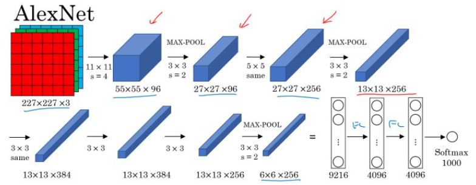
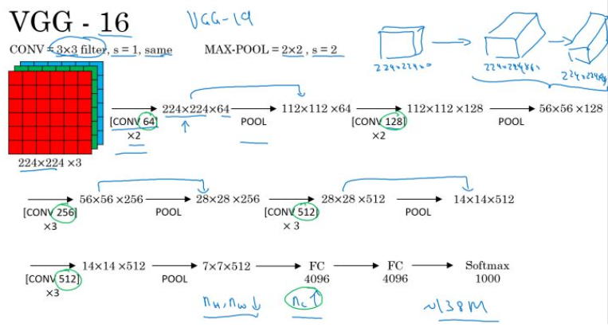

# WEEK4：卷积神经网络

## 4.1 第一章：卷积神经网络基础

### 4.1.1 计算机视觉

计算机视觉（Computer Vision）包含很多不同类别的问题，如图片分类、目标检测、图片风格迁移等等。

对于小尺寸的图片问题，也许用深度神经网络的结构可以较为简单的解决一定的问题。但是当应用在大尺寸的图片上，输入规模将变得十分庞大，使用神经网络将会有非常多的参数需要去学习，这个时候神经网络就不再适用。卷积神经网络在计算机视觉问题上是一个非常好的网络结构。

### 4.1.2 边缘检测示例

卷积运算是卷积神经网络的基本组成部分。下面以边缘检测的例子来介绍卷积运算。

所谓边缘检测，在下面的图中，分别通过垂直边缘检测和水平边缘检测得到不同的结果：

**垂直边缘检测：**

假设对于一个 $6\times6$，大小的图片（以数字表示），以及一个 $3\times3$ 大小的 **filter（卷积核）** 进行卷积运算，以 “$*$” 符号表示。图片和垂直边缘检测器分别如左和中矩阵所示：

filter 不断地和其大小相同的部分做对应元素的乘法运算并求和，最终得到的数字相当于新图片的一个像素值，如右矩阵所示，最终得到一个 $4\times4$ 大小的图片。

**边缘检测的原理：**

以一个有一条垂直边缘线的简单图片来说明。通过垂直边缘filter 得到的最终结果图片可以明显地将边缘和非边缘区分出来：

卷积运算提供了一个方便的方法来检测图像中的边缘，成为卷积神经网络中重要的一部分。

**多种边缘检测：**

垂直和水平边缘检测

更复杂的 **filter**

对于复杂的图片，可以直接将 **filter** 中的数字直接看作是需要学习的参数，其可以学习到对于图片检测相比上面filter更好的更复杂的 **filter** ，如相对于水平和垂直检测器，训练的 **filter** 参数也许可以知道不同角度的边缘。

通过卷积运算，在卷积神经网络中通过反向传播算法，可以学习到相应于目标结果的 **filter**，将其应用于整个图片，输出其提取到的所有有用的特征。

**卷积和互相关：**

在数学定义上，矩阵的**卷积（convolution）** 操作为首先将卷积核同时在水平和垂直方向上进行翻转，构成一个卷积核的镜像，然后使用该镜像再和前面的矩阵进行移动相乘求和操作。如下面例子所示：

在深度学习中，卷积运算实则没有卷积核变换为镜像的这一步操作，因为在权重学习的角度，变换是没有必要的。深度学习的卷积操作在数学上准确度来说称为**互相关（cross-correlation）**。

### 4.1.3 Padding
**没有Padding的缺点：**

- 每次卷积操作，图片会缩小

就前面的例子来说，$6\times6$大小的图片，经过$3\times3$大小的filter，缩小成了$4\times4$大小的图片：$n\times n \longrightarrow(n-f+1) \times (n-f+1)$

- 角落和边缘位置的像素进行卷积运算的次数少，可能会丢失有用信息。
其中，n 表示图片的长或宽的大小，f 表示filter的长或宽的大小。

**加Padding：**

为了解决上面的两个缺点，可以在进行卷积运算前为图片加padding，包围角落和边缘的像素，使得通过filter的卷积运算后，图片大小不变，也不会丢失角落和边沿的信息。

以**p**表示 Padding 的值，则输入 $n\times n$大小的图片，最终得到的图片大小为 $(n+2p-f+1) \times (n+2p-f+1)$ ，为使图片大小保持不变，需根据 **filter** 的大小调整p的值。

**Valid / Same** 卷积：

- **Valid：** no padding：$n\times n \longrightarrow(n-f+1) \times (n-f+1)$

- **Same：** padding，输出与输入图片大小相同，$p={(f-1) \over 2}$。在计算机视觉中，一般来说padding的值为奇数（因为filter一般为奇数）

### 4.1.4 卷积步长（stride）

卷积的步长是构建卷积神经网络的一个基本的操作。

如前面的例子中，我们使用的 stride=1，每次的卷积运算以1个步长进行移动。下面是 stride=2 时对图片进行卷积的结果：

以s表示stride的大小，那么在进行卷积运算后，图片的变化为：

$n\times n \longrightarrow [{{n+2p-f \over s}+1 }]\times [{{n+2p-f} \over s}+1]$

注意，在当$padding\ne 1$时，若移动的窗口落在图片外面，则不要再进行相乘的操作，丢弃边缘的数值信息，所以输出图片的最终维度为**向下取整**。

### 4.1.5 立体卷积

**卷积核的通道数：**

对于灰色图像中，卷积核和图像均是二维的。而应用于彩色图像中，因为图片有R、G、B三个颜色通道，所以此时的卷积核应为三维卷积核。

卷积核的第三个维度需要与进行卷积运算的图片的通道数相同。

**多卷积核：**

单个卷积核应用于图片时，提取图片特定的特征，不同的卷积核提取不同的特征。如两个大小均为 $3\times 3 \times 3$ 的卷积核分别提取图片的垂直边缘和水平边缘。

由图可知，最终提取到彩色图片的垂直特征图和水平特征图，得到有2个通道的$4\times4$大小的特征图片。

**Summary：**

图片：$(n\times n\times n_c)\times (f\times f\times n_c)\longrightarrow (n-f+1)\times (n-f+1)\times {n_c}'$

其中，$n_c$ 表示通道的数量，${n_c}'$ 表示下一层的通道数，同时也等于本层卷积的核的个数。

### 4.1.6 简单卷积网络

**单层卷积网络的例子：**

和普通的神经网络单层前向传播的过程类似，卷积神经网络也是一个先由输入和权重及偏置做线性运算，然后得到的结果输入一个激活函数中，得到最终的输出：

$z^{[1]} = w^{[1]}a^{[0]}+b^{[1]}$

$a^{[1]} = g(z^{[1]})$

不同点是：在卷积神经网络中，权重和输入进行的是卷积运算。

**单层卷积的参数个数：**

在一个卷积层中，如果有10个 $ 3 \times 3 \times 3$ 大小的卷积核，那么加上每个卷积核对应的偏置，则对于一个卷积层，则共有的参数个数为：$(3\times3\times3 +1)\times 10 = 280$

无论图片大小是多少，该例子中的卷积层参数个数一直都是280个，相对于普通的神经网络，卷积神经网络的参数个数要少很多。

标记的总结：

如果$l$代表一个卷积层：
- $f^{[l]}$：filter的大小
- $p^{[l]}$：padding
- $s^{[l]}$：步长（stride）
- 卷积核的个数：$n_C^{[l]}$
- filter大小：$f^{[l]} \times f^{[l]} \times n_C^{[l]}$
- 激活值（Activations）：$a^{[l]} \longrightarrow n_H^{[l]}\times n_W^{[l]} \times n_C^{[l]}$
- 权重（Weights）：$f^{[l]} \times f^{[l]} \times n_C^{[l-1]} \times n_C^{[l]}$
- 偏置（bias）：$n_C^{[l]} \longrightarrow (1,1,1,n_C^{[l]})$
- Input：$n_H^{[l-1]} \times n_W^{[l-1]}\times n_C^{[l-1]}$
- Output：$n_H^{[l]}\times n_W^{[l]}\times n_C^{[l]}$
- 其中：$n_H^{[l]}={[{{{n_H^{[l-1]}+2p^{[l]}-f^{[l]}} \over s^{[l]}}}+1]}$，$n_W^{[l]}={[{{{n_W^{[l-1]}+2p^{[l]}-f^{[l]}} \over s^{[l]}}}+1]}$

**简单卷积网络示例：**

多层卷积构成卷积神经网络，下面是一个卷积神经网络的例子：

卷积网络层的类型：
- 卷积层（Convolution），Conv
- 池化层（Pooling），Pool
- 全连接层（Fully connected）：Fc

### 4.1.7 池化层

**最大池化（Max pooling）：**

最大池化是对前一层得到的特征图进行池化减小，仅由当前小区域内的最大值来代表最终池化后的值。

在最大池化中，有一组超参数需要进行调整，其中，$f$ 表示池化的大小，$s$表示步长。
- 池化前：$n \times n$
- 池化后：$[{{n+2p-f \over s}+1 }]\times [{{n+2p-f} \over s}+1]$

**平均池化（Average pooling）：**

平均池化与最大池化唯一不同的是其选取的是小区域内的均值来代表该区域内的值。

**池化 Summary：**

池化层的超参数：
- $s$：filter的大小
- $s$：stride大小
- 最大池化或者平均池化
- $p$；padding，这里要注意，几乎很少使用。

注意，池化层没有需要学习的参数。

### 4.1.8 卷积神经网络示例

这里以 **LeNet-5** 为例，给出一个完整的卷积神经网络。

**构建深度卷积的模式：**
- 随着网络的深入，提取的特征图片大小将会逐渐减小，但同时通道数量应随之增加
- Conv——Pool——Conv——Pool——Fc——Fc——Fc——softmax

**卷积神经网络的参数：**

根据上表可以看出，对于卷积卷积神经网络的参数：
- 在卷积层，仅有少量的参数；
- 在池化层，没有参数；
- 在全连接层，存在大量的参数。

### 4.1.9 使用卷积神经网络

**参数少的优势：**

与普通的全连接神经网络相比，卷积神经网络的参数更少。如图中的例子，卷积神经网络仅有 $6\times(5\times 5+1)=156$ 个参数而普通的全连接网络有 $3072\times4704\approx14M$ 个参数

- **参数共享：** 一个特征检测器（filter）对图片的一部分有用的同时也有可能对图片的另外一部分有用。
- **连接的稀疏性：** 在每一层中，每个输出值只取决于少量的输入。

**训练卷积神经网络：**

我们将训练集输入到卷积神经网络中，对网络进行训练。利用梯度下降（Adam、momentum等优化算法）最小化代价函数来寻找网络的最优参数。

## 4.2 第二章：深度卷积模型

### 4.2.1 经典的卷积网络

介绍几种经典的卷积神经网络结构，分别是**LeNet、AlexNet、VGGNet**。

**LeNet-5：**

LeNet-5主要是针对灰度设计的，所以其输入较小，为 $32\times 32 \times 1$，其结构如下：

在LetNet中，存在的经典模式：
- 随着网络的深度增加，图像的大小在缩小，与此同时，通道的数量却在增加；
- 每个卷积层后面接一个池化层。

**AlexNet：**

AlexNet直接对彩色的大图片进行处理，其结构如下：

- 与**LeNet**相似，但网络结构更大，参数更多，表现更加出色；
- 使用了Relu；
- 使用了多个GPUs；
- LRN（后来发现用处不大，丢弃了）

**AlexNet**使得深度学习在计算机视觉方面受到极大的重视。

**VGG-16：**
VGG卷积层和池化层均具有相同的卷积核大小，都使用 $3\times3, stride = 1, SAME$ 的卷积核 $2\times2, stride = 2$ 的池化。其结构如下:

### 4.2.2 ResNet

ResNet是由残差块所构建。

**残差块：**

下面是一个普通的神经网络块的传输：

其前向传播的计算步骤为：

而ResNet块则将其传播过程增加了一个从$a^{[l]}$直接到$z^{[l+2]}$的连接，将其称之为 **“short cut”** 或者 **“skip connection”：**

也就是前向传播公式的最后一个步骤变为：$a^{[l+2]}= g(z^{[l+2]}+a^{[l]})$

增加 **“short cut”** 后，成为残差块的网络结构：

注意这里是连接在Relu激活函数之前。

**Residual Network：**

多个**残差块**堆积起来构成ResNet网络结构，其结构如下：

没有 **“short cut”** 的普通神经网络和ResNet的误差曲线：

- 在没有残差的普通神经网络中，训练的误差实际上是随着网络层数的加深，先减小再增加；
- 在有残差的ResNet中，即使网络再深，训练误差都会随着网络层数的加深逐渐减小。

**ResNet**对于中间的激活函数来说，有助于能够达到更深的网络，解决梯度消失和梯度爆炸的问题。

### 4.2.3 ResNet表现好的原因

假设有个比较大的神经网络，输入为 $x$ ，输出为 $a^{[l]}$ 。如果想增加网络的深度，这里再给网络增加一个残差块：

假设网络中均使用Relu激活函数，所以最后的输出 $a \ge 0 $。这里给出 $a^{[l+2]}$ 的值：

如果使用L2正则化或者权重衰减，会压缩W和b的值。如果 $W^{[l+2]} = 0$ 同时 $b^{[l+2]}= 0$，那么上式就变成：

所以从上面的结果可以看出，对于残差块来学习上面这个恒等函数是很容易的。所以在增加了残差块后更深的网络的性能也并不逊色于没有增加残差块简单的网络。所以尽管增加了网络的深度，但是并不会影响网络的性能。同时如果增加的网络结构能够学习到一些有用的信息，那么就会提升网络的性能。

同时由于结构 $a^{[l+2]} = g(z^{[l+2]} + a^{[l]})$ ,ResNet在设计中使用了很多相同的卷积，以保持 $z^{[l+2]}$ 和 $a^{[l]}$ 的维度相同。

**将普通深度神经网络变为ResNet：**

在两个相同的卷积层之间增加 **“skip connection”**。

### 4.2.4 1x1卷积

**1x1卷积：**

在二维上的卷积相当于图片的每个元素和一个卷积核数字相乘。

但是在三维上，与 $1 \times 1 \times n_C $ 卷积核进行卷积，相当于三维图像上的 $1 \times 1 \times n_C$ 的切片，也就是 $n_C$ 个点乘以卷积数值权重，通过elu函数后，输出对应的结果。而不同的卷积核则相当于不同的隐层神经元结点与切片上的点进行一一连接。

所以根本上 $1 \times 1$ 卷积核相当于对一个切片上的 $n_C$ 个单元都应用了一个全连接的神经网络。

最终三维的图形应用 $1 \times 1$ 的卷积核得到一个相同长宽但第三维度变为卷积核个数的图片。

**1x1卷积应用：**

- 维度压缩：使用目标维度的 $1 \times 1$ 的卷积核个数。
- 增加非线性：保持与原维度相同的 $1 \times 1$ 的卷积核个数。

### 4.2.5 Inception Network

Inception Network 的作用就是使我们无需去考虑在构建深度卷积神经网络时，使用多大的卷积核以及是否添加池化层等问题。

**Inception主要结构：**

在上面的Inception结构中，应用了不同的卷积核，以及带padding的池化层。在保持输入图片大小不变的情况下，通过不同运算结果的叠加，增加了通道的数量。

**计算成本的问题：**

对于上面的 $5 \times 5$ 大小卷积核的计算成本：

- 1 filters：$5 \times 5 \times 192 $
- 32 个 filters
- 总的计算成本：$28 \times 28 \times 32 \times 5 \times 5 \times 192 = 120M $

对于 $1 \times 1$ 大小卷积核用作过渡的计算成本，也将下面的中间的层叫做 **“bottleneck layer”**：

- $1 \times 1$ 卷积层计算成本：$28 \times 28 \times 16 \times 1 \times 1 \times 192 = 2.4M $
- $5 \times 5$ 卷积层计算成本：$28 \times 28 \times 32 \times 5 \times 5 \times 16 = 10.0M $
- 总的计算成本：$2.4M + 10.0M = 12.4M$

所以 $1 \times 1$ 卷积核作为 **“bottleneck layer”** 的过渡层能够有效减小卷积神经网的计算成本。事实证明，只要合理地设置 **“bottleneck layer”**，既可以显著减小上层的规模，同时又能降低计算成本，从而不会影响网络的性能。

**Inception 模块：**

将上面说介绍的两种主要思想和模式结合到一起构成 Inception 模块，如下：

**Inception Network：**

多个Inception 模块的堆叠构成Inception Network，下面是GoogleNet的结构：

### 4.2.6 迁移学习

**小数据集：**

如今在深度学习领域，许多研究者都会将他们的工作共享到网络上。在实施自己的工作的时候，比如说做某种物体的识别分类，如果只有少量的数据集，对于从头开始训练一个深度网络结构是远远不够的。

但是可以应用迁移学习，应用其他研究者建立的模型和参数，用少量的数据仅训练最后自定义的 **softmax** 网络。从而能够在小数据集上达到很好的效果。

**大数据集：**

如果我们在自己的问题上也拥有大量的数据集，可以多训练后面的几层。总之随着数据集的增加，我们需要 **“freeze”** 的层数越来越少。最后如果有十分庞大的数据集，那么我们可以训练网络模型的所有参数，将其他研究者训练的模型参数作为 **参数的初始化**来替代随机初始化，来加速我们模型的训练。

### 4.2.7 数据扩充

与其他机器学习问题相比，在计算机视觉领域当下最主要的问题是没有办法得到充足的数据。所以在训练计算机数据模型的时候，数据的扩充就是会非常有用。

**数据扩充的方法：**

- 镜像翻转（Mirroring）
- 随机剪裁（Random Cropping）
- 色彩转换（Color shifting）

为图片的RGB三个色彩通道进行增减值，如（R：+20，G：-20，B：+20）；PCA颜色增强：对图片的主色的变化较大，图片的次色变化较小，使总体的颜色保持一致。

**训练过程中的数据扩充：**

为了节省时间，数据扩充的过程和训练过程可以多CPU多线程来并行的实现。

### 4.2.8 计算机视觉现状

**数据和手工工程：**

不同问题当前的数据集大小：

在有大量数据的时候，我们更倾向于使用简单的算法和更少的手工工程。因为此时有大量的数据，不需要为这个问题来精心设计特征，使用一个大的网络结果或者更简单的模型就能够解决。

相反，在有少量数据的时候，我们从事更多的是手工工程。因为数据量太少，较大的网络结构或者模型很难从这些少量的数据中获取足够的特征，而手工工程实际上是获得良好表现的最佳方式。

**对于机器学习应用：**

- 标记数据，(x, y)
- 手工特征工程/网络结构/其他构建。

**Tips for doing well：**

在基准研究和比赛中，下面的tips可能会有较好的表现：
- **Ensembling：** 独立地训练多个网络模型，输出平均结果或加权平均结果
- 测试时的 **Multi-crop：** 在测试图片的多种版本上运行分类器，输出平均结果