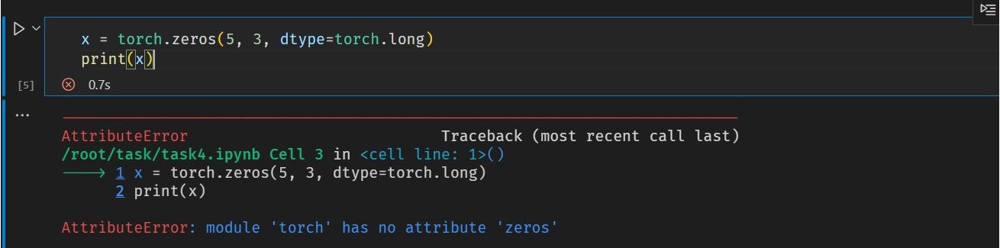
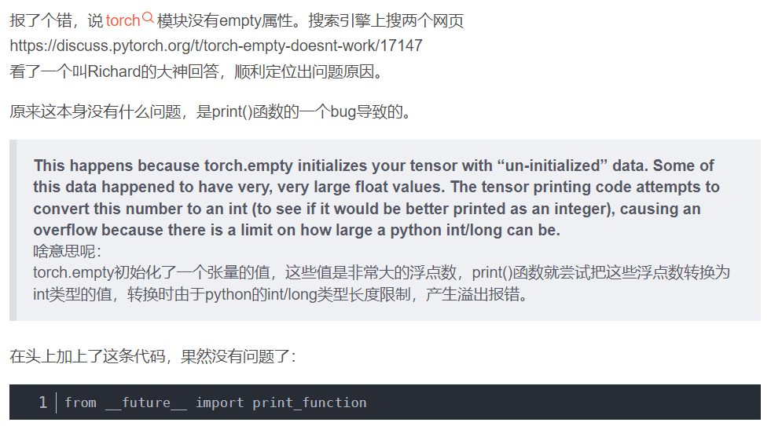
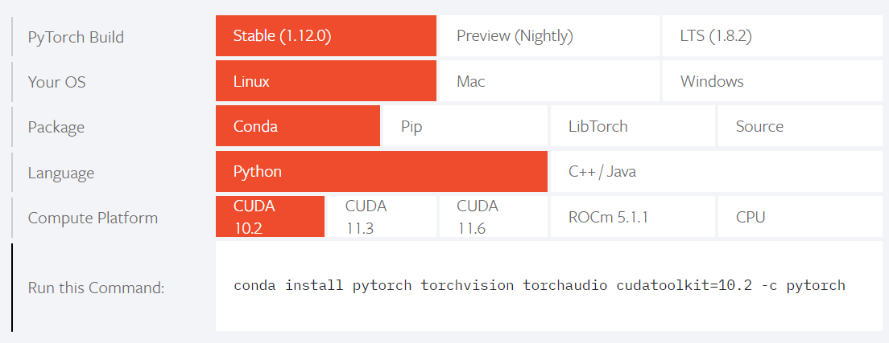
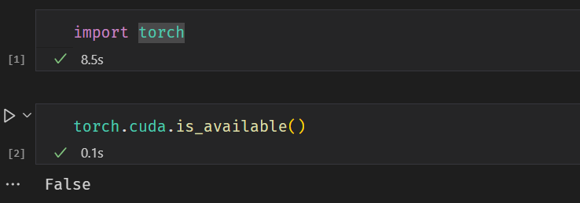
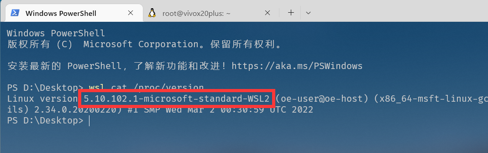
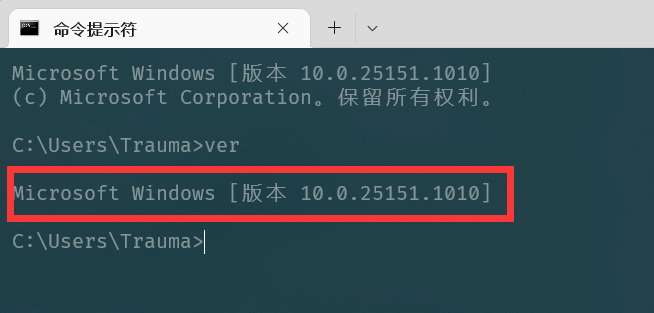
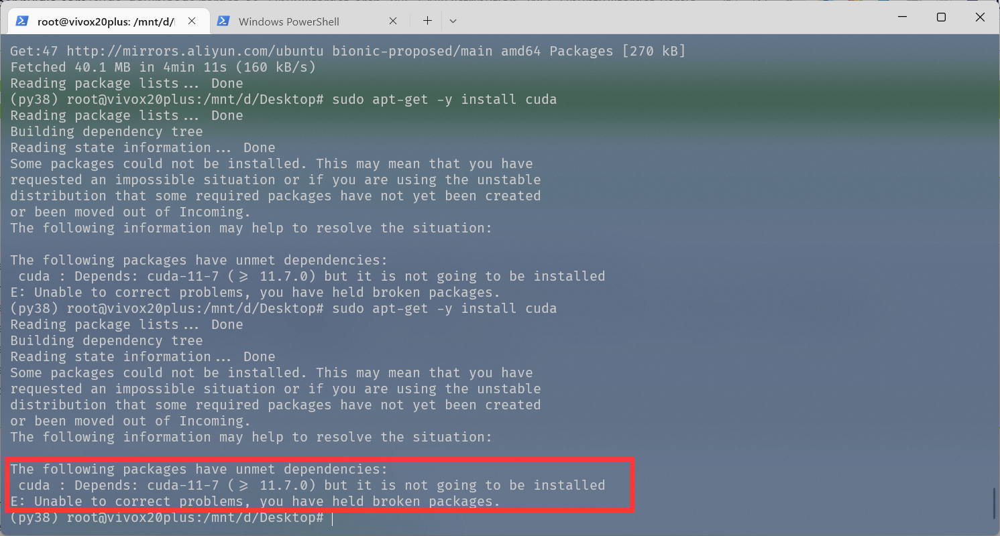
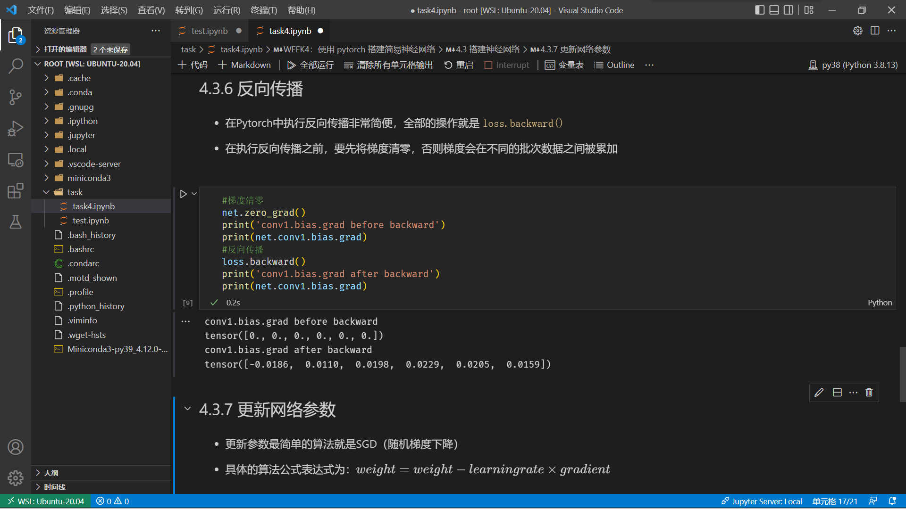

# WEEK4：本周问题总结

## 4.1 在WSL中搭建神经网络报错

上周在WSL中安装了cpu版本的pytorch，本周在学习W3Cschool中的pytorch深度学习章节时，运行代码出现如下错误：

`AttributeError: module 'torch' has no attribute 'xxx'`



然而 `import torch` 是没有出现报错的，所以我以为是prtorch包没有安装完全，于是重新安装了一遍torch无果后，只能寻求百度

## 4.2 添加 `from __future__ import print_function`
寻找良久，终于有一篇博客介绍了解决办法



于是加上
```python
from __future__ import print_function
import torch
```
但是还是出现 `AttributeError: module 'torch' has no attribute 'xxx'` 错误

此时不禁让我有些怀疑人生

## 4.3 安装 gpu 版本 pytorch

终于查了很久资料后，得知可能是cpu版本的pytorch版本过老，会出现这样的错误，于是我将WSL中cpu版本的torch卸载，安装gpu版本torch



经过长时间的下载安装后，通过 `torch.cuda.is_available()` 返回的是 False
QAQ



## 4.4 在 WSL 中安装 gpu 版本的 pytorch

再次查找百度，找到一篇介绍在WSL中安装gpu版本的pytorch博客
- [win10/11下wsl2安装gpu版的pytorch（避坑指南）](https://blog.csdn.net/zqm_0015/article/details/123768831)

按照其中的步骤安装

1. 查询GPU Driver 版本


2. 查询WSL2 内核版本



3. 查询系统版本



4. 安装CUDA Toolkit

这里的CUDA Toolkit 版本应该要与driver版本匹配，根据上面三部查询的结果在[CUDA Toolkit Documengtation](https://docs.nvidia.com/cuda/cuda-toolkit-release-notes/index.html)中获取相匹配的设置
  


终于将 CUDA Toolkit 的安装包下载完成

但是安装 CUDA Toolkit 的时候再次报错



无奈之下只能将 CUDA Toolkit 卸载重新安装

但是依旧报错

## 4.5 成功搭建神经网络

将原环境删除，在新建一个py38环境后，安装gpu 10.3版本的pytorch，在新环境中，没有再报 `AttributeError: module 'torch' has no attribute 'xxx'` 的错误

终于完成pytorch的学习，成功搭建神经网络




