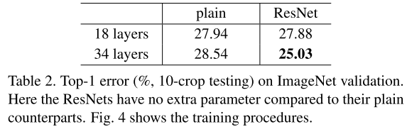

# WEEK5：Deep Residual Learning for Image Recognition 阅读笔记

## 5.1 研究背景

作者首先提出一个问题：**学习更好的网络就像堆叠更多的层一样简单吗？**

然而，随着网络的层数的叠加，我们会遇到**梯度消失**和**梯度爆炸**问题，而这个问题也会**阻碍模型的收敛**。

**规范化初始化（normalized initialization）** 和 **中间归一化层（intermediate normalization layers）** 很好的缓解了这个问题。
- 前者指的是在初始化权重的时候注意不将值设置太大也不要特别小
- 后者指的是在网络中间加一些 **标准化（normalization）**，比如 batch normalization 可以校验每个层之间的输出以及梯度的均值和方差，避免有些层特别大，有些层特别小。这就使得包含很多层的网络开始可以基于随机梯度下降(SGD)的优化器进行反向传播收敛了。

但是，随着网络层数的加深，精确度开始饱和，然后急剧衰减。作者将这种现象称为退化问题。而且这种退化问题不是由于**模型的层数变深、模型的参数变多**而过拟合导致的，给一个网络添加更多的层会导致更高的训练误差，这一结论在作者的实验中得到了证实。

**plain**指的是没有使用残差结构的网络。

假设有一个浅层的网络，已经优化的比较好了，如果为其增加更多的网络层，作者认为结果不应该变得更差，大不了也只是和没有添加这些层的结果一样，即直接跳过这些层输出结果，这个映射过程称为恒等映射。

但是我们目前的优化方法做不到。所以作者希望构造一个这样的结构，使得更深的结构不会比浅层结构表现更差。

## 5.2 核心思想

为了解决上述退化问题，作者提出**深度残差学习框架（deep residual learning framework）**。

作者不是直接提出一种网络层的堆叠方式来直接学习所需要的底层映射，而是构造满足残差映射的网络层。假设所需要学习的底层映射为$H(x)$，$x$是浅层网络所学习到的内容，然后继续添加若干层残差映射网络层，这些层不按照前几层的学习模式来直接学习$H(x)$，而是学习$x$与$H(x)$之间的残差$F$:$F(x) = H(x) - x$

这样一来，我们最终需要学习的$H(x)$可以表示为$F(x) + x$，这一结构可以使用神经网络前向传播过程中的捷径连接来实现，即下图的捷径部分

这一结构不会增加任何额外的参数数量以及复杂的运算，一样可以被SGD端到端地训练，且容易实现。

在实验中也表明，在较深的神经网络中，文章提出的**深度残差学习框架**很容易优化，而随着网络的深度加深，通过简单堆叠若干层的网络会产生更大的训练误差，本文的新网络却可以学习到更多的内容并提高精度。

## 5.3 细节阐述

### 5.3.1 深度残差学习（deep residual learning）

假设 $H(x)$ 是一些堆叠网络层(不一定是整个网络)需要达到的映射结果，$x$表示这一些堆叠网络层的输入。假设$H(x)$函数可以通过堆叠一系列非线性层来不断逼近。

常规的神经网络就是通过不断的堆叠网络层来拟合$H(x)$，但是本文直接拟合的是**残差函数**$F$:$F(x) = H(x) - x$

因此一开始我们需要求的函数$H(x)$​就变成$F(x)+x$​​​​​​​​​​​​。这样设计的动机是**层数增加反而导致训练误差增加**的反直觉现象。因为如果后面的网络层可以起到恒等映射的作用，那么增加网络层数即使不会提高网络的精度，也不至于在训练过程模型性能一直降低。

模型性能退化的现象表明，多层非线性网络层在拟合恒等映射的过程中有困难。使用残差结构训练，如果恒等映射是最优的，模型可以让多个非线性层的权值趋向于零，以接近恒等映射。

作者认为，残差结构应该更容易学习，因为这样的话网络只需要学习和期望值之间的残差，而不是学习一个全新的值。在本文中的残差结构可以使用如下的表达式来表示：$y = F(x,{w_i})+x$

其中，x​​和y​​表示的是所考虑层的输入和输出向量。$F(x,{w_i})$ 示需要学习的**残差映射**。如果F​​和x​​的维度不同，可以用一个线性投影矩阵$W_s$​与x​​相乘，使得二者的维度相同：$y = F(x,{w_i})+W_sx$

**残差函数F​**​的结构很灵活，在本文中提到了两种结构的**残差函数**：2层和3层，当然更多层数也可以。残差函数中的网络层不仅可以关于**全连接层**，还可以适用于**卷积层**，这样$F(x,{w_i})$​可以表示成不同的卷积层。

### 5.3.2 网络结构

作者称没有使用残差结构的网络为**plain nerwork**，有残差结构的网络为**residual network**。基于VGG的设计理念的启发，作者设计一个plain network，卷积层大多使用的是3x3的filters，而且总是保持两条规则：

1. 有相同输出特征图大小的层也有相同数量的filters（相同数量的filters会有相同的通道数，这就保证了通道维数相等）
2. 如果特征图大小减半，为了保持每层的时间复杂度，filters的数量需要增加一倍

下采样过程直接使用stride为2的卷积操作，网络的结尾是一个全局平均池化层以及一个1000维度的全连接层加上softmax输出。

plain network的结构如下图中间所示，左边是VGG-19的网络结构，右边是34层的residual net的网络结构：

plain network有更少的filters，而且相比于VGG有更低的复杂度。基于上述的plain network，通过添加捷径，将网络转换为一个残差网络。当输入和输出特征矩阵的维度相同时，可以直接使用identity shortcuts(上图网络结构中实线捷径)，如下图结构所示(输入残差结构的维度64-d没有发生改变)：

当特征矩阵的通道维度增加的时候（虚线捷径），可以考虑两种处理方法：

**option A.** 捷径仍然进行恒等映射，如果输入输出维度不相等就填充额外的0(zero-padding)使得二者的维度相等，这个操作不会增加额外的参数

**option B.** 使用投影捷径: 使用线性投影矩阵$W_s$​与$x$​​​​​​​​相相乘，从而使得通道维度互相匹配，这里使用1x1的卷积层来改变输入特征的通道维度数量。一般情况下，通道数如果变为原来的两倍，那么通常会使用stride=2将长和宽变为原来的一半.

## 5.4 实验思路与细节

### 5.4.1 发现问题并尝试现有方法解决

首先按照常规的思路，为了验证网络的深度加深会导致模型性能的降低，作者先训练18层的plain net和34层的plain net。二者的网络结构如下表所示:

然后作者发现，在验证阶段，34层的验证误差比18层的验证误差高，如下表所示：

为了探究原因，到底是34层网络复杂度太高而导致的过拟合还是其他原因，作者将34层plain net和18层plain net的训练过程和验证过程误差值的变化曲线作出来以便比较，虚线是训练过程，实线是验证过程：

从图中容易发现，整个训练过程34层的plain net误差也比18层的plain net误差高，所以问题不是**简单的过拟合**。

作者推测可能深层plain net收敛速度在以指数级别降低，影响了训练误差的减少。作者尝试通过3倍的迭代次数来重新训练，但是仍然出现退化问题，这就表明这个问题无法通过简单的增加迭代次数来解决。

### 5.4.2 使用本文提出的新方法解决

使用18层和34层的residual nets(ResNets)来实验。网络的baseline 结构和上述的plain nets结构相同，在plain net结构的基础上添加了捷径连接。

#### 5.4.2.1 所有捷径使用identity mapping(option A)

如果维数增加就使用零填充(zero-padding)，这样相对于相同层数的plain net没有额外的参数量。结合34层的验证误差比18层的验证误差高的数据表和plain nets、ResNets的实验数据，得出下图：

发现三个要点：

1. 在ResNets中，情况完全相反，训练误差低于测试误差，而且34层的ResNet比18层的ResNet更优。这表明模型性能退化的问题在作者的方法中得到了很好的解决，可以通过增加层数来获得更高的精度。
2. 从34层的验证误差比18层的验证误差高的数据表中的top-1 error中可以看出，34层的ResNet相比于34层的plain net有更低的误差，这得益于ResNet-34更低的训练误差，这个比较的结果验证了ResNet在深度神经网络中的有效性。
3. 虽然plain net和ResNet在最终有比较相近的精度，但是ResNet的收敛速度比plain net更快，比如误差50%的时候，plain net-18需要进行大概$15 \times 10^4$次迭代，而ResNet-18需要进行大概$3 \times 10^4$次迭代。在这种不是特别深的网络的情况下，SGD仍然可以为plain net求出优解，相同情况下，ResNet可以使得优化过程更容易，让网络在早期更快地收敛。

**既然提出来的方法可以很好的解决问题，那么接下来继续探究所提出来的几种方法以何种组合方式更优（option A和option B）。**

#### 5.4.2.2 使用projection shortcuts(option B)

为了探究option A 和option B以什么样的组合方式更优，作者进行了三种实验：

**实验A：** 使用零填充(zero-padding)来解决维度增加的情况，所有的捷径都是无参数的（和上述的option A所做的实验一样）

**实验B：** 使用投影(1x1卷积层)来解决通道数不匹配的情况，这会增加参数的数量，其他的捷径(维度未增加)使用恒等映射

**实验C：** 所有的捷径(不论前后特征图通道数是否相匹配)都使用投影(1x1卷积层)

实验结果表明，A/B/C都比plain net效果好。其中，B的效果比A略好，C比B效果好。

三种实验结果之间微小的差别表明，投影不是解决问题的关键所在，所以后面的实验不使用C而是使用B，以节省内存和运行时间，减少模型的大小，而 identity shortcut才是保证模型复杂度不增加的关键。

### 5.4.3 Bottleneck架构

为了减少模型的参数量从而节省训练时间，作者将原来设计的二层残差块（下图左边）修改成了三层残差块（下图右边），捷径还是使用identity shortcut

修改结构之后，发现参数量改变了，对于左边结构的参数量：

$3 \times 3 \times 64 \times 64 + 3 \times 3 \times 64 \times 64 = 73728 $

右边结构的参数量：

$1 \times 1 \times 256 \times 64 + 3 \times 3 \times 64 \times 64 + 1 \times 1 \times 256 \times 64  = 69632 $

参数量有所减少。

bottleneck中的残差块三层分别为：$1 \times 1$、$3 \times 3$、$1 \times 1$，其中$1 \times 1$卷积层负责将特征的维度减少然后增加，这样设计其实起到了编码的作用，而且可以减少参数量， 因为首先减少通道维度，就可以减$3 \times 3$的卷积核数量，这样节省下来的参数量是很多的。

identity shortcut相对于bottleneck是非常重要的，首先它不会徒增参数量，如果将bottleneck的架构中的identity shortcut换成projection shortcut，那么时间复杂度和模型的大小会加倍，因为shortcut（捷径）和两个高维向量直接相关联。

在将2层残差块结构换成3层残差块结构之后，模型的网络层总数就变成了50层（ResNet-50, 如表1所示）。然后增加残差块就构建了ResNet-101和ResNet-152，两种网络结构的复杂度仍然比VGG-16/19低。

**既然使用作者提出的架构增加网络的深度可以提升精度，那么在网络深度极深的情况下会怎么样呢？**

### 5.4.4 极深网络下的研究

为了探究基于bottleneck结构的极深情况下网络的表现情况，作者直接使用CIFAR-10数据集，使用的网络结构类似于34层的plain net和resnet。输入图像大小为$32 \times 32$，并将逐个像素减去均值。

使用一系列$3 \times 3$​​​卷积层堆叠的6n层网络在3种不同大小的特征图下进行运算，通过设置不同的n值从而实现调节整个网络的层数。当设置n=200时，网络层数高达1202层，如此夸张深度的网络在训练过程中仍然可以不断降低训练误差，但是测试误差有略微升高，作者分析这是**过拟合**造成的。

## 5.5 为什么ResNet有效？

反向传播的角度来分析，我们对一个函数求偏导的时候，有如下的链式法则：

随着层数的加深，在不断累乘下，$\partial f(g(x)) \over \partial x$值会越来越小。这也解释了，为什么随着网络的层数加深，梯度值会越来越小，导致模型性能降低。

那么如何分析ResNet反向传播时模型在网络较深的情况下仍然可以训练得动呢？

我们假设在一个残差块的输入为$g(x)$，多个残差块所起到的映射作用为$f(x)$​​，那么这个残差块的输出为 $f(g(x))+g(x)$，如下图所示：

反向传播求导的时候就变成了：

从公式上可以看见，添加了一项 $\partial g(x) \over \partial x$，$g(x)$是残差块的输入项，也是前一层网络的输出项，这一项始终保留着前面训练的结果，如果经过残差块里的几层网络之后，梯度值降低了，那么最后反向传播的时候仍然可以使用前一层结果的梯度值来进行训练，从而缓解了梯度消失的情况。