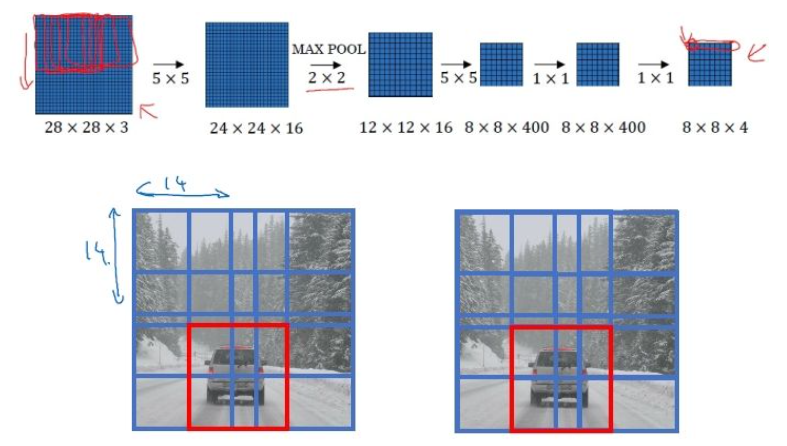
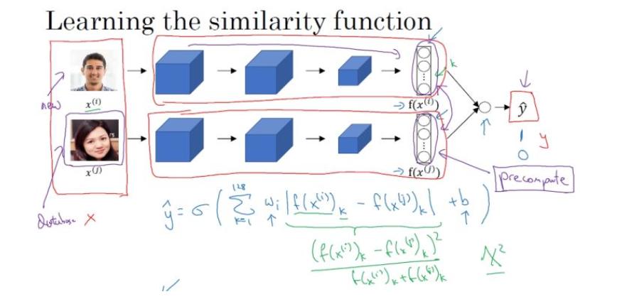
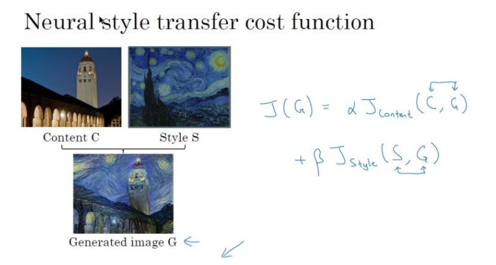

# WEEK5：卷积神经网络

## 5.1 第三章：目标检测

### 5.1.1 目标定位和特征点检测

**图片检测问题：**

- 分类问题：判断图中是否为汽车
- 目标定位：判断是否为汽车，并确定具体位置
- 目标检测：检测不同物体并定位。

**目标分类和定位：**

对于目标定位问题，卷积神经网络模型结构可能如下：

输出：包含图片中存在的对象及定位框

- 行人，0 or 1
- 汽车，0 or 1
- 摩托车，0 or 1
- 图片背景，0 or 1
- 定位框：$b_x$、$b_y$、$b_h$、$b_w$

其中， $b_x$、$b_y$ 表示汽车中点，$b_h$、$b_w$ 分别表示定位框的高和宽。以图片左上角为 (0,0) ，以右下角为 (1,1) ，这些数字均为位置或长度所在图片的比例大小。

**目标标签 y：**

- 当$P_c = 1$ 时，表示图片中存在物体
- 当$P_c = 0$ 时，表示图片中不存在物体，那么此时，输出 $y$ 的其他值为多少均没有意义，也不会参与损失函数的计算：

**损失函数：**

如果采用平方误差形式的损失函数：
- 当$P_c = 1$ 时：$L(\hat{y},y) = (\hat{y_1}-y_1)^2+(\hat{y_2}-y_2)^2+ \cdots + (\hat{y_1}-y_1)^2$

此时，需要关注神经网络对所有输出值的准确度

- 当$P_c = 0$ 时：$L(\hat{y},y) = (\hat{y_1}-y_1)^2$

此时，只关注神经网络对背景值的准确度。

在实际的目标定位应用中，可以使用更好的方式是：

- 对 $c_1、c_2、 c_3$ 和softmax使用**对数似然损失函数**
- 对边界框的四个值应用平方误差或者类似的方法
- 对 $P_c$ 应用**logistic regression损失函数**，或者**平方预测误差**

**特征点检测：**

由前面的目标定位问题，可以知道，神经网络可以通过输出图片上特征点的坐标（x,y），来实现对目标特征的识别和定位标记。

如对于人脸表情识别的问题中，通过标定训练数据集中特征点的位置信息，来对人脸进行不同位置不同特征的定位和标记。AR的应用就是基于人脸表情识别来设计的，如脸部扭曲、增加头部配饰等。

在人体姿态检测中，同样可以通过对人体不同的特征位置关键点的标注，来记录人体的姿态。

### 5.1.2 目标检测

目标检测采用的是基于滑动窗口的检测算法。

**训练模型：**

- 训练集X：将有汽车的图片进行适当的剪切，剪切成整张几乎都被汽车占据的小图或者没有汽车的小图
- 训练集Y：对X中的图片进行标注，有汽车的标注1，没有汽车的标注0

滑动窗口目标检测：

利用滑动窗口在实际图片中实现目标检测。

- 首先选定一个特定大小的窗口，将窗口内的图片输入到模型中进行预测
- 以固定步幅滑动该窗口，遍历图像的每个区域，对窗内的各个小图不断输入模型进行预测
- 继续选取一个更大的窗口，再次遍历图像的每个区域，对区域内是否有车进行预测
- 遍历整个图像，可以保证在每个位置都能检测到是否有车

缺点：计算成本巨大，每个窗口的小图都要进行卷积运算

**卷积层替代全连接层：**

对于卷积网络中全连接层，可以利用 $1 \times 1$ 大小卷积核的卷积层来替代。

在上一周课程中，吴恩达老师讲授过 $1 \times 1$ 的卷积核相当于在一个三维图像的切片上应用了一个全连接的神经网络。同样，全连接层也可以由 $1 \times 1$ 大小卷积核的卷积层来替代。需注意卷积核的个数与隐层神经元个数相同。

**滑动窗口的卷积实现：**

在实现了以卷积层替代全部的全连接层以后，在该基础上进行滑动窗口在卷积层上的操作。下面以一个小的图片为例：

以上面训练好的模型，输入一个 $16 \times 16 \times 3$ 大小的整幅图片，图中蓝色部分代表滑动窗口的大小。以2为大小的步幅滑动窗口，分别与卷积核进行卷积运算，最后得到4幅 $10 \times 10 \times 16$ 大小的特征图，然而因为在滑动窗口的操作时，输入部分有大量的重叠，也就是有很多重复的运算，导致在下一层中的特征图值也存在大量的重叠，所以最后得到的第二层激活值（特征图）构成一副 $12 \times 12 \times 16$ 大小的特征图。对于后面的池化层和全连接层也是同样的过程。

那么由此可知，滑动窗口在整幅图片上进行滑动卷积的操作过程，就等同于在该图片上直接进行卷积运算的过程。所以卷积层实现滑动窗口的这个过程，不需要把输入图片分割成四个子集分别执行前向传播，而是把他们作为一张图片输入到卷积神经网络中进行计算，其中的重叠部分（公共区域）可以共享大量的计算。

**汽车目标检测：**

依据上面的方法，将整张图片输入到训练好的卷积神经网络中。无需再利用滑动窗口分割图片，只需一次前向传播，就可以同时得到所有图片子集的预测值。

利用卷积的方式实现滑动窗口算法的方法，提高了整体的计算效率。

### 5.1.3 Bounding Box 预测

前面一节的卷积方式实现的滑动窗口算法，使得在预测时计算的效率大大提高。但是其存在的问题是：不能输出最精准的边界框（Bounding Box）。

在滑动窗口算法中，取的是一些离散的图片子集的位置，在这种情况下，有可能没有得到一个能够完美匹配汽车位置的窗口，也有可能真实汽车的边界框为一个长方形。所以需要寻找更加精确的边界框。

**YOLO：**

YOLO算法可以使得滑动窗口算法寻找到更加精准的边界框。

- 在整幅图片上加上较为精细的网格，将图片分割成 $n \times n$ 个小的图片
- 采用图像分类和定位算法，分别应用在图像的 $n \times n$ 个格子中

- 定义训练标签：（对于每个网格，定义如前面的向量 $y_i$ ）
  
  $y_i = [P_c\ \ b_x\ \ b_h\ \ b_w\ \ c_1\ \ c_2\ \ c_3]$
  
  对于不同的网格 $i$ 有不同的标签向量 $y_i$

- 将 $n \times n$ 个格子标签合并在一起，最终的目标输出Y的大小为： $n \times n \times 8$ （这里8是因为例子中的目标值有8个）

通过这样的训练集训练得到目标探测的卷积网络模型。可以利用训练好的模型，将与模型输入相同大小的图片输入到训练好的网络中，得到大小为 $n \times n \times 8$ 的预测输出。通过观察 $n \times n$ 不同位置的输出值，就能知道这些位置中是否存在目标物体，然后也能由存在物体的输出向量得到目标物体的更加精准的边界框。

**YOLO notation：**

- 将对象分配到一个格子的过程是：观察对象的中点，将该对象分配到其中点所在的格子中，（即使对象横跨多个格子，也只分配到中点所在的格子中，其他格子记为无该对象，即标记为“0”）；
- YOLO显式地输出边界框，使得其可以具有任意宽高比，并且能输出更精确的坐标，不受滑动窗口算法滑动步幅大小的限制；
- YOLO是一次卷积实现，并不是在 $n \times n$ 网格上进行 $n^2$ 次运算，而是单次卷积实现，算法实现效率高，运行速度快，可以实现实时识别。

**bounding boxes 细节：**

利用YOLO算法实现目标探测的时候，对于存在目标对象的网格中，定义训练标签Y的时候，边界框的指定参数的不同对其预测精度有很大的影响。这里给出一个较为合理的约定：

- 对于每个网格，以左上角为(0,0)，以右下角为(1,1)
- 图中点 $b_x、b_y$ 表示坐标值，在0~1之间
- 宽高 $b_h、b_w$ 表示比例值，存在>1的情况

### 5.1.4 交并比（Intersection-over-Union）

**交并比**函数用来评价目标检测算法是否运作良好。

对于理想的边界框和目标探测算法预测得到的边界框，交并比函数计算两个边界框交集和并集之比。

$IoU = {交集面积 \over 并集面积 }$

一般在目标检测任务中，约定如果 $IoU \ge 0.5$，那么就说明检测正确。当然标准越大，则对目标检测算法越严格。得到的$IoU$值越大越好。

### 5.1.5 非最大值抑制（non-max suppression，NMS）

对于前面提到的目标检测算法，可能会对同一个对象做出多次的检测，非最大值抑制可以确保算法对每个对象只检测一次。

**多网格检测同一物体：**

对于汽车目标检测的例子中，将图片分成很多精细的格子。最终预测输出的结果中，可能会有相邻的多个格子里均检测出都具有同一个对象。

**NMS算法思想：**

- 在对 $n \times n$ 个网格进行目标检测算法后，每个网格输出的 $P_c$ 为一个 0~1 的值，表示有车的概率大小。其中会有多个网格内存在高概率
- 得到对同一个对象的多次检测，也就是在一个对象上有多个具有重叠的不同的边界框
- 非最大值抑制对多种检测结果进行清理：选取最大 $P_c$ 的边界框，对所有其他与该边界框具有高交并比或高重叠的边界框进行抑制
- 逐一审视剩下的边界框，寻找最高的 $P_c$值边界框，重复上面的步骤
- 非最大值抑制，也就是说抑制那些不是最大值，却比较接近最大值的边界框

**NMS算法：**

以单个对象检测为例：

- 对于图片每个网格预测输出矩阵：$y_i = [P_c\ \ b_x\ \ b_y\ \ b_h\ \ b_w]$，其中 $P_c$ 表示有对象的概率
- 抛弃 $P_c \le 0.6 $ 的边界框，也就是低概率的情况
- 对剩余的边界框（while）：
  1. 选取最大 $P_c$ 值的边界框，作为预测输出边界框
  2. 抛弃和选取的边界框$IoU \ge 0.5$ 的剩余的边界框

对于多对象检测，输出标签中就会有多个分量。正确的做法是：对每个输出类别分别独立进行一次非最大值抑制。

### 5.1.6 Anchor box

通过上面的各种方法，目前的目标检测算法在每个格子上只能检测出一个对象。使用**Anchor box** 可以同时检测出多个对象。

**重叠目标：**

对于重叠的目标，这些目标的中点有可能会落在同一个网格中，对于之前定义的输出：

$y_i = [P_c\ \ b_x \ \ b_y\ \ b_h\ \ b_w \ \ c_1 \ \ c_2 \ \ c_3]$，只能得到一个目标的输出

而Anchor box 则是预先定义多个不同形状的Anchor box，需要把预测目标对应地和各个Anchor box 关联起来，所以重新定义目标向量：

$y_i = [P_c\ \ b_x \ \ b_y\ \ b_h\ \ b_w \ \ c_1 \ \ c_2 \ \ c_3 \ \ P_c\ \ b_x \ \ b_y\ \ b_h\ \ b_w \ \ c_1 \ \ c_2 \ \ c_3]$

用这样的多目标向量分别对应不同的Anchor box，从而检测出多个重叠的目标。

- 不使用Anchor box：训练图片中的每个对象，根据对象的中点，分配到对应的格子中。输出大小（例如8）：$n \times n \times 8$
- 使用Anchor box：训练图片的每个对象，根据对象的中点，分配到对应的格子中，同时还分配到一个和对象形状的IoU最高的Anchor box 中。输出大小（例如两个Anchor box）：$n \times n \times 16$

**例子：**

如下面的图片，里面有行人和汽车，可以为其分配两个 Anchor box。对于行人形状更像 Anchor box 1，汽车形状更像 Anchor box 2，所以可以将人和汽车分配到不同的输出位置。

如果格子中只有汽车的时候，此时使用了两个Anchor box，那么这时的目标向量就成为：

$y_i = [0\ \ ? \ \ ?\ \ ?\ \ ? \ \ ? \ \ ? \ \ ? \ \ 1\ \ b_x \ \ b_y\ \ b_h\ \ b_w \ \ c_1 \ \ c_2 \ \ c_3]$

其中，“ ？”代表的是该位置的参数不需要关心。

**Anchor box 的选择：**

- 一般人工指定Anchor box 的形状，选择5~10个以覆盖到多种不同的形状，可以涵盖想要检测的对象的形状
- 高级方法：K-means 算法：将不同对象形状进行聚类，用聚类后的结果来选择一组最具代表性的Anchor box，以此来代表想要检测对象的形状。

### 5.1.7 YOLO算法目标检测

假设需要在图片中检测三种目标：行人、汽车和摩托车，同时使用两种不同的Anchor box。

**训练集：**

- 输入X：同样大小的完整图片
- 目标Y：使用$3 \times 3$ 网格划分，输出大小 $3 \times 3 \times 2 \times 8$ ，或者 $3 \times 3 \times 16$
- 对不同格子中的小图，定义目标输出向量Y

**模型预测：**

输入与训练集中相同大小的图片，同时得到每个格子中不同的输出结果： $3 \times 3 \times 2 \times 8$

**运行非最大值抑制（NMS）：**

- 假设使用了2个Anchor box，那么对于每一个网格，都会得到预测输出的2个bounding boxes，其中一个 $P_c$ 比较高

- 抛弃概率 $P_c$ 值低的预测bounding boxes

- 对每个对象（如行人、汽车、摩托车）分别使用NMS算法得到最终的预测边界框

### 5.1.8 候选区域（region proposals）

**R-CNN：**

R-CNN（Regions with convolutional networks），会在图片中选出一些目标的候选区域，从而避免了传统滑动窗口在大量无对象区域的无用运算。

所以在使用了R-CNN后，一般不会再针对每个滑动窗口运算检测算法，而是只选择一些候选区域的窗口，在少数的窗口上运行卷积网络。

具体实现：运用图像分割算法，将图片分割成许多不同颜色的色块，然后在这些色块上放置窗口，将窗口中的内容输入网络，从而减小需要处理的窗口数量。

**更快的算法：**

- R-CNN：给出候选区域，**不使用滑动窗口**，对每个候选区域进行分类识别，输出对象 标签 和 bounding box，从而在确实存在对象的区域得到更精确的边界框，但速度慢
- Fast R-CNN：给出候选区域，使用**滑动窗口的卷积实现**去分类所有的候选区域，但得到候选区的聚类步骤仍然非常慢
- Faster R-CNN：使用**卷积网络**给出候选区域

## 5.2 第四章：人脸识别和神经风格迁移

## Part 1：人脸识别

### 5.2.1 人脸验证和人脸识别

**人脸验证（Verification）：**

- Input：图片、名字/ID
- Output：输入的图片是否是对应的人
- 1 to 1 问题

**人脸识别（Recognition）：**

- 拥有一个具有K个人的数据库
- 输入一副人脸图片
- 如果图片是任意这K个人中的一位，则输出对应人的ID

人脸识别问题对于人脸验证问题来说，具有更高的难度。如对于一个验证系统来说，如果拥有 99% 的精确度，那么这个验证系统已经具有了很高的精度；但是假设在另外一个识别系统中，如果把这个验证系统应用在具有K个人的识别系统中，那么系统犯错误的机会就变成了K倍。所以如果想在识别系统中得到更高的精度，那么就需要得到一个具有更高精度的验证系统。

### 5.2.2 one shot learning

对于大多数的人脸识别系统都存在的一个问题就是one shot learning。

**什么是 one shot learning：**

对于一个人脸识别系统，需要仅仅通过先前的一张人脸的图片或者说一个人脸的样例，就能够实现该人的识别，那么这样的问题就是 one shot 问题。对于存在于数据库中的人脸图片，系统能够识别到对应的人；而不在数据库中的人脸图片，则系统给出无法通过识别的结果。

对于one shot learning 问题，因为只有单个样本，是不足以训练一个稳健的卷积神经网络来进行不同人的识别过程。而且，在有新的样本成员加入的时候，往往还需要对网络进行重新训练。所以不能以传统的方法来实现识别系统。

**Similarity 函数：**

为了能够让人脸识别系统实现一次学习，需要让神经网络学习 **Similarity** 函数：

- $d(img1, img2)$：两幅图片之间的差异度
- 输入：两幅图片
- 输出：两者之间的差异度
- 如果 $d(img1, img2)$ ，则输出“ same ”
  如果 $d(img1, img2)$ ，则输出“ different ”

对于人脸识别系统，通过将输入的人脸图片与数据库中所拥有的图片成对输入Similarity函数，两两对比，则可解决one shot problem。如果有新的人加入团队，则只需将其图片添加至数据库即可。

### 5.2.3 Siamese 网络

利用Siamese 网络来实现 Similarity 函数。

**构建网络：**

对于一个卷积神经网络结构，去掉最后的softmax层，将图片样本1输入网络，最后由网络输出一个N维的向量（图中实例以128表示），这N维向量则代表输入图片样本1的编码。将不同人的图片样本输入相同参数的网络结构，得到各自相应的图片编码。

**Similarity 函数实现：**

将Similarity 函数表示成两幅图片编码之差的范数：

$d(x_1,x_2) = \parallel f(x_1) - f(x_2) \parallel ^2$

那么也就是说：

- 神经网络的参数定义了图片的编码
- 学习网络的参数，可以得到好的Similarity 函数
  如果 $x_1, x_2$ 是同一个人的图片，那么得到的$ \parallel f(x_1) - f(x_2) \parallel ^2 $
  如果 $x_1, x_2$ 不是同一个人的图片，那么得到的$ \parallel f(x_1) - f(x_2) \parallel ^2 $

### 5.2.4 Triplet 损失

如何通过学习神经网络的参数，得到优质的人脸图片的编码？方法之一就是定义 Triplet 损失函数，并在其之上运用梯度下降。

**学习目标：**

使用Triplet 损失函数，需要比较成对的图像（三元组术语）：

- Anchor （A）： 目标图片
- Positive（P）：与Anchor 属于同一个人的图片
- Negative（N）：与Anchor不属于同一个人的图片

对于Anchor 和 Positive，希望二者编码的差异小一些；对于Anchor 和Negative，则希望他们编码的差异大一些。所以目标以编码差的范数来表示为：

$d(A, P) = \parallel f(A) - f(P) \parallel ^2 \le \parallel f(A) - f(N) \parallel ^2 = d(A, N)$

也就是：

$\parallel f(A) - f(P) \parallel ^2 - \parallel f(A) - f(N) \parallel ^2 \le 0$

当 $f(A) = f(P) = f(N) = 0$时，也就是神经网络学习到的函数总是输出0时，或者 $f(A) = f(P) = f(N)$时，也满足上面的公式，但却不是想要的目标结果。所以为了防止出现这种情况，需要对上式进行修改，使得两者差要小于一个较小的负数：

$\parallel f(A) - f(P) \parallel ^2 - \parallel f(A) - f(N) \parallel ^2 \le -\alpha$

一般将 $-\alpha$ 写成 $+\alpha$ ，称为“margin”即：

$\parallel f(A) - f(P) \parallel ^2 - \parallel f(A) - f(N) \parallel ^2  +\alpha \le 0$

不同 margin 值的设置对模型学习具有不同的效果，margin 的作用就是拉大了 Anchor与Positive 图片对 和 Anchor与Negative 图片对之间的差距。

**Triplet 损失函数：**

Triplet 损失函数的定义基于三张图片：Anchor、Positive、Negative。

$L(A, P, N) = \max(\parallel f(A) - f(P) \parallel ^2 - \parallel f(A) - f(N) \parallel ^2  +\alpha , 0)$

**整个网络的代价函数：**

$J = \sum_{i=1}^mL(A^{(i)}, P^{(i)}, N^{(i)})$

假设有一个10000张片的训练集，里面是1000个不同的人的照片样本。需要做的就是从这10000张训练集中抽取图片生成（A,P,N）的三元组，来训练本地的学习算法，并在Triplet 损失函数上进行梯度下降。

注意：为了训练本地的网络，必须拥有Anchor和Positive对，所以这里必须有每个人的多张照片，而不能仅仅是一张照片，否则无法训练网络。

**三元组（A,P,N）的选择：**

在训练的过程中，如果随机地选择图片构成三元组（A,P,N），那么对于下面的条件是很容易满足的：

$d(A,P)+\alpha \le d(A, N)$

所以，为了更好地训练网络，需要选择那些训练有“难度”的三元组，也就是选择的三元组满足：

$d(A,P) \thickapprox d(A, N)$

- 算法将会努力使得 $d(A,N)$ 变大，或者使得 $d(A, N)+\alpha $ 变小，从而使两者之间至少有一个 $\alpha$ 的间隔
- 增加学习算法的计算效率，避免那些太简单的三元组

最终通过训练，学习到的参数，会使得对于同一个人的图片，编码的距离很小；对不同人的图片，编码的距离就很大。

对于大型的人脸识别系统，常常具有上百万甚至上亿的训练数据集，并非容易得到。所以对于该领域，常常是下载别人在网上上传的预训练模型，而不是从头开始。

### 5.2.5 脸部验证和二分类

除了利用 Triplet 损失函数来学习人脸识别卷积网络参数的方法外，还有其他的方式。可以将人脸识别问题利用 Siamese 网络当成一个二分类问题，同样可以实现参数的学习。

**Siamese 二分类改进：**

对两张图片应用 Siamese 网络，计算得到两张图片的N维编码，然后将两个编码输入到一个logistic regression 单元中，然后进行预测。如果是相同的人，那么输出是1；如果是不同的人，输出是0。那么这里就将人脸识别的问题，转化为一个二分类问题。

对于最后的sigmoid函数，可以进行如下计算：

其中， $f(x^{(i)})$ 代表图片 $x^{(i)}$ 的编码，下标 $k$ 代表选择N维编码向量中的第 $k$ 个元素。

以两个图片编码向量对应元素之间的差值作为特征输入到logistic regression 的单元中，增加参数 $w_i$ 和 b ，通过训练得到合适的参数权重和偏置，进而判断两张图片是否为同一个人。

同时输入逻辑回归单元的特征可以进行更改，如还可以是：

上式也被称为 $\chi$ 方公式，有时也称为 $\chi$ 方相似度。

在实际的人脸验证系统中，可以对数据库的人脸图片进行预计算，存储卷积网络得到的编码。当有图片进行识别时，运用卷积网络计算新图片的编码，与预计算保存好的编码输入到逻辑回归单元中进行预测。这样可以提高系统预测的效率，节省计算时间。

**总结：**

利用Siamese 网络，可以将人脸验证当作一个监督学习，创建成对的训练集和是否同一个人的输出标签。

利用不同的图片对，使用反向传播的算法对Siamese网络进行训练，进而得到人脸验证系统。

## Part 2：神经风格迁移

### 5.2.6 深度网络学习内容可视化

**如何可视化：**

假设训练了一个卷积神经网络如下所示：

需要看到不同层的隐藏单元的计算结果。依次对各个层进行如下操作：

- 在当前层挑选一个隐藏单元
- 遍历训练集，找到最大化地激活了该运算单元的图片或者图片块
- 对该层的其他运算单元执行操作

对于在第一层的隐藏单元中，其只能看到卷积网络的小部分内容，也就是最后找到的那些最大化激活第一层隐层单元的是一些小的图片块。可以理解为第一层的神经单元通常会寻找一些简单的特征，如边缘或者颜色阴影等。

**各层网络可视化：**

对于卷积网络的各层单元，随着网络深度的增加，隐藏层计算单元随着层数的增加，从简单的事物逐渐到更加复杂的事物。

### 5.2.7 神经风格迁移代价函数

**代价函数：**

为了实现神经风格迁移，需要为生成的图片定义一个代价函数。

对于神经风格迁移，目标是由内容图片C和风格图片S，生成最终的风格迁移图片G：

所以为了实现神经风格迁移，需要定义关于G的代价函数J，以用来评判生成图片的好坏：

$J(G) = \alpha J_{content}(C,G) + \beta J_{style}(S,G)$

其中
- $J_{content}(C,G)$代表生成图片G的内容和内容图片C的内容的相似度
- $J_{style}(S,G)$代表生成图片G的内容和风格图片S的内容的相似度
- $\alpha、\beta$ 两个超参数用来表示以上两者之间的权重

**执行过程：**

- 随机初始化生成图片G，如大小为 $100 \times 100 \times 3$
- 使用梯度下降算法最小化上面定义的代价函数$J(G)，G = G - {{\partial J(G)} \over \partial G}$

对于上图的内容图片C和风格图片S，通过梯度下降算法一次次的训练，可以由初始的噪声图片得到最终的风格迁移图片G。

### 5.2.8 内容代价函数（Content cost）

- 假设使用隐藏层 $l$ 来计算内容代价。（如果选择的 $l$ 太小，那么代价函数就会使得的生成图片G在像素上非常接近内容图片；然而用很深的网络，那么生成图片G中就会产生与内容图片中所拥有的物体。所以对于 $l$ 一般选在网络的中间层，既不深也不浅）
- 使用一个预训练的卷积网络。（如，VGG或其他）
- 令 $a^{[l](c)}$ 和 $a^{[l](G)}$ 分别代表内容图片C和生成图片G的 $l$ 层的激活值
- 如果 $a^{[l](c)}$ 和 $a^{[l](G)}$ 相似，那么两张图片就有相似的内容

定义内容代价函数如下：

$J_{content}(C,G) = {{1 \over 2}{\parallel}a^{[l](c)} - a^{[l](G)} \parallel^2}$

在对代价函数运行梯度下降算法时，会激励这里的内容代价函数，努力使得生成图片G隐含层 $l$ 的激活值和内容图片C隐含层 $l$ 的激活值相似

### 5.2.9 风格代价函数（Style cost）

**“Style”的含义：**

对于一个卷积网络中，选择网络的中间层 $l$ ， 定义“Style”表示 $l$ 层的各个通道激活项之间的相关性

相关性大小的度量：

上面是 $l$ 层的激活项，对于不同的通道值，代表不同的神经元所学习到的特征，这里假如红色的通道可以找到图片中含有垂直纹理特征的区域，黄色通道可以找出橙色的区域。

而相关性大小的含义就是，如假设中，图片出现垂直纹理特征的区域显示橙色可能的大小。

将相关系数应用到风格图片S和生成图片G的对应通道上，就可以度量风格图片和生成图片的相似度。

**Style 矩阵：**

上面的矩阵在线性代数中又称为Gram 矩阵，这里称为风格矩阵。

**代价函数：**

内容代价函数和风格代价函数前面的归一化可以加也可以不加，因为总体的代价函数前面有权重系数。

如果对各层都使用风格代价函数，那么会让结果变得更好：

### 5.2.10 1D to 3D 卷积

卷积运算还可以推广到1D和3D的情况。

**2D和1D卷积：**

- 2D卷积： $14 \times 14 \times 3 \cdot 5 \times 5 \times 3 \longrightarrow 10 \times 10 \times n_c $
- 1D卷积： $14 \times 1 \cdot 5 \times 1 \longrightarrow 10 \times n_c$

**3D卷积：**

3D卷积：$14 \times 14 \times 14 \times 1 \cdot 5 \times 5 \times 5 \times 1 \longrightarrow 10 \times 10 \times \times 10 \times n_c $