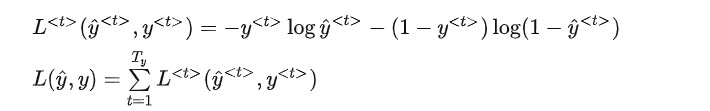
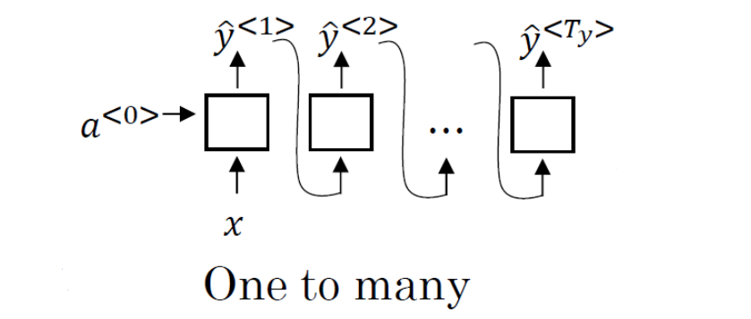
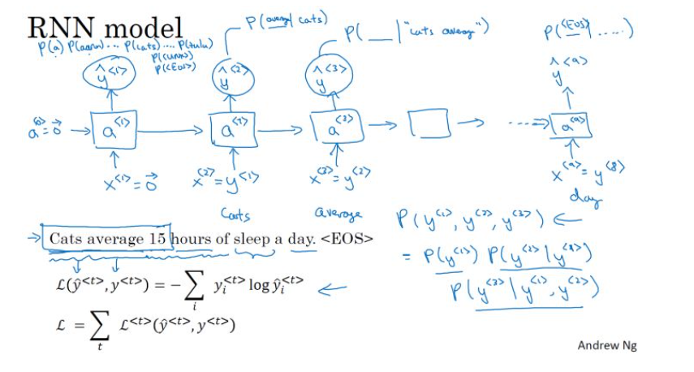
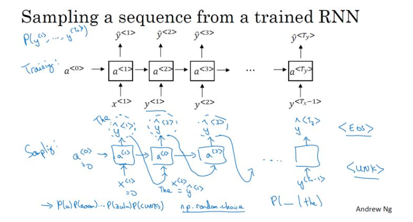
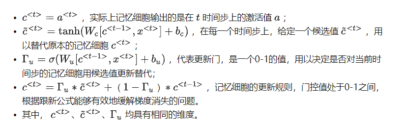
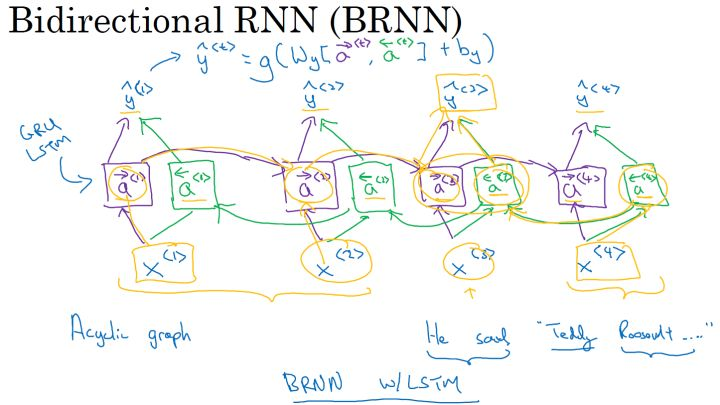
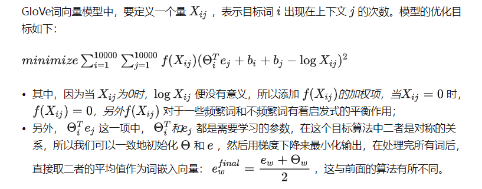

# WEEK6：序列神经网络

## 6.1 第一章：循环神经网络

### 6.1.1 序列模型的应用

这些序列模型基本都属于监督式学习，输入 x 和输出 y 不一定都是序列模型。如果都是序列模型的话，模型长度不一定完全一致。

- 语音识别：将输入的语音信号直接输出相应的语音文本信息。无论是语音信号还是文本信息均是序列数据。
- 音乐生成：生成音乐乐谱。只有输出的音乐乐谱是序列数据，输入可以是空或者一个整数。
- 情感分类：将输入的评论句子转换为相应的等级或评分。输入是一个序列，输出则是一个单独的类别。
- DNA序列分析：找到输入的DNA序列的蛋白质表达的子序列。
- 机器翻译：两种不同语言之间的想换转换。输入和输出均为序列数据。
- 视频行为识别：识别输入的视频帧序列中的人物行为。
- 命名实体识别：从输入的句子中识别实体的名字。

### 6.1.2 符号定义

**Harry Potter and Hermione Granger invented a new spell.**

对于输入 x，表示为：

$\left[\mathrm{x}^{<1>} \mathrm{x}^{<2>} \mathrm{x}^{<3>} \mathrm{x}^{<4>} \mathrm{x}^{<5>} \mathrm{x}^{<6>} \mathrm{x}^{<7>} \mathrm{x}^{<8>} \mathrm{x}^{<9>}\right]$

$\mathrm{x}^{<t>}$表示序列对应位置的输入，$T_x$表示输入序列长度。

该句话包含 9 个单词，输出 y 即为 1 x 9 向量，每位表征对应单词是否为人名的一部分，1 表示是，0 表示否。很明显，该句话中 “Harry”，“Potter”，“Hermione”，“Granger” 均是人名成分，所以，对应的输出 y 可表示为：

$\mathrm{y}=\left[\begin{array}{lllllllll}
1 & 1 & 0 & 1 & 1 & 0 & 0 & 0 & 0
\end{array}\right]$

$\mathrm{y}^{<t>}$表示序列对应位置的输入，$T_y$表示输入序列长度，则$1 \leq \mathrm{t} \leq \mathrm{T}_{\mathrm{y}}$

$\mathrm{x}^{<t>}$用 one-hot 编码表示，首先定义词库找出单词对应索引，然后用高维词库对应的高维向量表示。

如果出现词汇表之外的单词，可以使用 UNK 或其他字符串来表示。

对于多样本，以上序列模型对应的命名规则可表示为：$\mathrm{X}^{(\mathrm{i})<\mathrm{t}>}, \mathrm{y}^{(\mathrm{i})<\mathrm{t}>}, \mathrm{T}_{\mathrm{x}}^{(\mathrm{i})}, \mathrm{T}_{\mathrm{y}}^{(\mathrm{i})}$

其中，i 表示第 i 个样本。不同样本的$\mathrm{T}_{\mathrm{x}}^{(\mathrm{i})}$或$\mathrm{T}_{\mathrm{y}}^{(\mathrm{i})}$都有可能不同。

### 6.1.3 循环神经网络模型

**传统标准的神经网络：**

对于序列模型，如果使用标准的神经网络，其模型结构如下：

使用标准的神经网络模型存在两个问题：

- 不同样本的输入序列长度或输出序列长度不同，即 $\mathrm{T}_{\mathrm{x}}^{(\mathrm{i})} \neq \mathrm{T}_{\mathrm{x}}^{(\mathrm{j})}, \mathrm{T}_{\mathrm{y}}^{(\mathrm{i})} \neq \mathrm{T}_{\mathrm{y}}^{(\mathrm{j})}$，造成模型难以统一。解决办法之一是**设定一个最大序列长度**，对每个输入和输出序列补零并统一到最大长度。但是**这种做法实际效果并不理想**。
- 第二个问题，这种标准神经网络结构**无法共享序列不同$\mathrm{x}^{<t>}$之间的特征**。

**循环神经网络：**

标准的神经网络不适合解决序列模型问题，而循环神经网络（RNN）是专门用来解决序列模型问题的。RNN 模型结构如下：

序列模型从左到右，依次传递，此例中，$T_x = T_y$。$\mathrm{x}^{<t>}$到$\mathrm{y}^{<t>}$之间是隐藏神经元。$\mathrm{a}^{<t>}$会传入到第 t+1 个元素中，作为输入。其中$\mathrm{a}^{<0>}$一般为零向量。

RNN 模型包含三类权重系数，分别是$W_{ax}, W_{aa}, W_{ya}$，**且不同元素之间同一位置共享同一权重系数。**

RNN 的正向传播（Forward Propagation）过程为：

$\mathrm{a}^{<\mathrm{t}>}=\mathrm{g}\left(\mathrm{W}_{\mathrm{aa}} \cdot \mathrm{a}^{<\mathrm{t}-1>}+\mathrm{W}_{\mathrm{ax}} \cdot \mathrm{x}^{<\mathrm{t}>}+\mathrm{ba}\right)$

$\hat{\mathrm{y}}^{<\mathrm{t}>}=\mathrm{g}\left(\mathrm{W}_{\mathrm{ya}} \cdot \mathrm{a}^{<\mathrm{t}>}+\mathrm{b}_{\mathrm{y}}\right)$

其中，g(x) 表示激活函数，不同的问题需要使用不同的激活函数。

### 6.1.4 穿越时间的反向传播

为了进行反向传播计算，使用梯度下降等方法来更新RNN的参数，需要定义一个损失函数：

上式表示将每个输出的损失进行求和即为整体的损失函数。反向传播算法按照前向传播相反的方向进行导数计算，来对参数进行更新。其中比较特别的是在RNN中，从右向左的反向传播计算是通过时间来进行，像穿越时间的反向计算。

### 6.1.5 不同类型的RNN

对于RNN，不同的问题需要不同的输入输出结构。

**many-to-many( $T_x = T_y$ ):**

这种情况下的输入和输出的长度相同，是上面例子的结构，如下图所示：

**many-to-one：**

如在情感分类问题中，需要对某个序列进行正负判别或者打星操作。在这种情况下，就是输入是一个序列，但输出只有一个值：

**one-to-many：**

如在音乐生成的例子中，输入一个音乐的类型或者空值，直接生成一段音乐序列或者音符序列。在这种情况下，就是输入是一个值，但输出是一个序列：

**many-to-many( $T_x  \ne T_y$ )：**

上面介绍的一种RNN的结构是输入和输出序列的长度是相同的，但是像机器翻译这种类似的应用来说，输入和输出都是序列，但长度却不相同，这是另外一种多对多的结构：

### 6.1.6 语言模型和序列生成

在NLP中，构建语言模型是最基础也是最重要的工作之一，可以通过RNN来很好的实现。

**什么是语言模型？**

对于下面的例子，两句话有相似的发音，但是想表达的意义和正确性却不相同，如何让构建的语音识别系统能够输出正确地给出想要的输出。也就是对于语言模型来说，从输入的句子中，评估各个句子中各个单词出现的可能性，进而给出整个句子出现的可能性。

**使用RNN构建语言模型：**

- 训练集：一个很大的语言文本语料库；
- Tokenize：将句子使用字典库标记化；
- 其中，未出现在字典库中的词使用“UNK”来表示；
- 第一步：使用零向量对输出进行预测，即预测第一个单词是某个单词的可能性；
- 第二步：通过前面的输入，逐步预测后面一个单词出现的概率；
- 训练网络：使用softmax损失函数计算损失，对网络进行参数更新，提升语言模型的准确率。

### 6.1.7 新序列采样

在完成一个序列模型的训练之后，如果想要了解这个模型学到了什么，其中一种非正式的方法就是进行一次新序列采样（sample novel sequences）。对于一个序列模型，其模拟了任意特定单词序列的概率，如$P(y^{<1>}, \dots,y^{<T_y>})$  ，而要做的就是对这个概率分布进行采样，来生成一个新的单词序列。

如下面的一个已经训练好的RNN结构，这是为了进行采样需要做的：

- 首先输入 $x^{<1>} = 0,a^{<0>} = 0$，在这第一个时间步，得到所有可能的输出经过$softmax$层后可能的概率，根据这个$softmax$的分布，进行随机采样，获取第一个随机采样单词$\hat{y}^{<1>}$
- 然后继续下一个时间步，以刚刚采样得到的$\hat{y}^{<1>}$作为下一个时间步的输入，进而
$softmax$层会预测下一个输出$\hat{y}^{<2>}$，依次类推
- 如果字典中有结束的标志如：“EOS”，那么输出是该符号时则表示结束；若没有这种标志，则可以自行设置结束的时间步。

上面的模型是基于词汇的语言模型，还可以构建基于字符的语言模型，其中每个单词和符号则表示一个相应的输入或者输出：

但是基于字符的语言模型，一个主要的缺点就是最后会得到太多太长的输出序列，其对于捕捉句子前后依赖关系，也就是句子前部分如何影响后面部分，不如基于词汇的语言模型那样效果好；同时基于字符的语言模型训练代价比较高。所以目前的趋势和常见的均是基于词汇的语言模型。但随着计算机运算能力的增强，在一些特定的情况下，也会开始使用基于字符的语言模型。

### 6.1.8 RNN的梯度消失

RNN在NLP中具有很大的应用价值，但是其存在一个很大的缺陷，那就是梯度消失的问题。例如下面的例句中：
- The cat, which already ate ...........，was full；
- The cats, which already ate ...........，were full.

在这两个句子中，cat对应着was，cats对应着were，（中间存在很多很长省略的单词），句子中存在长期依赖（long-term dependencies），前面的单词对后面的单词有很重要的影响。但是目前所见到的基本的RNN模型，是不擅长捕获这种长期依赖关系的。

如下图所示，和基本的深度神经网络结构类似，输出y得到的梯度很难通过反向传播再传播回去，也就是很难对前面几层的权重产生影响，所以RNN也有同样的问题，也就是很难让网络记住前面的单词是单数或者复数，进而对后面的输出产生影响。

对于梯度消失问题，在RNN的结构中是首要关心的问题，也更难解决；虽然梯度爆炸在RNN中也会出现，但对于梯度爆炸问题，因为参数会指数级的梯度，会让网络参数变得很大，得到很多的Nan或者数值溢出，所以梯度爆炸是很容易发现的，解决方法就是用梯度修剪，也就是观察梯度向量，如果其大于某个阈值，则对其进行缩放，保证它不会太大。

### 6.1.9 GRU单元

门控循环单元（Gated Recurrent Unit, GRU）改变了RNN的隐藏层，使其能够更好地捕捉深层次连接，并改善了梯度消失的问题。

RNN单元：

对于RNN的一个时间步的计算单元，在计算$a^{<t>}$也就是下图右边的公式，能以左图的形式可视化呈现：

**简化的GRU 单元：**

以时间步从左到右进行计算的时候，在GRU单元中，存在一个新的变量称为  ，（代表cell）,作为“记忆细胞”，其提供了长期的记忆能力。

GRU的可视化实现如下图右边所示：

**完整的GRU 单元：**

完整的GRU单元还存在另外一个门，以决定每个时间步的候选值，公式如下：

### 6.1.10 LSTM

长短期记忆（long short-term memory, LSTM）对捕捉序列中更深层次的联系要比GRU更加有效。

LSTM中，使用了单独的更新门$\Gamma_u$和$\Gamma_f$，以及一个输出门$\Gamma_o$，主要公式如下：

LSTM单元的可视化图如下所示：

### 6.1.11 双向RNN

双向RNN（bidirectional RNNs）模型能够让我们在序列的某处，不仅可以获取之间的信息，还可以获取未来的信息。

对于下图的单向RNN的例子中，无论RNN单元是基本的RNN单元，还是GRU，或者LSTM单元，对于例子中第三个单词"Teddy"很难判断是否是人名，仅仅使用前面的两个单词是不够的，需要后面的信息来进行判断，但是单向RNN就无法实现获取未来的信息。

而双向RNN则可以解决单向RNN存在的弊端。在BRNN中，不仅有从左向右的前向连接层，还存在一个从右向左的反向连接层。

在NLP问题中，常用的就是使用双向RNN的LSTM。

### 6.1.12 深层RNNs

与深层的基本神经网络结构相似，深层RNNs模型具有多层的循环结构，但不同的是，在传统的神经网络中，可能会拥有很多层，几十层上百层，但是对与RNN来说，三层的网络结构就已经很多了，因为RNN存在时间的维度，所以其结构已经足够的庞大。如下图所示：

## 6.2 自然语言处理和词嵌入

### 6.2.1 词汇表征

为了让计算机能够能更好地理解人类的语言，建立更好的语言模型，需要将词汇进行表征。下面是几种不同的词汇表征方式：

**one-hot 表征：**

对应单词的位置用1表示，其余位置用0表示，如下图所示：

one-hot表征的缺点：这种方法将每个词孤立起来，使得模型对相关词的泛化能力不强。每个词向量之间的距离都一样，乘积均为0，所以无法获取词与词之间的相似性和关联性。

**特征表征：词嵌入**

用不同的特征来对各个词汇进行表征，相对与不同的特征，不同的单词均有不同的值。如下例所示：

这种表征方式使得词与词之间的相似性很容易地表征出来，这样对于不同的单词，模型的泛化性能会好很多。下面是使用t-SNE算法将高维的词向量映射到2维空间，进而对词向量进行可视化，很明显可以看出对于相似的词总是聚集在一块儿：

### 6.2.2 使用 Word Embeddings

Word Embeddings对不同单词进行了实现了特征化的表示。

**名字实体识别的例子：**

如下面的一个句子中名字实体的定位识别问题，假如有一个比较小的数据集，可能不包含durain（榴莲）和cultivator（培育家）这样的词汇，那么就很难从包含这两个词汇的句子中识别名字实体。但是如果可以从网上的其他地方获取了一个学习好的word Embedding，它将告诉我们榴莲是一种水果，并且培育家和农民相似，那么就有可能从少量的训练集中，归纳出没有见过的词汇中的名字实体。

**词嵌入的迁移学习：**

词嵌入迁移学习的步骤：
- 第一步：从大量的文本集合中学习word Embeddings（1-100B words），或者从网上下载预训练好的词嵌入模型；
- 第二步：将词嵌入模型迁移到本地小训练集的新任务上；
- 第三步：可选，使用新的标记数据对词嵌入模型继续进行微调。

**词嵌入和人脸编码：**

词嵌入和人脸编码之间有很奇妙的联系。在人脸识别领域，通常会将人脸图片预编码成不同的编码向量，以表示不同的人脸，进而在识别的过程中使用编码来进行比对识别。词嵌入则和人脸编码有一定的相似性。

但是不同的是，对于人脸识别，可以将任意一个没有见过的人脸照片输入到本地构建的网络中，则可输出一个对应的人脸编码。而在词嵌入模型中，所有词汇的编码是在一个固定的词汇表中进行学习单词的编码以及其之间的关系的。

### 6.2.3 词嵌入的特性

**类比推理特性：**

词嵌入还有一个重要的特性，它还能够帮助实现类比推理。如下面的例子中，通过不同词向量之间的相减计算，可以发现不同词之间的类比关系，man——woman、king——queen，如下图所示：

计算词与词之间的相似度，实际上是在多维空间中，寻找词向量之间各个维度的距离相似度。

**相似度函数：**

### 6.2.4  嵌入矩阵

在对一个词汇表学习词嵌入模型时，实质上就是要学习这个词汇表对应的一个嵌入矩阵$E$。当学习好了这样一个嵌入矩阵后，通过嵌入矩阵与对应词的one-hot向量相乘，则可得到该词汇的embedding，如下图所示：

### 6.2.5 学习词嵌入

**上下文和目标词对：**

将要预测的单词称为目标词，其是通过一些上下文推导预测出来的。对于不同的问题，上下文的大小和长度以及选择的方法有所不同。

- 选取目标词之前的几个词；
- 选取目标词前后的几个词；
- 选取目标词前的一个词；
- 选取目标词附近的一个词，（一种Skip-Gram模型的思想）。

### 6.2.6 Word2Vec

Word2Vec算法是一种简单的计算更加高效的方式来实现对词嵌入的学习。

**Skip-grams：**

在Skip-grams模型中，需要抽取上下文（Content）和目标词（Target）配对，来构造一个监督学习问题。

上下文不一定是要目标词前面或者后面离得最近的几个单词，而是随机选择一个词作为上下文，同时在上下文的一定距离范围内随机选择另外一个词作为目标词。构造这样一个监督学习问题的目的，并不是想要解决监督学习问题本身，而是想要使用这个问题来学习一个好的词嵌入模型。

**模型流程：**

**存在的问题：**

- 计算速度的问题，如在上面的 $Softmax$单元中，需要对所有10000个整个词汇表的词做求和计算，计算量庞大。
- 简化方案：使用分级$Softmax$分类器，其计算复杂度是前面的$log|v|$级别。在构造分级$softmax$分类器时，一般常用的词会放在树的顶部位置，而不常用的词则会放在树的更深处，其并不是一个平衡的二叉树。

**如何采样上下文：**

在构建上下文目标词对时，如何选择上下文与模型有不同的影响。

- 对语料库均匀且随机地采样：使得如the、of、a等这样的一些词会出现的相当频繁，导致上下文和目标词对经常出现这类词汇，但想要的目标词却很少出现。
- 采用不同的启发来平衡常见和不常见的词进行采样。这种方法是实际使用的方法。

### 6.2.7 负采样

**新的学习问题：**

- 定义一个新的学习问题：预测两个词之间是否是上下文-目标词对，如果是词对，则学习的目标为1；否则为0。
- 使用k次相同的上下文，随机选择不同的目标词，并对相应的词对进行正负样本的标记，生成训练集。
- 建议：小数据集，k=5 ~ 20；大数据集，k=2 ~ 5。
- 最后学习$x-y$的映射关系。

**模型：**

在负采样模型中，可以使用logistic回归模型：

$P(y=1|c,t) = \sigma(\theta_t^Te_c)$

每个正样本均有k个对应的负样本。在训练的过程中，对于每个上下文词，就有对应的$k+1$个分类器。如下图所示：

相比与Skip-grams模型，负采样不再使用一个具有词汇表大小时间复杂度高的庞大维度的Softmax，而是将其转换为词汇表大小个二分类问题。每个二分类任务都很容易解决，因为每个的训练样本均是1个正样本，外加k个负样本。

**如何选择负样本：**

在选定了上下文（Content）后，在确定正样本的情况下，还需要选择k个负样本以训练每个上下文的分类器。

### 6.2.8 GloVe 词向量

**GloVe模型：**

从上面的目标中，可以得出想要学习一些向量，他们的输出能够对上下文和目标两个词同时出现的频率进行很好的预测，从而得到想要的词嵌入向量。

**词嵌入的特征化：**

通过上面的很多算法得到的词嵌入向量，无法保证词嵌入向量的每个独立分量是能够可以理解的。能够确定是每个分量是和预想的一些特征是有关联的，其可能是一些能够理解的特征的组合而构成的一个组合分量。使用上面的GloVe模型，从线性代数的角度解释如下：

加入的$A$项，可能构成任意的分量组合。

### 6.2.9 情感分类

情感分类就是通过一段文本来判断这个文本中的内容是否喜欢其所讨论的内容，这是NLP中最重要的模块之一。

情感分类任务存在的一个问题就是只有很小的数据集，缺乏训练样本。但是在使用了词嵌入后，则能够带来很好的效果，足以训练一个良好的情感分类模型。

**平均值或和的模型：**

- 获取一个训练好的词嵌入矩阵 $E$ 
- 得到每个词的词嵌入向量，并对所有的词向量做平均或者求和
- 输入到$softmax$分类器中，得到最后的输出$\hat{y}$
- 缺点：没有考虑词序，可能会导致多数的积极词汇削弱前面消极词汇的影响，从而造成错误的预测。

**RNN模型：**

- 取一个训练好的词嵌入矩阵$E$
- 得到每个词的词嵌入向量，输入到many-to-one的RNN模型中
- 通过最后的softmax分类器，得到最后的输出$\hat{y}$
- 优点：考虑了词序，效果好很多

### 6.2.10 词嵌入消除偏见

**目前的偏见问题：**

以一些预料库中学习到的词嵌入向量，会发现学习到的词向量存在下面一些具有性别、种族等偏见，这反映了人们在历史的写作中存在的这种社会偏见：

**消除偏见的方法：**

- 定义偏见的方向：如性别
- 对大量性别相对的词汇进行相减并求平均
- 通过平均后的向量，则可以得到一个或多个偏见趋势相关的维度，以及大量不相关的维度
- 中和化：对每一个定义不明确的词汇，进行偏见的处理，如像 doctor、babysitter 这类词；通过减小这些词汇在得到的偏见趋势维度上值的大小
- 均衡：将如 grandmother 和 grandfather 这种对称词对调整至babysitter这类词汇平衡的位置上，使babysitter这类词汇处于一个中立的位置，进而消除偏见

