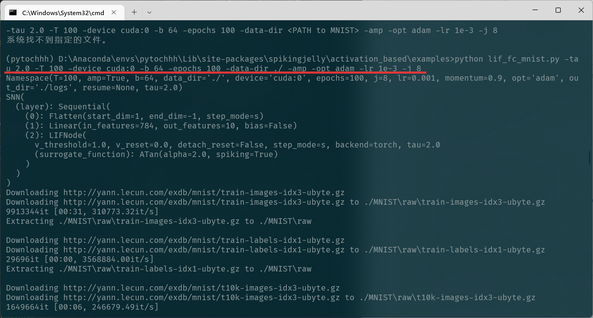
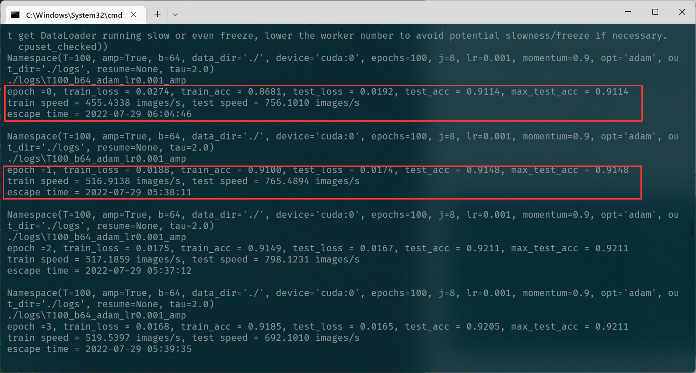
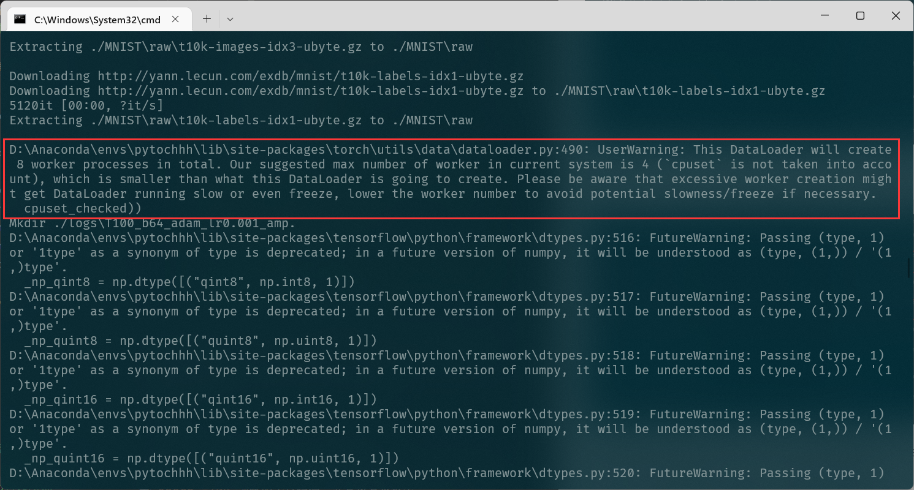
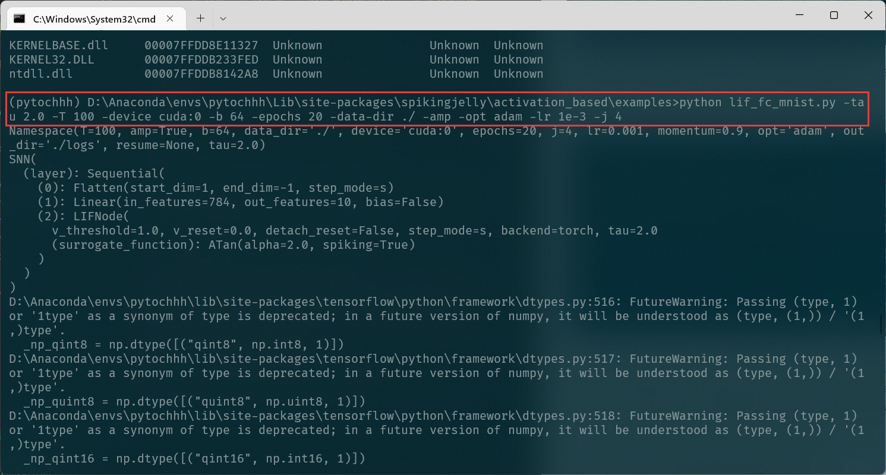
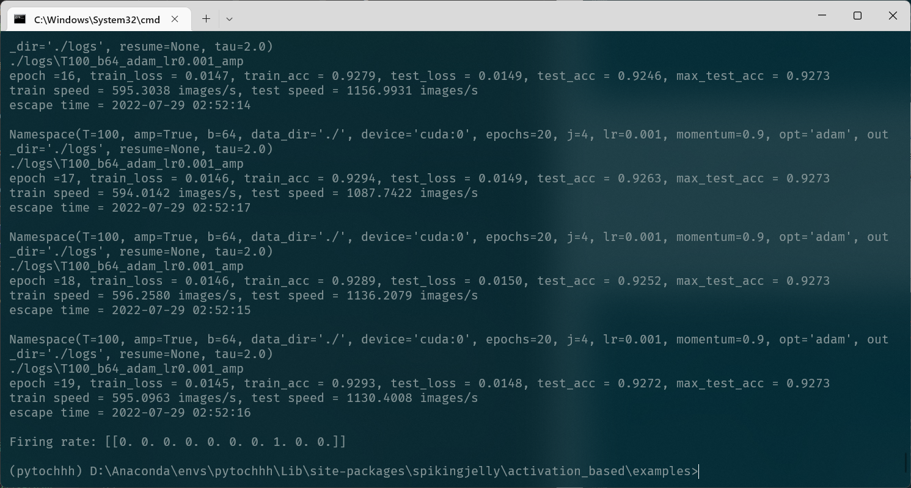
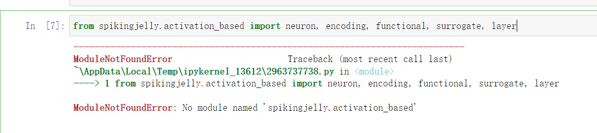
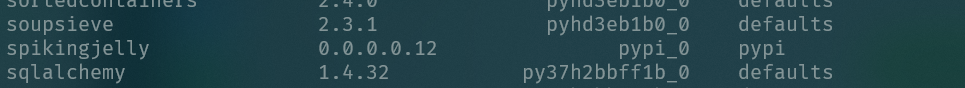
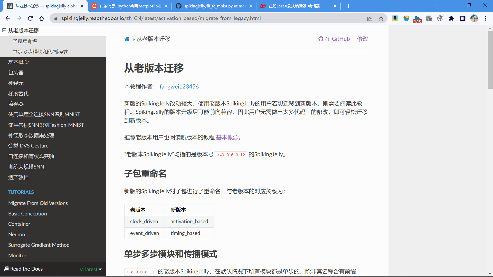
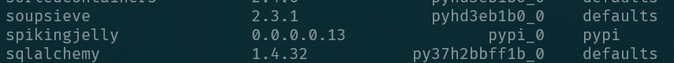
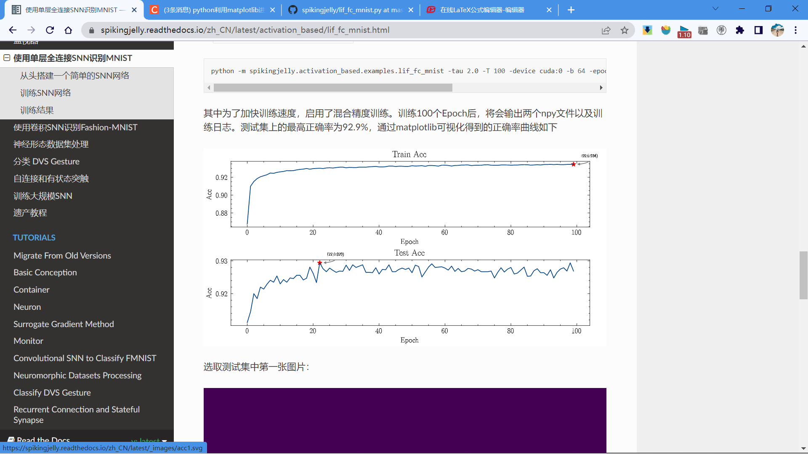

# WEEK6：单层全连接SNN识别MNIST

## 6.1 搭建SNN网络

选择LIF神经元。神经元之间的连接层需要用`spikingjelly.activation_based.layer`包装：

```python
nn.Sequential(
    layer.Flatten(),
    layer.Linear(28 * 28, 10, bias=False),
    neuron.LIFNode(tau=tau, surrogate_function=surrogate.ATan())
    )
```

其中膜电位衰减常数 $\tau$ 需要通过参数tau设置，替代函数这里选择`surrogate.ATan`

## 6.2 训练SNN网络

训练代码的编写需要遵循以下三个要点：

1. 脉冲神经元的输出是二值的，而直接将单次运行的结果用于分类极易受到编码带来的噪声干扰。因此一般认为脉冲网络的输出是输出层一段时间内的**发放频率**（或称发放率），发放率的高低表示该类别的响应大小。因此网络需要运行一段时间，即使用T个时刻后的**平均发放率**作为分类依据。
2. 理想结果是除了正确的神经元以**最高频率发放**，其他神经元**保持静默**。常常采用交叉熵损失或者MSE损失，这里我们使用实际效果更好的MSE损失。
3. 每次网络仿真结束后，需要**重置**网络状态

训练循环的核心代码如下：
```python

for epoch in range(start_epoch, args.epochs):
    start_time = time.time()
    net.train()
    train_loss = 0
    train_acc = 0
    train_samples = 0
    for img, label in train_data_loader:
        optimizer.zero_grad()
        img = img.to(args.device)
        label = label.to(args.device)
        label_onehot = F.one_hot(label, 10).float()

        # 混合精度训练
        if scaler is not None:
            with amp.autocast():
                out_fr = 0.
                # 运行T个时间步
                for t in range(args.T):
                    encoded_img = encoder(img)
                    out_fr += net(encoded_img)
                out_fr = out_fr / args.T
                # out_fr是shape=[batch_size, 10]的tensor
                # 记录整个仿真时长内，输出层的10个神经元的脉冲发放率
                loss = F.mse_loss(out_fr, label_onehot)
                # 损失函数为输出层神经元的脉冲发放频率，与真实类别的MSE
                # 这样的损失函数会使得：当标签i给定时，输出层中第i个神经元的脉冲发放频率趋近1，而其他神经元的脉冲发放频率趋近0
            scaler.scale(loss).backward()
            scaler.step(optimizer)
            scaler.update()
        else:
            out_fr = 0.
            for t in range(args.T):
                encoded_img = encoder(img)
                out_fr += net(encoded_img)
            out_fr = out_fr / args.T
            loss = F.mse_loss(out_fr, label_onehot)
            loss.backward()
            optimizer.step()

        train_samples += label.numel()
        train_loss += loss.item() * label.numel()
        # 正确率的计算方法如下。认为输出层中脉冲发放频率最大的神经元的下标i是分类结果
        train_acc += (out_fr.argmax(1) == label).float().sum().item()

        # 优化一次参数后，需要重置网络的状态，因为SNN的神经元是有“记忆”的
        functional.reset_net(net)

```
在测试训练时，取`tau=2.0,T=100,batch_size=64,lr=1e-3,epoch =100`


开始训练：



因为我的笔记本较为老旧，显卡也只是10系列的显卡，所以第一次设置`epoch =100`训练的十分缓慢，并且也有个警告



`userWarning:此 DataLoader 将总共创建 8 个工作进程。 我们建议当前系统中的最大工作线程数为 4（不考虑cpuset），这比此 DataLoader 将要创建的要小。 请注意，过多的工作程序创建可能会使 DataLoader 运行缓慢甚至冻结，如有必要，请降低工作程序数量以避免潜在的缓慢/冻结`

为节省时间，再次设置训练参数进行训练，取`tau=2.0,T=100,batch_size=64,lr=1e-3,epoch=20,j=4`



训练完成：



## 6.3 遇到的问题

### 6.3.1 导入包错误

在学习spikingjelly文档时，初次导入代码所用包时：出现如下错误



第一反应是包安装错误，查看了包的版本后，重新安装了一遍，仍旧是报错



然后在网上寻找解决办法的时候，偶然看到文档中介绍的`从老版本迁移`QAQ

原来问题的解决办法竟在我眼皮底下QAQ



于是从github上clone了最新的包进行安装



包导入报错的问题得以解决

### 6.3.2 matplotlib可视化问题

这个问题尚未解决，在完成本次单层全连接SNN识别MNIST的训练后，我想按照文档将结果可视化出来，但是发现自己不会QAQ。



之前使用Jupyter Notebook，逐行运行代码时，按照教程，可以实现可视化，但是放在命令行运行，发现自己对`matplotlib`包的使用并不熟悉。

但是本周作业截至时间将至QAQ，所以打算将使用`matplotlib`包可视化放在周末进行学习。