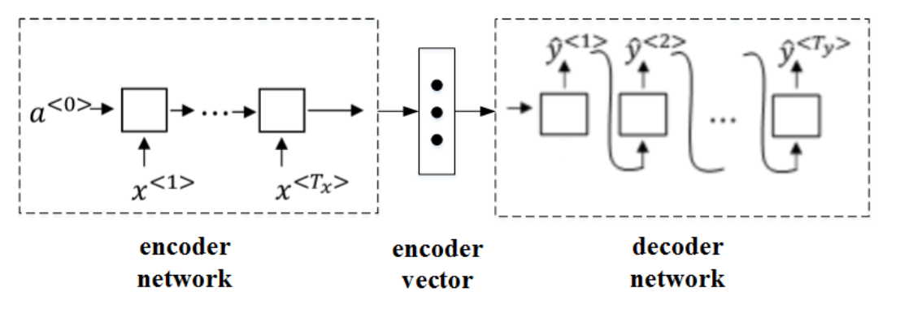
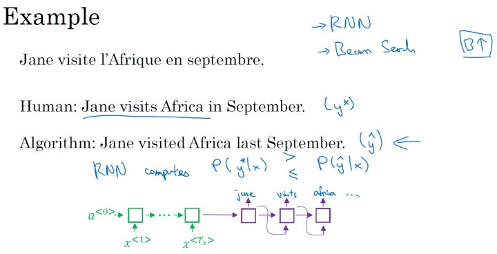
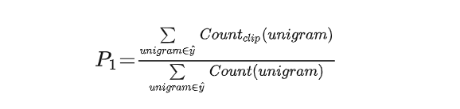

# WEEK7：序列神经网络

## 7.1 第三章：序列模型和注意力机制

### 7.1.1 基础模型

**sequence to sequence 模型：**

序列模型在**机器翻译**和**语音识别**方面都有着广泛的应用，举例如下：

针对该机器翻译问题，可以使用 “编码网络（encoder network）”+“解码网络（decoder network）” 两个 RNN 模型组合的形式来解决。encoder network 将输入语句编码为一个特征向量，传递给 decoder network，完成翻译。具体模型结构如下图所示：

- 其中，encoder vector代表了输入语句的编码特征。encoder network和decoder network都是RNN模型，可使用GRU或LSTM单元。
- 这种“编码网络（encoder network）”+“解码网络（decoder network）”的模型，可以在机器翻译中取得良好的效果。

**image to sequence 模型：**

这种模型也可以应用到图像捕捉领域。图像捕捉，即捕捉图像中主体动作和行为，描述图像内容。如下所示：

- 首先，将图片输入到CNN，例如使用预训练好的AlexNet，删去最后的softmax层，保留至最后的全连接层。
- 则该全连接层就构成了一个图片的特征向量（编码向量），表征了图片特征信息。
- 然后，将encoder vector输入至RNN，即decoder network中，进行解码翻译。

### 7.1.2 选择最可能的句子

**machine translation模型与language模型的区别：**

- Language model是自动生成一条完整语句，语句是随机的。
- machine translation model是根据输入语句，进行翻译，生成另外一条完整语句。
  - 上图中，绿色部分表示**encoder network**，紫色部分表示**decoder network**。
  - **decoder network**与 language model是相似的
  - **encoder network**可以看成是language model的$a^{<0>}$，是模型的一个条件，在输入语句的条件下，生成正确的翻译语句。
  - 因此，machine translation可以看成是有条件的语言模型（conditional language model）

所以，machine translation的目标就是根据输入语句，作为条件，找到最佳翻译语句，使其概率最大：

列举几个模型可能得到的翻译：

对于各种可能的翻译结果，通常并不是要从得到的分布中进行随机取样，而是要找到一个使得条件概率最大化的英文句子作为输出。所以在设计机器翻译模型的时候，一个重要的步骤就是设计一个合适的算法，找到使得条件概率最大化的的结果。目前最通用的算法就是：束搜索（Beam Search）。

**不使用贪心搜索（greedy search）的原因：**

贪心搜索根据条件，每次只寻找一个最佳单词作为翻译输出，力求把每个单词都翻译准确。
- 例如，首先根据输入语句，找到第一个翻译的单词“Jane”，然后再找第二个单词“is”，再继续找第三个单词“visiting”，以此类推。

**贪心搜索缺点：**

- 首先，因为贪心搜索每次只搜索一个单词，没有考虑该单词前后关系，概率选择上有可能会出错。
- 首先，因为贪心搜索每次只搜索一个单词，没有考虑该单词前后关系，概率选择上有可能会出错。
- 贪心搜索运算成本巨大，降低运算速度。

### 7.1.3 集束搜索(Beam Search)

**beam search的搜索原理：**

Greedy search 每次是找出预测概率最大的单词，而 beam search 则是每次找出预测概率最大的B个单词。其中，参数B表示取概率最大的单词个数，可调。本例中，令B=3。

首先，先从词汇表中找出翻译的第一个单词概率最大的B个预测单词。例如上面的例子中，预测得到的第一个单词为：in，jane，september。

概率表示为：$P(\hat{y}^{<1>}|x)$

然后，再分别以in，jane，september为条件，计算每个词汇表单词作为预测第二个单词的概率。从中选择概率最大的3个作为第二个单词的预测值，得到：in september，jane is，jane visits。

概率表示为：$P(\hat{y}^{<2>}|x, \hat{y}^{<1>})$

此时，得到的前两个单词的3种情况的概率为：

接着，再预测第三个单词。方法一样，分别以in september，jane is，jane visits为条件，计算每个词汇表单词作为预测第三个单词的概率。从中选择概率最大的3个作为第三个单词的预测值，得到：in september jane，jane is visiting，jane visits africa。

概率表示为：$P(\hat{y}^{<3>}|x, \hat{y}^{<1>}, \hat{y}^{<2>})$

此时，得到的前三个单词的3种情况的概率为：

以此类推，每次都取概率最大的三种预测。最后，选择概率最大的那一组作为最终的翻译语句。

**Jane is visiting Africa in September.**

值得注意的是，如果参数B=1，则就等同于greedy search。实际应用中，可以根据不同的需要设置B为不同的值。一般B越大，机器翻译越准确，但同时也会增加计算复杂度。

### 7.1.4 改进集束搜索

Beam search中，最终机器翻译的概率是乘积的形式：

多个概率相乘可能会使乘积结果很小，远小于1，造成数值下溢。为了解决这个问题，可以对上述乘积形式进行取对数log运算，即：

因为取对数运算，将乘积转化为求和形式，避免了数值下溢，使得数据更加稳定有效。

这种概率表达式还存在一个问题，就是机器翻译的单词越多，乘积形式或求和形式得到的概率就越小，这样会造成模型倾向于选择单词数更少的翻译语句，使机器翻译受单词数目的影响，这显然是不太合适的。因此，一种改进方式是进行长度归一化，消除语句长度影响。

实际应用中，通常会引入归一化因子$\alpha$：

若α=1，则完全进行长度归一化；若α=0，则不进行长度归一化。一般令α=0.7，效果不错。

### 7.1.5 集束搜索的误差分析

集束搜索是一种近似搜索算法。实际应用中，如果机器翻译效果不好，需要通过错误分析，判断是RNN模型问题还是集束搜索算法问题。

一般来说，增加训练样本、增大beam search参数B都能提高准确率。但是，这种做法并不能得到我们期待的性能，且并不实际。

首先，为待翻译语句建立人工翻译，记为$y^*$。在RNN模型上使用beam search算法，得到机器翻译，记为$\hat{y}$。显然，人工翻译$y^*$最为准确。

这样，整个模型包含两部分：**RNN**和**集束搜索**算法。

然后，将输入语句输入到RNN模型中，分别计算输出是$y^*$的概率$P(y^*|x)$和$\hat{y}$的概率$P(\hat{y}|x)$

接下来就是比较两者的大小

- $P(y^*|x) > P(\hat{y}|x)$：集束搜索算法有误
- $P(y^*|x) < P(\hat{y}|x)$：RNN模型有误

### 7.1.6 Bleu Score

引入Bleu score 用来评估翻译系统的准确性。

首先，对原语句建立人工翻译参考，一般有多个人工翻译（利用验证集火测试集）。例如下面这个例子：

如上所示，机器翻译为“the the the the the the the.”，效果很差。Bleu Score的宗旨是机器翻译越接近参考的人工翻译，其得分越高，方法原理就是看机器翻译的各个单词是否出现在参考翻译中。

最简单的准确度评价方法是看机器翻译的每个单词是否出现在参考翻译中。显然，上述机器翻译的每个单词都出现在参考翻译里，准确率为$7\over 7 = 1$，其中，分母为机器翻译单词数目，分子为相应单词是否出现在参考翻译中。但是，这种方法很不科学，并不可取。

另外一种评价方法是看机器翻译单词出现在参考翻译单个语句中的次数，取最大次数。上述例子对应的准确率为$2\over 7$，，其中，分母为机器翻译单词数目，分子为相应单词出现在参考翻译中的次数（分子为2是因为“the”在参考1中出现了两次）。这种评价方法较为准确。

**二元词组的Bleu score：**

另外一种更科学的打分方法是bleu score on bigrams，即同时对两个连续单词进行打分。

- 如果只看单个单词，相应的(一元组)unigrams precision为：

如果是n个连续单词，相应的(n元组)n-grams precision为：

总结一下，可以同时计算$p_1,\cdots, p_n$，再对其求平均：

$p = {1\over n} {\sum_{i=1}^n p_i}$

通常，对上式进行指数处理，并引入参数因子brevity penalty，记为BP。顾名思义，BP是为了“惩罚”机器翻译语句过短而造成的得分“虚高”的情况。

$p = BP·exp({1\over n} {\sum_{i=1}^n p_i})$

其中，BP值由机器翻译长度和参考翻译长度共同决定。

### 7.1.7 注意力模型

如果原语句很长，要对整个语句输入RNN的编码网络和解码网络进行翻译，则效果不佳。相应的bleu score会随着单词数目增加而逐渐降低。

对待长语句，正确的翻译方法是将长语句分段，每次只对长语句的一部分进行翻译。人工翻译也是采用这样的方法，高效准确。也就是说，每次翻译只注重一部分区域，这种方法使得bleu score不太受语句长度的影响。

根据这种“局部聚焦”的思想，建立相应的注意力模型（attention model）。

如上图所示，attention model仍由类似的编码网络（下）和解码网络（上）构成。其中，$S^{<t>}$，由原语句附近单元共同决定，原则上说，离得越近，注意力权重（attention weights）越大，相当于在你当前的注意力区域有个滑动窗。

**注意力模型的详细介绍：**

注意力模型中选择双向RNN，可以使用GRU单元或者LSTM。由于是双向RNN，每个$a^{<t'>}$表示：

RNN编码生成特征，注意力权重用α表示，C是各个RNN神经元经过注意力权重得到的参数值。例如，$\alpha^{<1,t'>}$表示机器翻译的第一个单词“jane”对应的第t'个RNN神经元，$C^{<1>}$表示机器翻译第一个单词“jane”对应的解码网络输入参数。满足：

也就是说，$\alpha^{<t,t'>}$表示输出 $ \hat{y}^{<t'>}$ 对RNN单元 $\alpha ^{<t'>}$ 的注意力权重因子。

为了让$\alpha^{<t,t'>}$之和为1，利用softamx思想，引入参数$e^{<t,t'>}$，使得：

这样，只要求出$e^{<t,t'>}$，就能得到$\alpha^{<t,t'>}$

如何求出$e^{<t,t'>}$？方法是建立一个简单的神经网络，如下图所示。输入是$S^{<t-1>}$和$a^{<t'>}$，输出是$e^{<t,t'>}$。

然后，利用梯度下降算法迭代优化，计算得到$e^{<t,t'>}$和$\alpha^{<t,t'>}$

Attention model的一个缺点是其计算量较大，若输入句子长度为$T_x$，输出句子长度为$T_y$，则计算时间约为$T_x \times T_y$。但是，其性能提升很多，计算量大一些也是可以接受的。

Attention model能有效处理很多机器翻译问题，例如下面的时间格式归一化并将注意力权重可视化：

上图中，颜色越白表示注意力权重越大，颜色越深表示权重越小。可见，输出语句单词与其输入语句单词对应位置的注意力权重较大，即对角线附近。

### 7.1.8 语音识别

深度学习中，语音识别的输入是声音，量化成时间序列。更一般地，可以把信号转化为频域信号，即声谱图，再进入RNN模型进行语音识别。

之前，语言学家们会将语音中每个单词分解成多个音素，构建更精准的传统识别算法。但在end-to-end深度神经网络模型中，一般不需要这么做也能得到很好的识别效果。通常训练样本很大，需要上千上万个小时的语音素材。

语音识别的注意力模型如下图所示：

一般来说，语音识别的输入时间序列都比较长，例如是10s语音信号，采样率为100Hz，则语音长度为1000。而翻译的语句通常很短，例如“the quick brown fox”，包含19个字符。这时候，$T_x$与$T_y$差别很大。为了让$T_x = T_y$，可以把输出相应字符重复并加入空白：

其中，下划线”_“表示空白，”⊔“表示两个单词之间的空字符。这种写法的一个基本准则是没有被空白符”$ \_ $“分割的重复字符将被折叠到一起，即表示一个字符。

这样，加入了重复字符和空白符、空字符，可以让输出长度也达到1000，即$T_x = T_y$，这种模型被称为CTCConnectionist temporal classification）。

### 7.1.9 触发词检测

触发字检测系统可以使用RNN模型来建立。如下图所示，输入语音中包含一些触发字，其余都是非触发字。RNN检测到触发字后输出1，非触发字输出0。这样训练的RNN模型就能实现触发字检测。

但是这种模型有一个缺点，就是通常训练样本语音中的触发字较非触发字数目少得多，即正负样本分布不均。一种解决办法是在出现一个触发字时，将其附近的RNN都输出1。这样就简单粗暴地增加了正样本。  

## 7.2 Transformer网络

### 7.2.1 Transformer网络直觉

Transformer是一种网络架构，它在自然语言处理领域大展风头，如今许多很有效的算法，都是基于Transformer架构而发展起来的。

RNN存在梯度消失的问题，，因此RNN很难捕捉到远距离依赖和序列，后来研究了门控循环单元（GRU）和长短期记忆模型（LSTM）模型，在这两个模型中，使用门来控制信息流。

从RNNs到GRU，再到LSTM，模型会变得越来越复杂。

为了理解注意力网络，接下来会学习两个两个关键概念：自注意力机制和多头注意力机制。

### 7.2.2 自注意力机制

卷积、全连接、池化层都只考虑非自主性提示，如max pooling抽取一定范围内最大的数据，注意力机制则考虑自主性提示。

**注意力评分函数：**

注意力分数是query和key的相似度，注意力权重是分数的softmax结果。

假设有一个查询$q\in \mathbb{R}^q$，和$m$个（键，值）：$(k_1,v_1),\cdots,(k_m,k_m)$，其中$v_i \in \mathbb{R}^v$。注意力汇聚函数$f$就被表示成值的加权和：

其中查询 $q$和键 $k_i$ 的注意力权重是通过注意力评分函数a将两个向量映射成标量，再经过softmax运算得到的：

### 7.2.3 多头注意力机制

在实践中，当给定相同的查询、键和值的集合时，通常希望模型可以基于相同的注意力机制学习到不同的行为，然后将不同的行为作为知识组合起来， 捕获序列内各种范围的依赖关系 （例如，短距离依赖和长距离依赖关系）。

为此，多头注意力使用 $h$ 个独立的注意力池化，通过合并各个头的输出，并且通过另一个可以学习的线性投影进行变换，得到最终输出。(类似于CNN使用多个卷积核试图提取图片的不同特征)

### 7.2.4 Transformer网络

**Transformer模型：**

Transformer模型完全基于注意力机制，没有任何卷积层后循环神经网络层。

Transformer作为编码器－解码器架构的一个实例，其整体架构图如下图中展示，transformer是由编码器和解码器组成的。transformer的编码器和解码器是基于自注意力的模块叠加而成的，源（输入）序列和目标（输出）序列的嵌入（embedding）表示将加上位置编码（positional encoding），再分别输入到编码器和解码器中。

从宏观角度来看，transformer的编码器是由多个相同的层叠加而成的，每个层都有两个子层（子层表示为$s u b l a y e r $）。第一个子层是多头自注意力（multi-head self-attention）汇聚；第二个子层是基于位置的前馈网络（positionwise feed-forward network）。

Transformer解码器也是由多个相同的层叠加而成的，并且层中使用了残差连接和层规范化。除了编码器中描述的两个子层之外，解码器还在这两个子层之间插入了第三个子层，称为编码器－解码器注意力（encoder-decoder attention）层。

在编码器－解码器注意力中，查询来自前一个解码器层的输出，而键和值来自整个编码器的输出。在解码器自注意力中，查询、键和值都来自上一个解码器层的输出。但是，解码器中的每个位置只能考虑该位置之前的所有位置。这种掩蔽（masked）注意力保留了自回归（auto-regressive）属性，确保预测仅依赖于已生成的输出词元。

