# WEEK7：使用卷积SNN识别Fashion-MNIST

## 7.1 网络结构

使用最常见的卷积神经网络结构：

`{Conv2d-BatchNorm2d-IFNode-MaxPool2d}-{Conv2d-BatchNorm2d-IFNode-MaxPool2d}-{Linear-IFNode}`

网络结构的定义如下：

```python
# spikingjelly.activation_based.examples.conv_fashion_mnist
import matplotlib.pyplot as plt
import torch
import torch.nn as nn
import torch.nn.functional as F
import torchvision
from spikingjelly.activation_based import neuron, functional, surrogate, layer
from torch.utils.tensorboard import SummaryWriter
import os
import time
import argparse
from torch.cuda import amp
import sys
import datetime
from spikingjelly import visualizing

class CSNN(nn.Module):
    def __init__(self, T: int, channels: int, use_cupy=False):
        super().__init__()
        self.T = T

        self.conv_fc = nn.Sequential(
        layer.Conv2d(1, channels, kernel_size=3, padding=1, bias=False),
        layer.BatchNorm2d(channels),
        neuron.IFNode(surrogate_function=surrogate.ATan()),
        layer.MaxPool2d(2, 2),  # 14 * 14

        layer.Conv2d(channels, channels, kernel_size=3, padding=1, bias=False),
        layer.BatchNorm2d(channels),
        neuron.IFNode(surrogate_function=surrogate.ATan()),
        layer.MaxPool2d(2, 2),  # 7 * 7

        layer.Flatten(),
        layer.Linear(channels * 7 * 7, channels * 4 * 4, bias=False),
        neuron.IFNode(surrogate_function=surrogate.ATan()),

        layer.Linear(channels * 4 * 4, 10, bias=False),
        neuron.IFNode(surrogate_function=surrogate.ATan()),
        )
```
为了更快的训练速度，将网络设置成多步模式，并根据构造函数的要求，决定是否使用 cupy 后端：

```python
# spikingjelly.activation_based.examples.conv_fashion_mnist

class CSNN(nn.Module):
    def __init__(self, T: int, channels: int, use_cupy=False):
        # ...
        functional.set_step_mode(self, step_mode='m')

        if use_cupy:
            functional.set_backend(self, backend='cupy')
```

网络的输入直接是`shape=[N, C, H, W]`的图片，将其添加时间维度，并复制`T`次，得到`shape=[T, N, C, H, W]`的序列，然后送入到网络层。网络的输出定义为最后一层脉冲神经元的脉冲发放频率。因而，网络的前向传播定义为：

```python
# spikingjelly.activation_based.examples.conv_fashion_mnist
class CSNN(nn.Module):
    def forward(self, x: torch.Tensor):
    # x.shape = [N, C, H, W]
    x_seq = x.unsqueeze(0).repeat(self.T, 1, 1, 1, 1)  # [N, C, H, W] -> [T, N, C, H, W]
    x_seq = self.conv_fc(x_seq)
    fr = x_seq.mean(0)
    return fr
```

## 7.2 网络训练

网络的训练方式、损失函数定义、分类结果的确定均与单层全连接SNN识别MNIST相同，唯一的区别是，使用Fashion-MNIST数据集：
```python
# spikingjelly.activation_based.examples.conv_fashion_mnist

train_set = torchvision.datasets.FashionMNIST(
        root=args.data_dir,
        train=True,
        transform=torchvision.transforms.ToTensor(),
        download=True)

test_set = torchvision.datasets.FashionMNIST(
        root=args.data_dir,
        train=False,
        transform=torchvision.transforms.ToTensor(),
        download=True)
```
设置参数为`-T 4 -device cuda:0 -b 128 -epochs 16 -data-dir /datasets/FashionMNIST/ -amp -cupy -opt sgd -lr 0.1 -j 8`进行训练，如下所示：

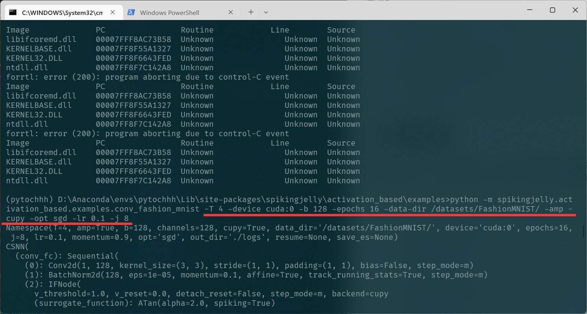

输出如下：
```
Namespace(T=4, amp=True, b=128, channels=128, cupy=True, data_dir='/datasets/FashionMNIST/', device='cuda:0', epochs=16, j=8, lr=0.1, momentum=0.9, opt='sgd', out_dir='./logs', resume=None, save_es=None)
CSNN(
  (conv_fc): Sequential(
    (0): Conv2d(1, 128, kernel_size=(3, 3), stride=(1, 1), padding=(1, 1), bias=False, step_mode=m)
    (1): BatchNorm2d(128, eps=1e-05, momentum=0.1, affine=True, track_running_stats=True, step_mode=m)
    (2): IFNode(
      v_threshold=1.0, v_reset=0.0, detach_reset=False, step_mode=m, backend=cupy
      (surrogate_function): ATan(alpha=2.0, spiking=True)
    )
    (3): MaxPool2d(kernel_size=2, stride=2, padding=0, dilation=1, ceil_mode=False, step_mode=m)
    (4): Conv2d(128, 128, kernel_size=(3, 3), stride=(1, 1), padding=(1, 1), bias=False, step_mode=m)
    (5): BatchNorm2d(128, eps=1e-05, momentum=0.1, affine=True, track_running_stats=True, step_mode=m)
    (6): IFNode(
      v_threshold=1.0, v_reset=0.0, detach_reset=False, step_mode=m, backend=cupy
      (surrogate_function): ATan(alpha=2.0, spiking=True)
    )
    (7): MaxPool2d(kernel_size=2, stride=2, padding=0, dilation=1, ceil_mode=False, step_mode=m)
    (8): Flatten(start_dim=1, end_dim=-1, step_mode=m)
    (9): Linear(in_features=6272, out_features=2048, bias=False)
    (10): IFNode(
      v_threshold=1.0, v_reset=0.0, detach_reset=False, step_mode=m, backend=cupy
      (surrogate_function): ATan(alpha=2.0, spiking=True)
    )
    (11): Linear(in_features=2048, out_features=10, bias=False)
    (12): IFNode(
      v_threshold=1.0, v_reset=0.0, detach_reset=False, step_mode=m, backend=cupy
      (surrogate_function): ATan(alpha=2.0, spiking=True)
    )
  )
)
```
训练完成，结果如下：
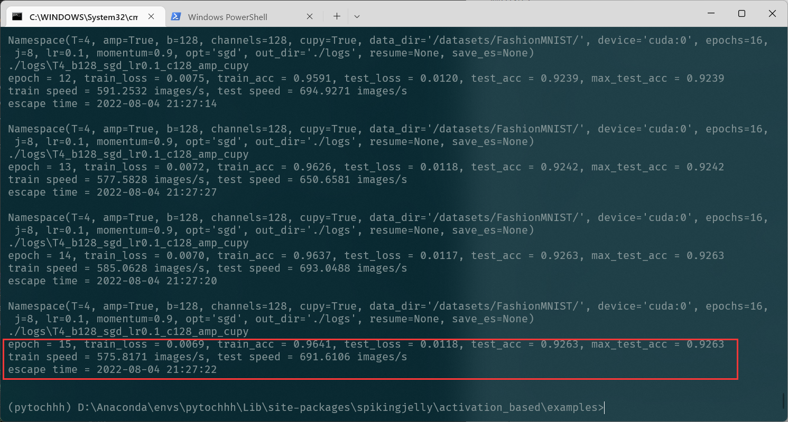

最终获得 `max_test_acc = 0.9263` 。

## 7.3 可视化编码器
将图片直接送入网络，实际的编码过程是由网络中的首个 `{Conv2d-BatchNorm2d-IFNode}` 实现的。现在提取出网络中的编码器，输入图片，并将输出脉冲可视化，代码如下：
```python
# spikingjelly.activation_based.examples.conv_fashion_mnist
class CSNN(nn.Module):
    # ...
    def spiking_encoder(self):
        return self.conv_fc[0:3]
def main():
    # ...
    if args.resume:
        checkpoint = torch.load(args.resume, map_location='cpu')
        net.load_state_dict(checkpoint['net'])
        optimizer.load_state_dict(checkpoint['optimizer'])
        lr_scheduler.load_state_dict(checkpoint['lr_scheduler'])
        start_epoch = checkpoint['epoch'] + 1
        max_test_acc = checkpoint['max_test_acc']
        if args.save_es is not None and args.save_es != '':
            encoder = net.spiking_encoder()
            with torch.no_grad():
                for img, label in test_data_loader:
                    img = img.to(args.device)
                    label = label.to(args.device)
                    # img.shape = [N, C, H, W]
                    img_seq = img.unsqueeze(0).repeat(net.T, 1, 1, 1, 1)  # [N, C, H, W] -> [T, N, C, H, W]
                    spike_seq = encoder(img_seq)
                    functional.reset_net(encoder)
                    to_pil_img = torchvision.transforms.ToPILImage()
                    vs_dir = os.path.join(args.save_es, 'visualization')
                    os.mkdir(vs_dir)

                    img = img.cpu()
                    spike_seq = spike_seq.cpu()

                    img = F.interpolate(img, scale_factor=4, mode='bilinear')
                    # 28 * 28 is too small to read. So, we interpolate it to a larger size

                    for i in range(label.shape[0]):
                        vs_dir_i = os.path.join(vs_dir, f'{i}')
                        os.mkdir(vs_dir_i)
                        to_pil_img(img[i]).save(os.path.join(vs_dir_i, f'input.png'))
                        for t in range(net.T):
                            print(f'saving {i}-th sample with t={t}...')
                            # spike_seq.shape = [T, N, C, H, W]

                            visualizing.plot_2d_feature_map(spike_seq[t][i], 8, spike_seq.shape[2] // 8, 2, f'$S[{t}]$')
                            plt.savefig(os.path.join(vs_dir_i, f's_{t}.png'))
                            plt.savefig(os.path.join(vs_dir_i, f's_{t}.pdf'))
                            plt.savefig(os.path.join(vs_dir_i, f's_{t}.svg'))
                            plt.clf()

                    exit()
    # ...
```
加载已经训练好的模型，设置 `batch_size=4` （表示只保存4张图片和对应的编码后的脉冲），将图片保存到 ./logs 下，设置参数如下：
`-T 4 -device cuda:0 -b 4 -epochs 16 -data-dir /datasets/FashionMNIST/ -amp -cupy -opt sgd -lr 0.1 -j 8 -resume ./logs/T4_b128_sgd_lr0.1_c128_amp_cupy/checkpoint_latest.pth -save-es ./logs`

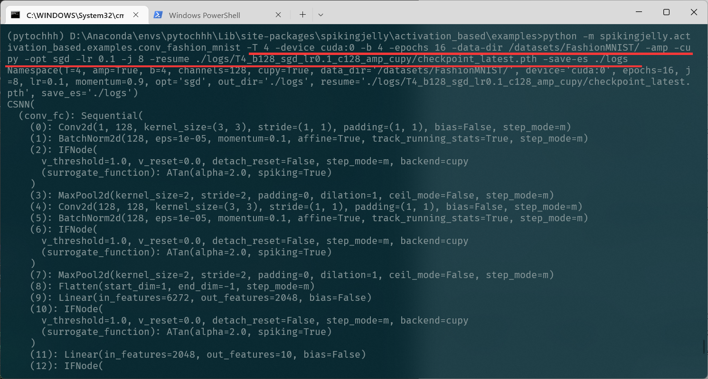

运行结束：

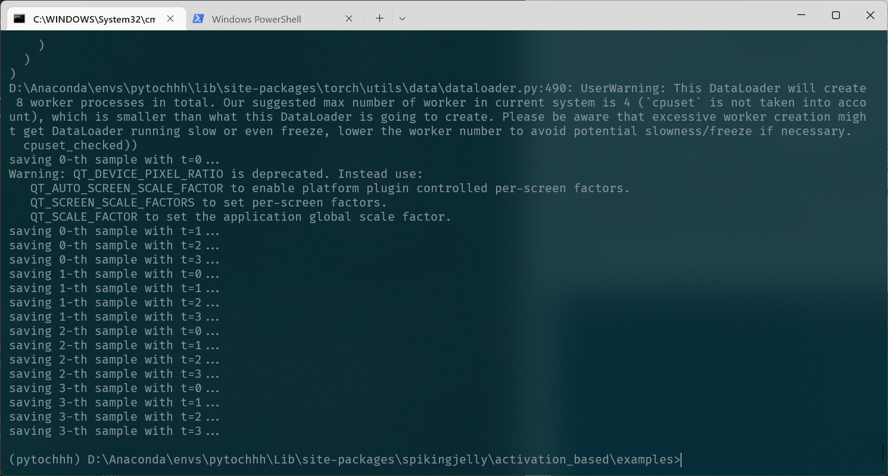

下面展示2个输入图片，和对应的编码后的脉冲。
图片1：


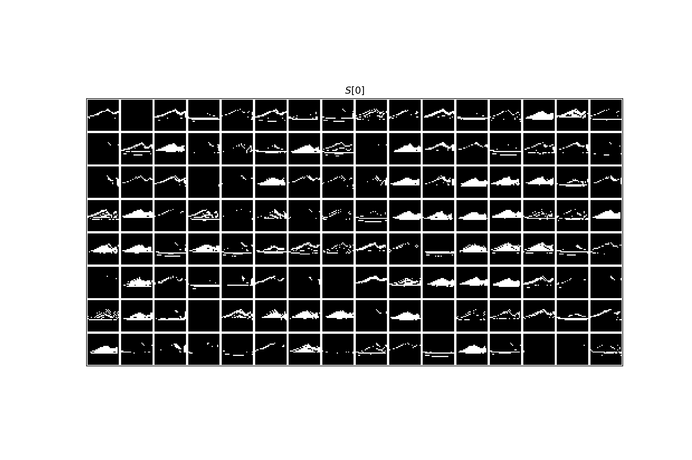

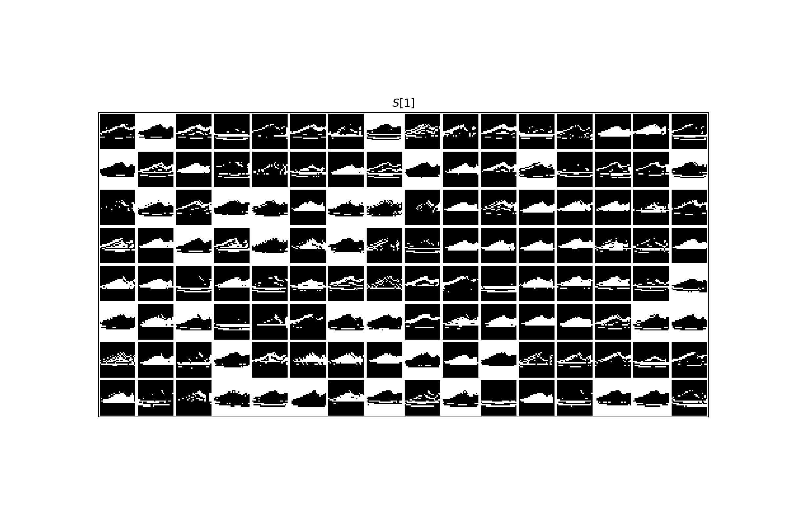

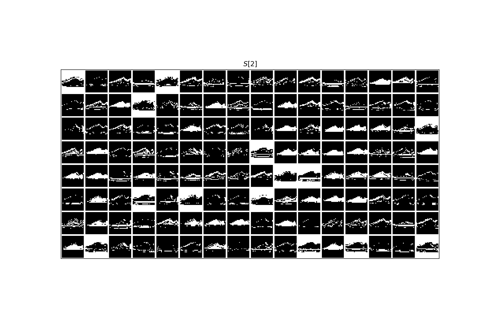

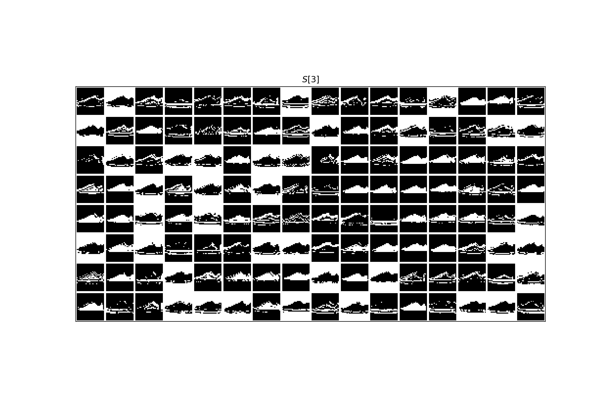


图片2：

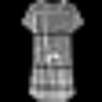

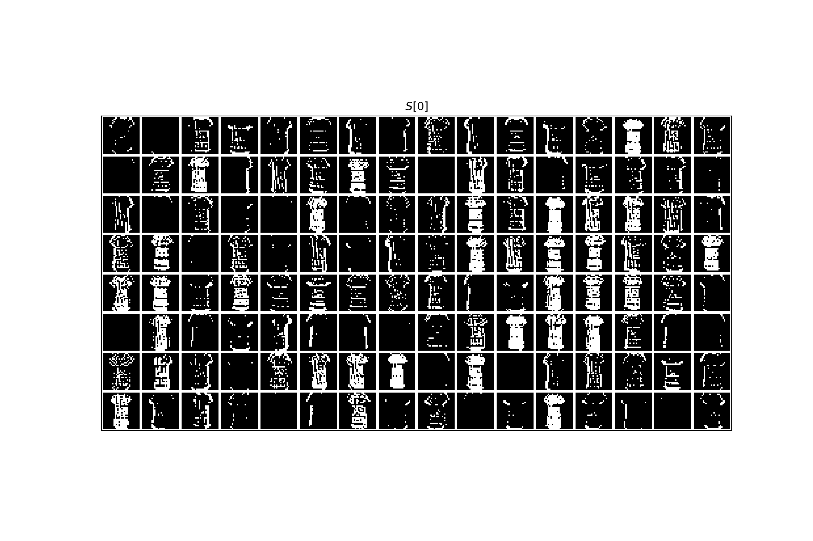

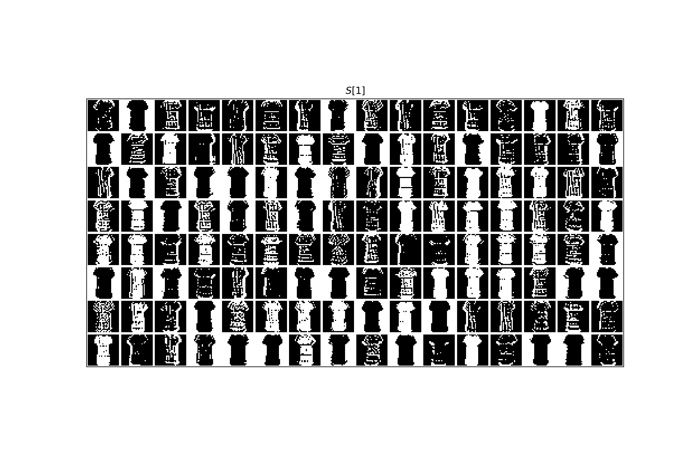

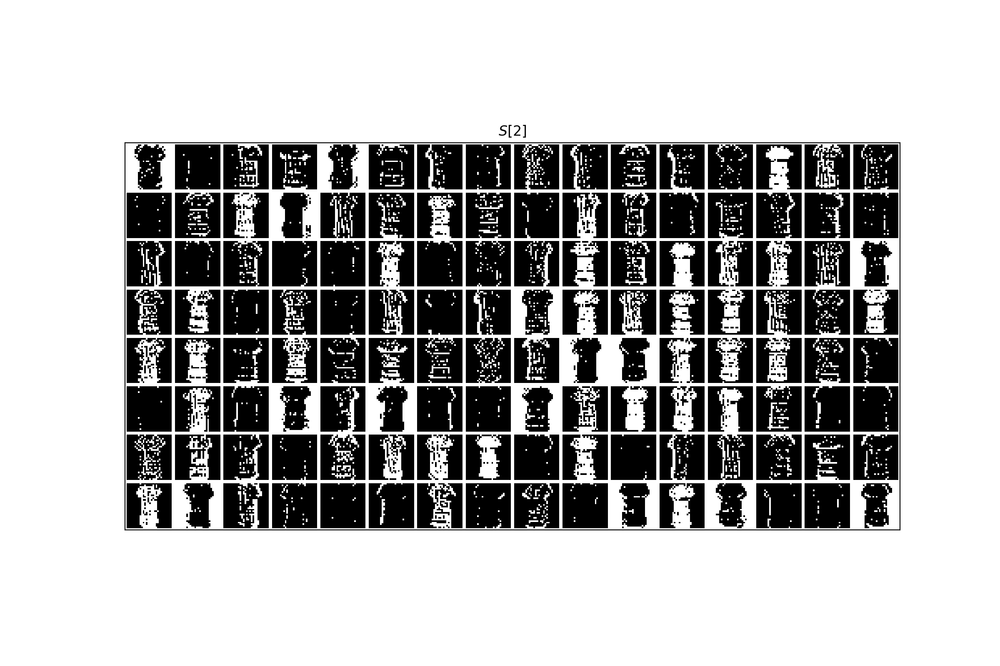

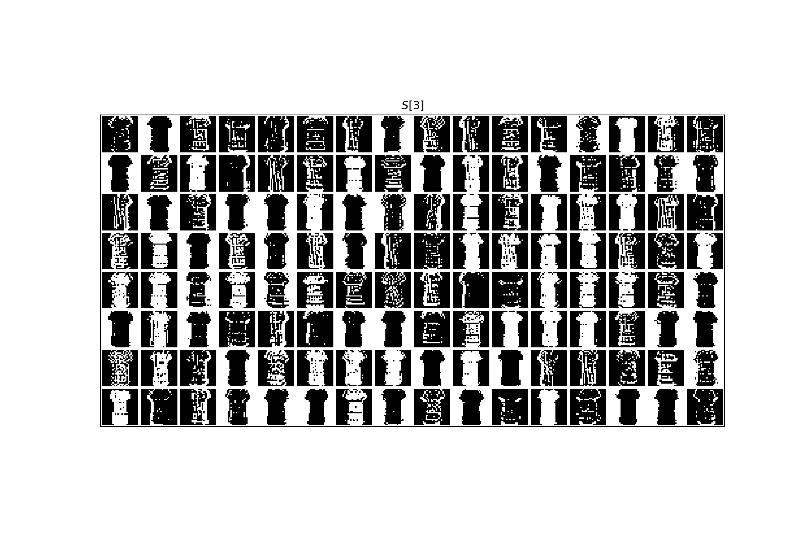