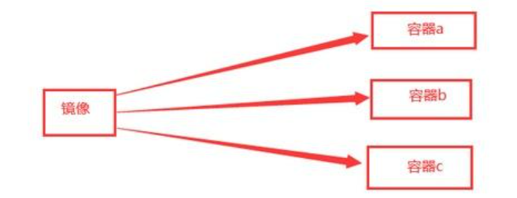
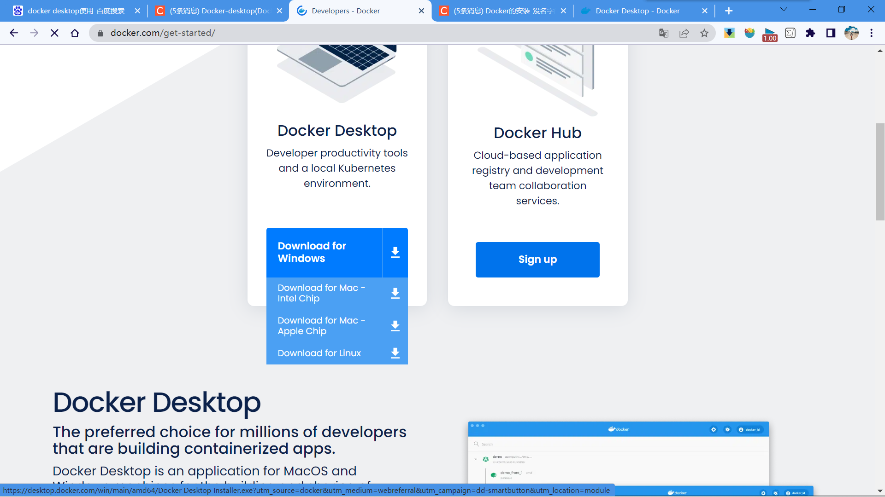
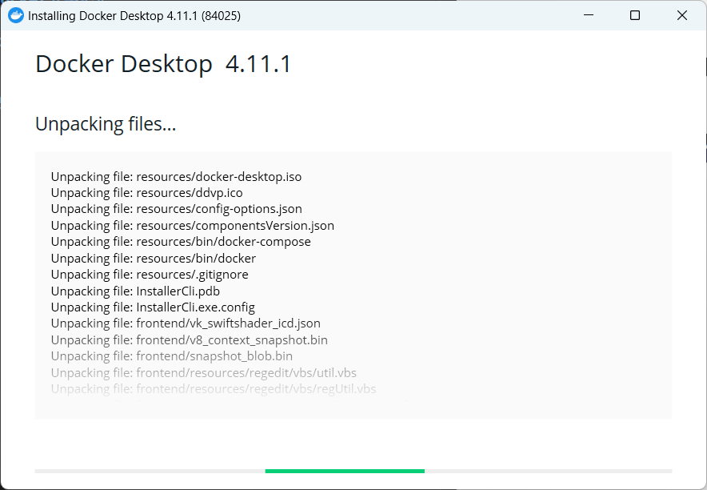
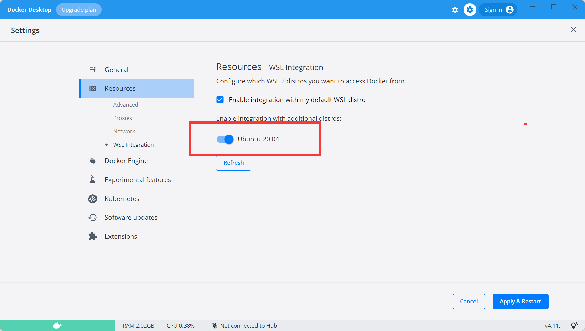
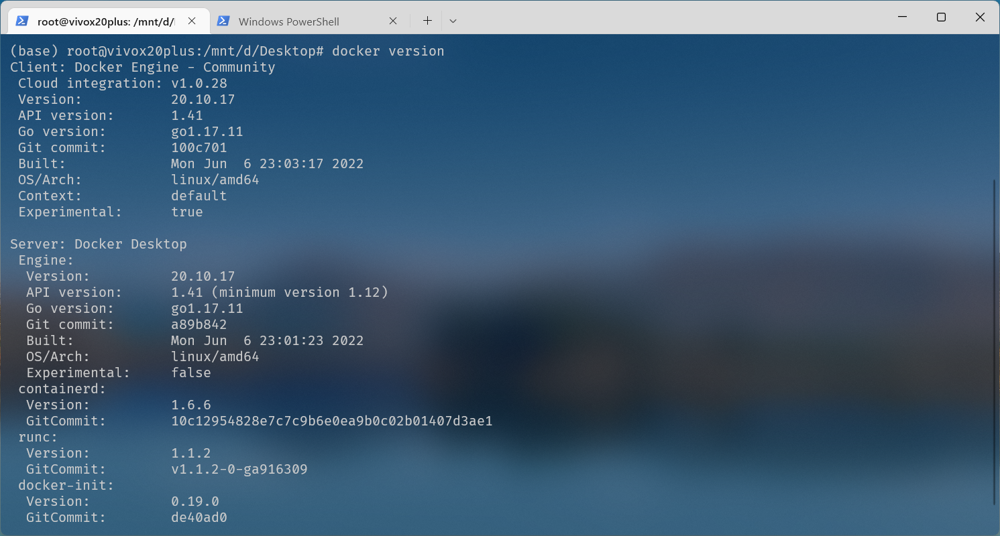
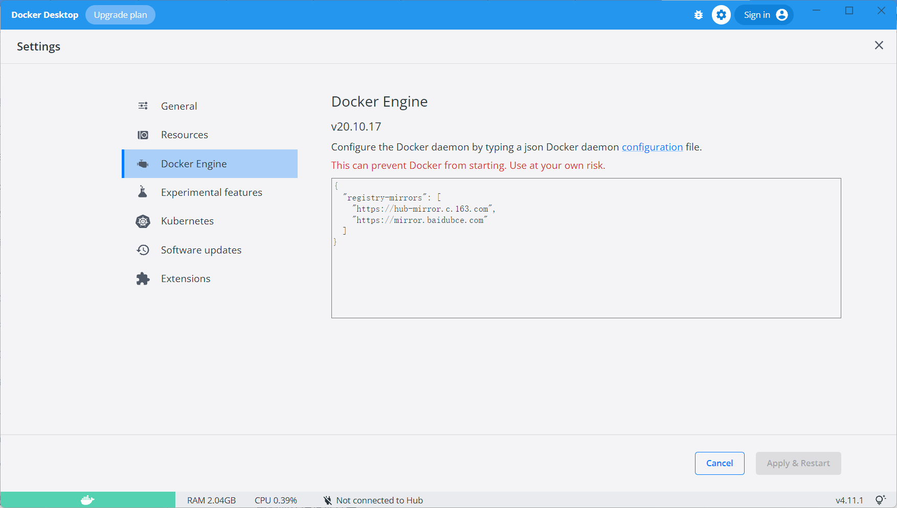
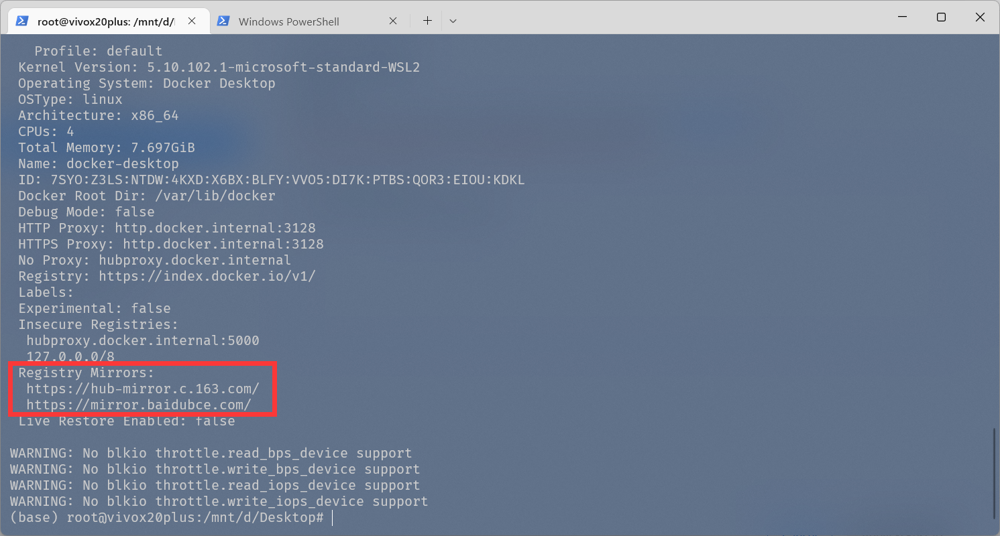

# WEEK8：Docker安装笔记

## 8.1 Docker介绍

Docker基于 Linux 内核的 cgroup，namespace，以及 OverlayFS 类的 Union FS 等技术，对进程进行封装隔离，属于操作系统层面的虚拟化技术。由于隔离的进程独立于宿主和其它的隔离的进程，因此也称其为容器。

Docker 在容器的基础上，进行了进一步的封装，从文件系统、网络互联到进程隔离等等，极大的简化了容器的创建和维护。使得 Docker 技术比虚拟机技术更为轻便、快捷。

**容器介绍**

与虚拟机通过操作系统实现隔离不同，容器技术只隔离应用程序的运行时环境但容器之间可以共享同一个操作系统，这里的运行时环境指的是程序运行依赖的各种库以及配置。

**容器和镜像关系**

可以通过一个镜像，运行出三个容器，镜像是别人打包好在镜像仓库的，通常去下载就好了。但是下载镜像的时候要带上版本号。

## 8.2 安装流程

下载安装包

进行安装

在 Resources 的WSL Integration中设置要从哪个 WSL2 发行版中访问 Docker

在wsl2中使用Docker命令

## 8.3 Docker配置

镜像加速器

