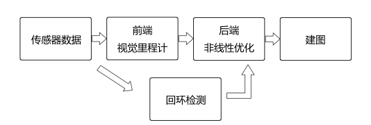
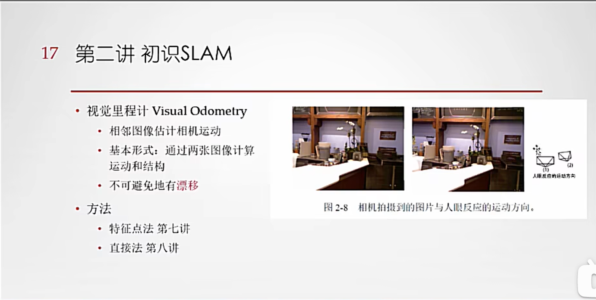
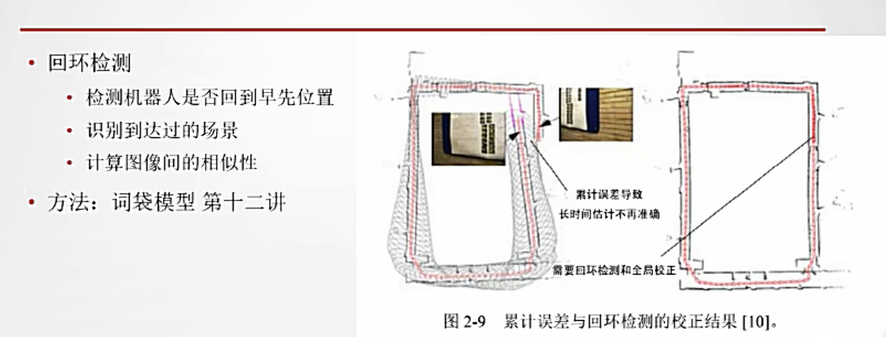
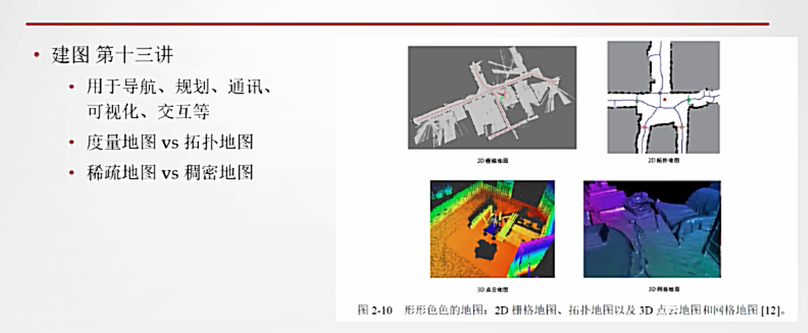
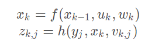

# WEEK8：SLAM技术

## 8.1 SLAM介绍

SLAM（Simultaneous Localization and Mapping），中文译作“同时定位与地图构建”。它是指搭载特定传感器的主体，在没有环境先验信息的情况下，于运动过程中建立环境的模型，同时估计自己的运动。如果这里的传感器主要为相机，那就称为“视觉 SLAM”。

SLAM的目的是解决“定位”与“地图构建”这两个问题。也就是说，一边要估计传感器自身的位置，一边要建立周围环境的模型。当用相机作为传感器时，我们要做的，就是根据一张张连续运动的图像（它们形成一段视频），从中推断相机的运动，以及周围环境的情况。

## 8.2 视觉SLAM流程

SLAM回答了两个关键问题：

- 我在什么地方？——定位
- 周围环境怎么样？——建图

**传感器分类：**

分为两类: 一类传感器是携带于机器人本体上的，例如机器人的轮式编码器、相机、激光等等。另一类是安装于环境中的，例如导轨、二维码标志等等。

按照相机的工作方式，把相机分为**单目**（Monocular）、**双目**（Stereo）和**深度相机**（RGB-D）三个大类。

**视觉SLAM流程：**

1. **传感器信息读取。**
2. **视觉里程计 (Visual Odometry, VO)**。任务是估算相邻图像间相机的运动， 以及局部地图的构建。VO 又称为前端（Front End）。
3. **后端优化（Optimization）**。后端接受不同时刻视觉里程计测量的相机位姿，以及回环检测的信息，对它们进行优化，得到全局一致的轨迹和地图。由于接在VO之后， 又称为后端（Back End）。
4. **回环检测（Loop Closing）**。判断机器人是否曾经到达过先前的位置。如果检测到回环，它会把信息提供给后端进行处理。
5. **建图（Mapping）**。它根据估计的轨迹，建立与任务要求对应的地图。

**视觉里程计：**

视觉里程计关心相邻图像之间的相机运动，最简单的情况是两张图像之间的运动关系。

视觉 SLAM 中，只能看到一个个像素，知道它们是某些空间点在相机的成像平面上投影的结果。所以，为了定量地估计相机运动，必须在了解相机与空间点的几何关系之后进行。 VO能够通过相邻帧间的图像估计相机运动，并恢复场景的空间结构。VO只计算相邻时刻的运动，而和往前的信息没有关联。假定已有了一个视觉里程计，估计了两张图像间的相机运动。那么，只要把相邻时刻的运动串起来，就构成了机器人的运动轨迹，从而解决了定位问题。另一方面，可以根据每个时刻的相机位置，计算出各像素对应的空间点的位置，就得到了地图。

但是，有了VO，并没有解决SLAM问题。

仅通过视觉里程计来估计轨迹，将出现累计漂移（Accumulating Drift）。这是由于视觉里程计（在最简单的情况下）只估计两个图像间运动造成的。每次估计都带有一定的误差，而由于里程计的工作方式，先前时刻的误差将会传递到下一时刻， 导致经过一段时间之后，估计的轨迹将不再准确。比方说，机器人先向左转90度，再向右 转了90度。由于误差，会把第一个90度估计成了89度。向右转之后机器人的估计位置并没有回到原点。即使之后的估计再准确，与真实值相比，都会带上这-1度的误差。这也就是所谓的漂移（Drift）。这将导致无法建立一致的地图。为了解决漂移问题，还需要两种技术：后端优化和回环检测。回环检测负责把机器人回到原始位置检测出来，而后端优化则根据该信息，校正整个轨迹的形状。

**后端优化**

**回环检测**

**建图**

**SLAM问题的数学表述**

主要有两个方程，分别为位置方程和观测方程：

$x_k$表示机器人当前所处的位置，$u_k$是运动传感器的读数或者输入，$z_{k,j}$是机器人与环境特征建立的观测数据

