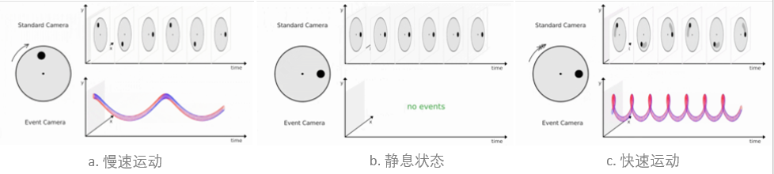

# WEEK8：事件相机

## 8.1 事件相机介绍

事件相机是具有微秒反应时间的仿生传感器，可记录每像素亮度变化的异步流，称为“事件”。

事件相机（event-based camera）**异步**地观测每个像素的亮度变化，并输出一系列事件（event）。

对于每个像素点，当该点亮度变化累计超过**设定阈值**时，则以微秒级分辨率标记时间戳，记录一个事件。

一个事件由事件**发生时刻**、发生该事件的**像素坐标**和事件发生的**极性（亮度升高或降低）** 三部分信息组成。

事件从像素阵列传输到外围，然后使用共享的数字输出总线从相机输出，通常用address-event representation（AER）形式表示。

**特点：**

1. **高时间分辨率：** 时间刷新率为微秒量级，即百万帧率；
2. **高动态范围：** 传统相机仅为60dB，事件相机高达140dB;
3. **低功耗：** 所消耗的能耗仅为mW级。

## 8.2 事件相机面临的挑战

1. **不同的时空输出：**
   事件相机的输出与标准相机的输出有根本的不同：事件是异步的，空间稀疏的，而图像是同步的，空间密集的。因此，针对图像序列设计的基于帧的视觉算法并不直接适用于事件数据。
2. **不同的光度传感：**
   与标准相机提供的灰度信息不同，每个事件包含二进制（增加/减少）亮度变化信息。亮度的变化不仅取决于场景的亮度，还取决于场景和相机之间当前和过去的相对运动。
3. **噪声和动态效果：**
   所有的视觉传感器都是有噪声的，因为光子中存在固有的散粒噪声以及晶体管电路也存在噪声。这种噪声在事件相机影响尤为明显。

## 8.3 基于双目事件相机的视觉里程计

**论文标题：** 

Zhou, Yi, Guillermo Gallego, and Shaojie Shen. "**Event-based Stereo Visual Odometry.**" arXiv preprint arXiv:2007.15548 (2020).

**文章主要贡献：**

- 一个基于双目 Event Camera 的 Visual Odometry，同时实现 semi-dense 的建图。
- 提出一种新的基于优化的方法来实现逆深度的估计，基于 event 的 spatio-temporal 一致性。
- 基于估计出的逆深度的概率分布，提出一种 fusion 的方式，来提升三维重建的密度和精度。
- 通过 3D-2D 进行 registration 来进行 tracking。

该论文目前我还读不懂，仍需继续学习。