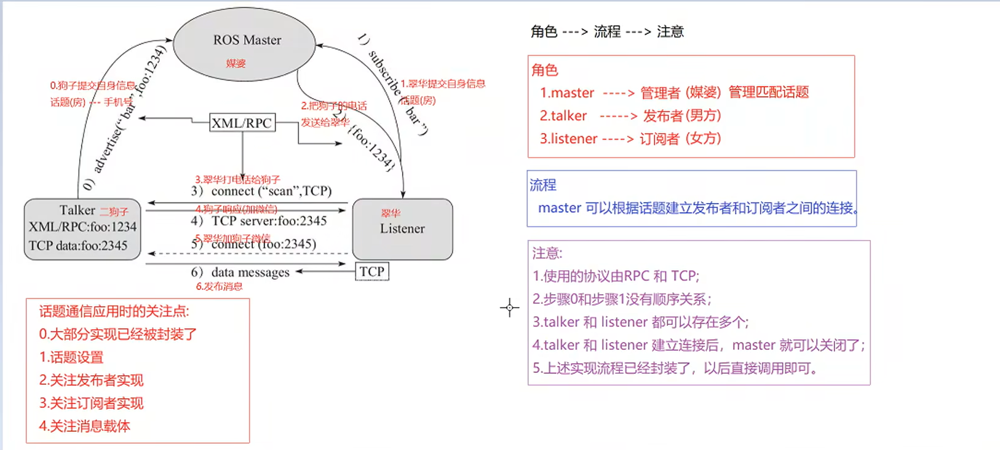
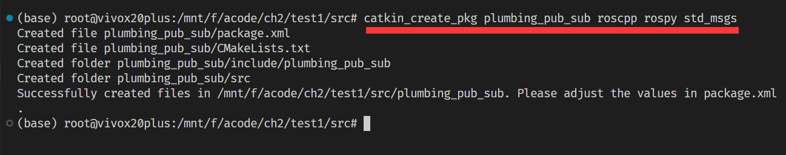
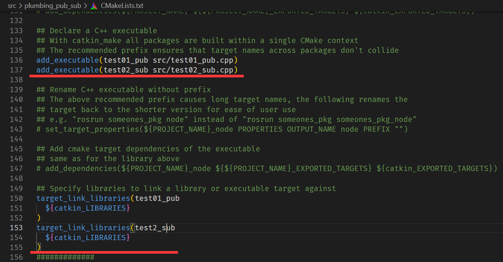
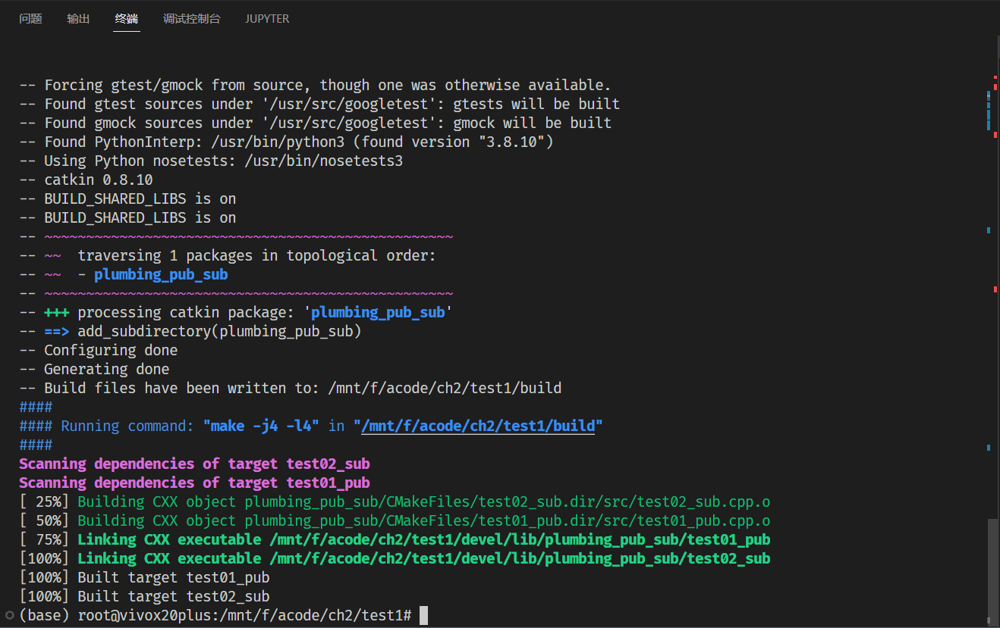
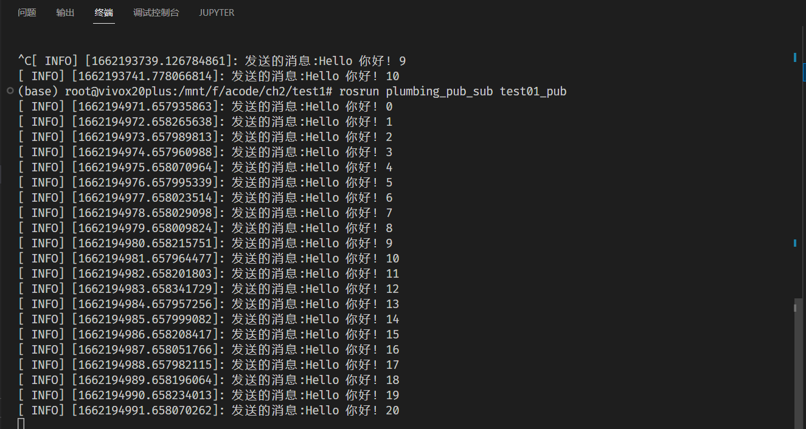
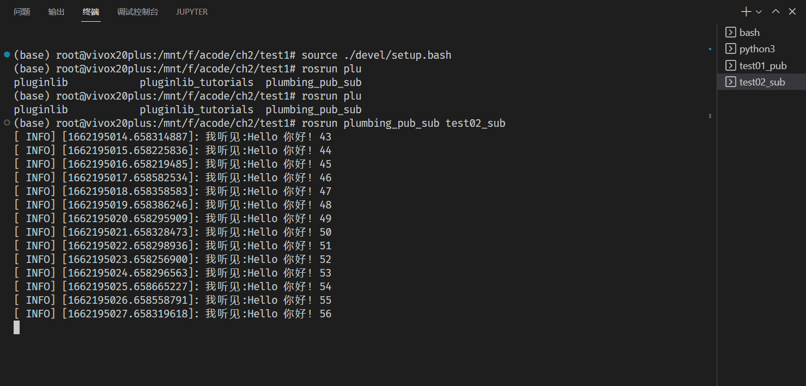

# WEEK9：ROS实验_话题通信

## 9.1 话题通信理论模型

话题通信是ROS中使用频率最高的一种通信模式，话题通信是基于发布订阅模式的，也即:一个节点发布消息，另一个节点订阅该消息。

话题通信实现模型是比较复杂的，该模型如下图所示,该模型中涉及到三个角色:

- ROS Master (管理者)
- Talker (发布者)
- Listener (订阅者)

ROS Master 负责保管 Talker 和 Listener 注册的信息，并匹配话题相同的 Talker 与 Listener，帮助 Talker 与 Listener 建立连接，连接建立后，Talker 可以发布消息，且发布的消息会被 Listener 订阅。



## 9.2 实现步骤

1. **Talker注册：** Talker启动后，会通过RPC在 ROS Master 中注册自身信息，其中包含所发布消息的话题名称。ROS Master 会将节点的注册信息加入到注册表中。
2. **Listener注册：** Listener启动后，也会通过RPC在 ROS Master 中注册自身信息，包含需要订阅消息的话题名。ROS Master 会将节点的注册信息加入到注册表中。
3. **ROS Master实现信息匹配：** ROS Master 会根据注册表中的信息匹配Talker 和 Listener，并通过 RPC 向 Listener 发送 Talker 的 RPC 地址信息。
4. **Listener向Talker发送请求：** Listener 根据接收到的 RPC 地址，通过 RPC 向 Talker 发送连接请求，传输订阅的话题名称、消息类型以及通信协议(TCP/UDP)。
5. **Talker确认请求：** Talker 接收到 Listener 的请求后，也是通过 RPC 向 Listener 确认连接信息，并发送自身的 TCP 地址信息。
6. **Talker向Listener发送消息：** 连接建立后，Talker 开始向 Listener 发布消息。

## 9.3 C++实现话题通信

**需求:**

编写发布订阅实现，要求发布方以1HZ(每秒1次)的频率发布文本消息，订阅方订阅消息并将消息内容打印输出。

**分析:**

在模型实现中，ROS master 不需要实现，而连接的建立也已经被封装了，需要关注的关键点有三个:
1.发布方
2.接收方
3.数据(此处为普通文本)

**流程:**

1. 编写发布方实现；
2. 编写订阅方实现；
3. 编辑配置文件；
4. 编译并执行。

### 9.3.1 新建Workplace和ROS包



### 9.3.2 发布方代码
```c++
#include "ros/ros.h"
#include "std_msgs/String.h" //普通文本类型的消息
#include <sstream>

int main(int argc, char  *argv[])
{   
    //设置编码，防止出现乱码
    setlocale(LC_ALL,"");

    //2.初始化 ROS 节点:命名(唯一)
    // 参数1和参数2 后期为节点传值会使用
    // 参数3 是节点名称，是一个标识符，需要保证运行后，在 ROS 网络拓扑中唯一
    ros::init(argc,argv,"talker");
    //3.实例化 ROS 句柄
    ros::NodeHandle nh;//该类封装了 ROS 中的一些常用功能

    //4.实例化 发布者 对象
    //泛型: 发布的消息类型
    //参数1: 要发布到的话题
    //参数2: 队列中最大保存的消息数，超出此阀值时，先进的先销毁(时间早的先销毁)
    ros::Publisher pub = nh.advertise<std_msgs::String>("chatter",10);

    //5.组织被发布的数据，并编写逻辑发布数据
    //数据(动态组织)
    std_msgs::String msg;
    // msg.data = "你好啊！！！";
    std::string msg_front = "Hello 你好！"; //消息前缀
    int count = 0; //消息计数器

    //逻辑(一秒1次)
    ros::Rate r(1);

    //节点不死
    while (ros::ok())
    {
        //使用 stringstream 拼接字符串与编号
        std::stringstream ss;
        ss << msg_front << count;
        msg.data = ss.str();
        //发布消息
        pub.publish(msg);
        //加入调试，打印发送的消息
        ROS_INFO("发送的消息:%s",msg.data.c_str());

        //根据前面制定的发送贫频率自动休眠 休眠时间 = 1/频率；
        r.sleep();
        count++;//循环结束前，让 count 自增
        //暂无应用
        ros::spinOnce();
        // 处理回调函数
    }


    return 0;
}
```

### 9.3.3 订阅方代码
```c++
#include "ros/ros.h"
#include "std_msgs/String.h"

void doMsg(const std_msgs::String::ConstPtr& msg_p){
    ROS_INFO("我听见:%s",msg_p->data.c_str());
    // ROS_INFO("我听见:%s",(*msg_p).data.c_str());
}
int main(int argc, char  *argv[])
{
    setlocale(LC_ALL,"");
    //2.初始化 ROS 节点:命名(唯一)
    ros::init(argc,argv,"listener");
    //3.实例化 ROS 句柄
    ros::NodeHandle nh;

    //4.实例化 订阅者 对象
    ros::Subscriber sub = nh.subscribe<std_msgs::String>("chatter",10,doMsg);
    //5.处理订阅的消息(回调函数)

    //     6.设置循环调用回调函数
    ros::spin();//循环读取接收的数据，并调用回调函数处理

    return 0;
}
```
### 9.3.4 配置 CMakeLists.txt



### 9.3.5 编译并执行

1. 启动 roscore;

2. 启动发布节点;

3. 启动订阅节点。



编译成功



启动发送方节点



启动订阅方节点，收到信息。