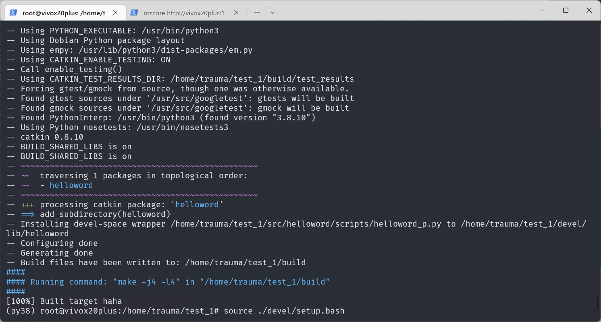

# WEEK9：ROS快速体验

## 9.1 HelloWorld实现简介

ROS中的程序即便使用不同的编程语言，实现流程也大致类似，以当前HelloWorld程序为例，实现流程大致如下：

1. 先创建一个工作空间；
2. 再创建一个功能包；
3. 编辑源文件；
4. 编辑配置文件；
5. 编译并执行。

## 9.2 创建工作空间并初始化

```c
mkdir -p 自定义空间名称/src
cd 自定义空间名称
catkin_make
```

上述命令，首先会创建一个工作空间以及一个 src 子目录，然后再进入工作空间调用 catkin_make命令编译。


## 9.3 进入 src 创建 ros 包并添加依赖

```c
cd src
catkin_create_pkg 自定义ROS包名 roscpp rospy std_msgs
```

上述命令，会在工作空间下生成一个功能包，该功能包依赖于 roscpp、rospy 与 std_msgs，其中roscpp是使用C++实现的库，而rospy则是使用python实现的库，std_msgs是标准消息库，创建ROS功能包时，一般都会依赖这三个库实现。


## 9.4 HelloWorld(C++版)

### 9.4.1 进入 ros 包的 src 目录编辑源文件


保存并退出

### 9.4.2 编辑 ros 包下的 Cmakelist.txt文件

```c
add_executable(可以自定义，例如：haha
  src/上一步的源文件名.cpp
)
target_link_libraries(上一步的源文件名
  ${catkin_LIBRARIES}
)
```


保存并退出

### 9.4.3 进入工作空间目录并编译

```c
cd 自定义空间名称
catkin_make
```


编译完成

### 9.4.4 执行

先启动命令行1：
```c
roscore
```

再启动命令行2：

```c
cd 工作空间
source ./devel/setup.bash
rosrun 包名 C++节点
```


输出成功。

## 9.5 HelloWorld(Python版)

### 9.5.1 进入 ros 包添加 scripts 目录并编辑 python 文件


保存并退出

### 9.5.2 为 python 文件添加可执行权限

```c
chmod +x 自定义文件名.py
```


### 9.5.3 编辑 ros 包下的 CamkeList.txt 文件

```c
catkin_install_python(PROGRAMS scripts/自定义文件名.py
  DESTINATION ${CATKIN_PACKAGE_BIN_DESTINATION}
)
```


### 9.5.4 进入工作空间目录并编译

```c
cd 自定义空间名称
catkin_make
```



编译成功

### 9.5.5 进入工作空间目录并执行

先启动命令行1：
```c
roscore
```

再启动命令行2：

```c
cd 工作空间
source ./devel/setup.bash
rosrun 包名 C++节点
```


输出成功