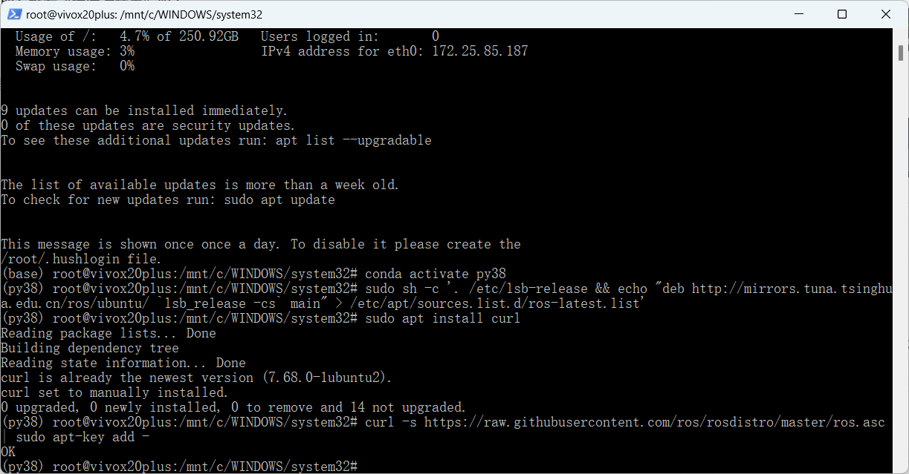
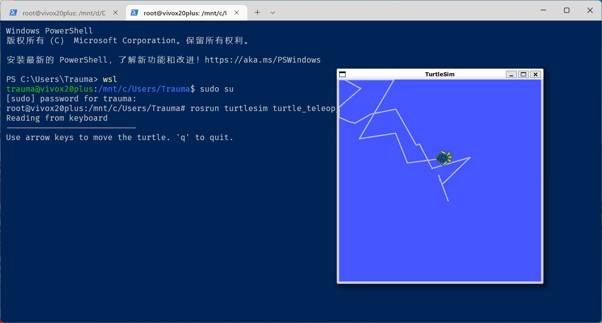
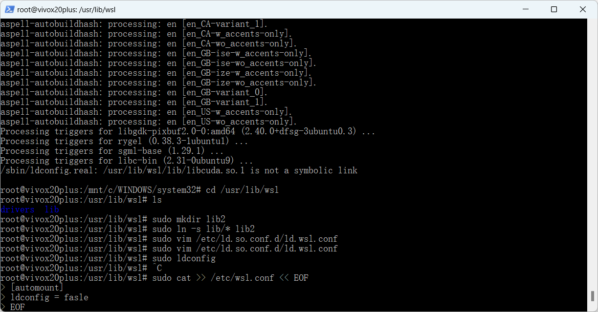

# WEEK9：ROS环境搭建

## 9.1 ROS介绍

机器人操作系统 （ROS） 是编写机器人软件的灵活框架。讲ROS必须先说一下柳树车库公司（Willow Garage），斯科特.哈森在2006年创立。

ROS将现有的、通常难以使用、不兼容的传感器、执行器等硬件整合在一起，通过将其数据流转换成消息总线，使用在硬件驱动器和计算单元之间兼容的数据类型。

它类似于中间件，可以为我们提供各种测试，验证算法，它确实很复杂，也挺值得我们去学习使用。

## 9.2 添加ROS软件源和添加密钥



更新wsl2


## 9.3 安装ROS

下载软件包


解压软件包


解压完成


## 9.4 初始化rosdep

输入以下的命令，其初始化

`sudo rosdep init`


设置环境变量
输入以下两条命令：
```
echo "source /opt/ros/noetic/setup.bash" >> ~/.bashrc
```
```
gedit .bashrc
```

## 9.5 安装rosinstall和验证ROS是否安装成功

输入以下命令进行安装：
```
sudo apt install python3-rosinstall python3-rosinstall-generator python3-wstool
```

**验证ROS**




## 9.6 遇到的问题

### 9.6.1 安装 aptitude 时误删 apt

在第一次搭建环境时，在输入安装命令：`sudo apt install ros-noetic-desktop-full`频频报依赖包出错，在搜索解决办法时，找到一个答案，安装 aptitude 可以解决。但是aptitude和apt不能共存，apt被删掉QAQ。


然后苦苦搜寻了很久安装apt的方法，都没有成功，不得已重新安装了WSL2，之前搭建的conda和pytorch环境都没有了QAQ。

教训：下次在安装其他软件包时，一定得先查一下该软件包的作用QAQ

### 9.6.2 报错：`/sbin/ldconfig.real: /usr/lib/wsl/lib/libcuda.so.1 is not a symbolic link`

在安装完ROS包时，报错：`/sbin/ldconfig.real: /usr/lib/wsl/lib/libcuda.so.1 is not a symbolic link`


**原因:** /usr/lib/wsl/lib/目录下都是文件而不是链接，且该目录只读，需要在其他目录操作 

**解决办法如下：**

```
cd /usr/lib/wsl
sudo mkdir lib2
sudo ln -s lib/* lib2
# 更改wsl配置文件
sudo vim /etc/ld.so.conf.d/ld.wsl.conf
# 将 /usr/lib/wsl/lib 改为 /usr/lib/wsl/lib2
# 测试修改是否生效
sudo ldconfig
# 永久修改
sudo cat >> /etc/wsl.conf << EOF
[automount]
ldconfig = fasle
EOF
```




## 9.7 参考

[详细介绍如何在ubuntu20.04中安装ROS系统，超快完成安装（最新版教程）](https://blog.csdn.net/u014541881/article/details/125050643?app_version=5.6.0&code=app_1562916241&csdn_share_tail=%7B%22type%22%3A%22blog%22%2C%22rType%22%3A%22article%22%2C%22rId%22%3A%22125050643%22%2C%22source%22%3A%22TRAUMA_A%22%7D&uLinkId=usr1mkqgl919blen)


