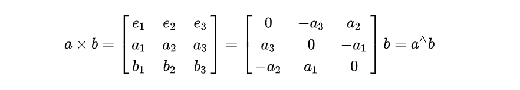
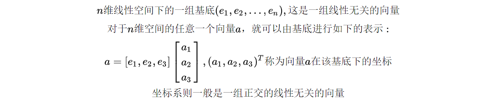
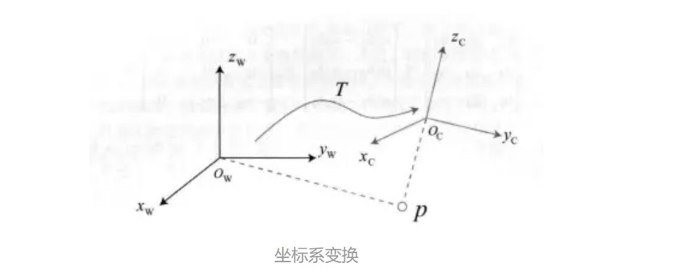
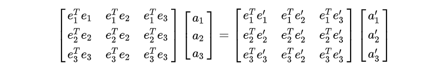
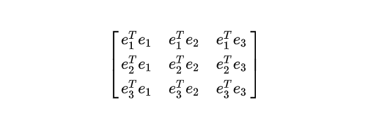
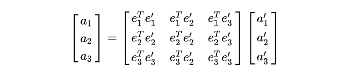
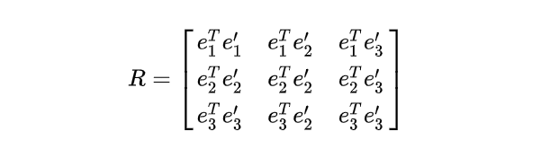
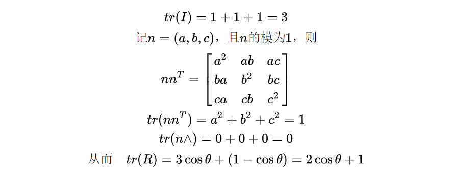
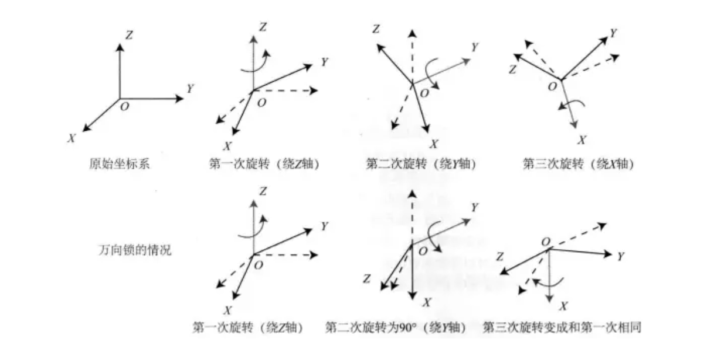

# WEEK9：SLAM学习——三维空间刚体运动

## 9.1 数学基础

**向量内积**

**向量外积**

其中

## 9.2 坐标与坐标系 

**坐标系之间的欧式变换**

设想一下，如若获得了相机当前的位姿（称为相机坐标系），同时以相机的初始位姿作为世界坐标系，如何将相机视野里的某个向量由相机坐标系下的坐标变换到世界坐标下？这就需要进行坐标系间的变换。所谓欧式变换，则是指在刚体运动过程中，向量在各个坐标系内的长度与角度不会发生变化。

简便起见，先讨论旋转而忽略平移。记两组原点在同一位置上的基底，分别为$e$和$e‘$，同一个向量在两组基底下的坐标分别为$a$和$a’$，对于同一个向量，是无关坐标系的，所以有

两边同时左乘一个列向量如下

由矩阵乘法可以得到

对于矩阵

由于e是一组线性无关的基底，而式中相当于在求基中各个线性无关向量的点乘，而线性无关时，一个向量在另一个向量上的投影为0，所以只有主对角线上的三个值为1，其余为0。也就是说，这是一个单位矩阵。

所以原式变为了

其中

称R为**旋转矩阵**，该矩阵必为正交矩阵，即其逆与其转置矩阵是一致的，且行列式为1

把n维旋转矩阵记作一个集合SO(n)，称为特殊正交群

这样就得到了一个**坐标变换方程：**

相反的变换也很容易得到：

## 9.3 三维刚体运动方程

记两个坐标系1，2。

从坐标系1到坐标系2的旋转矩阵为$R_{21}$，从坐标系2到坐标系1的旋转矩阵为$R_{12}$。
从坐标系1原点到坐标系2原点的向量在坐标系1下的坐标为$t_{12}$，从坐标系2原点到坐标系1原点的向量在2坐标系2的坐标为$t_{21}$

向量a在坐标系1下的坐标为a1，在坐标系2下的坐标为a2，则有

其中，$t_{12}$并不一定等于$t_{21}$，它仅在特殊情况下成立（比如两坐标系无旋转或者无平移等），因为这是在不同坐标系下的坐标，对于向量本身是相反的，但是在经过旋转的坐标系下的坐标表示就不满足了。

依靠旋转矩阵R和平移向量t，可以唯一得到一个坐标系变换。

但是，多次进行变换时，会产生类似如下的式子，计算不够闭合,若干次后的形式非常繁杂。

引入齐次形式

记**变换矩阵**

则可以多次左乘变换矩阵T来表示多次的变换，相较于之前的表示法更为方便。

这类变换矩阵也可以称为一个集合，叫做特殊欧式群

求解该矩阵的逆也可以用于表示一个反向的变换

## 9.4 旋转的其他表示法

### 9.4.1 旋转向量

旋转向量采用向量$n$表示旋转轴的方向，$θ$表示绕该旋转轴旋转的角度，那么，称$θn$为旋转向量，这仅仅用了三个量就表示了旋转。

它与旋转矩阵的关系为

该式称为罗德里格斯公式，这一公式给出了旋转向量和旋转矩阵之间的关系

对上式两边求迹（矩阵的迹为对角线元素和），有

简单证明如下 

由上式可得

这个式子说明可以由旋转矩阵R直接得到相对于旋转轴$n$的旋转角$θ$

由于转轴上的向量在旋转后不变，故而

这说明了$n$是R特征值1的特征向量，求解此方程再归一化则可以得到旋转轴向量。

### 9.4.2 欧拉角

使用偏航-俯仰-横滚(yaw-pitch-roll)来描述一个旋转，记一个刚体前方为$X$轴，右侧为$Y$轴，上方为$Z$轴，通过$ZYX$三次旋转来表达总的旋转，用$[r,p,y]$的转置这样一个向量来描述任意旋转。旋转的方式是：先绕$Z$轴旋转，再绕旋转后的$Y$轴旋转，再绕旋转后的$X$轴旋转。

因为它的转轴是固定以ZYX顺序进行旋转的，如果Y旋转了$±90°$，所以，X旋转时实际上在和第一步的$Z$用的是物理实际上的同一个轴，这就丢失了一个自由度，这个问题也被称为万向锁问题。 

### 9.4.3 四元数

旋转没有不具有奇异性的三维向量的描述。旋转矩阵采用九个量表示，冗余较大，旋转向量和四元数又过于紧凑，导致具有奇异性问题。因此引入四元数这一概念进行表示，它使用四个量无奇异性的表示旋转。

**定义**

也可以分为实部和虚部，表达为

**运算性质**

1. 加法与减法：直接对应相加减即可
2. 乘法
   
3. 模长：与复数类似，四元数的模长为其各项的平方和
4. 共轭：虚部取相反数即可，一个四元数与其共轭相乘，其实部为模长的平方，虚部为0
5. 逆：四元数的逆为其共轭除去模长的平方
   

**四元数表示旋转**

记一个三维空间点$p$，经过一个变换$R$变换到点$p'$

现在，由一个四元数$q$来指定旋转规则，现将p的三维坐标代入四元数的虚部，再通过第二式即得

**四元数转换为旋转向量**

$s,v$即为四元数的实部与虚部，反之也可以得到旋转向量到四元数的公式