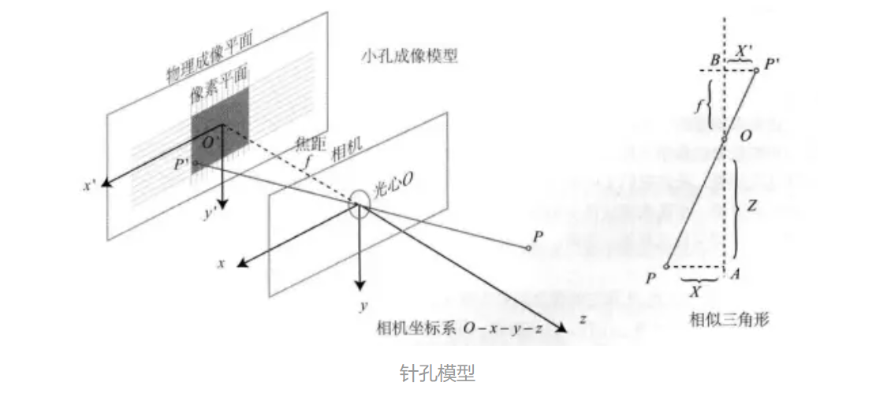
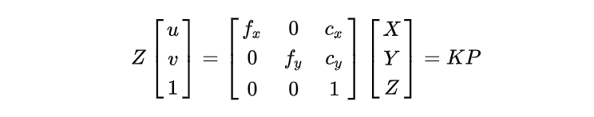
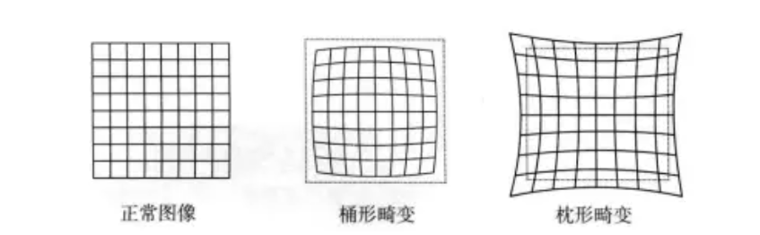
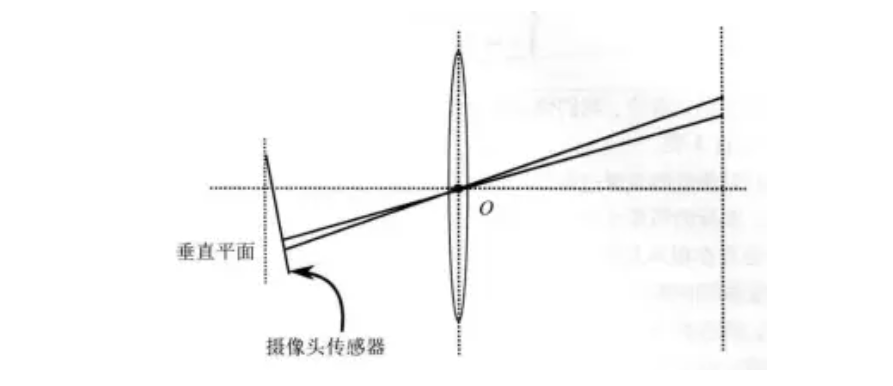
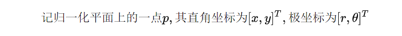
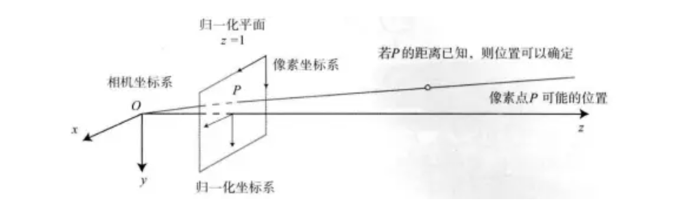
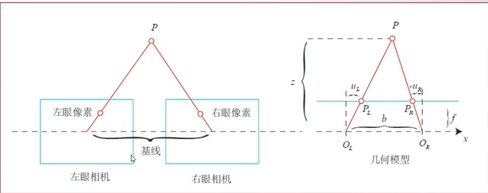
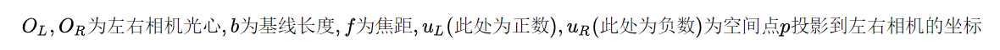
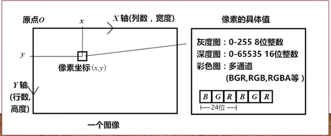

# WEEK9：SLAM学习——相机与图像

## 9.1 相机模型

相机完成了将三维的空间点映射到二维图像平面这样一个过程。关于相机模型，最简单的是针孔模型（这一点与小孔成像的原理是一致的），不过相机内部还有透镜，所以还需要一个畸变模型来描述光线通过透镜发生的变化。大部分普通的相机都可以通过针孔和畸变模型来描述这一过程，并将这一过程中的参数称为相机的内参数。

## 9.2 针孔模型：

可以看到三维空间点 $P$ 通过针孔相机模型投影到成像平面上的点 $p'$。

首先，记$o-x-y-z$坐标系为相机坐标系，o为相机光心（也是针孔模型中的针孔），三维空间中一点P通过光心投影到物理成像平面上，成像点为$P'$，记

并且记光心到物理成像平面的距离为f（焦距），则根据上图的相似三角形关系，有

其中负号表示像是倒立的，但我们使用时相机都是正像，为了符合实际相机，我们可以将物理成像平面虚拟地移到光心前，如下图所示，这样就符合实际相机产出图像的模型。

得到针孔模型

到这里，已经完成了**三维空间一点到物理成像平面一点的转换**，描述它们的单位都是真实尺度下的单位，比如米，毫米等等。但相机输出的是像素坐标，所以**中间还有从物理成像平面一点$P’$到像素平面坐标**的转换过程。

设物理成像平面$o-x'-y'$的同一平面上固定像素平面$o'-u-v$，而像素坐标系的一般定义是原点$o'$放在图像左上角，$u$轴与$x'$轴平行，$v$轴与$y'$轴平行。所以，物理成像平面与像素平面的坐标变换相差一个平移和一个缩放，可以描述为

直接从三维空间一点到像素平面则是

写为矩阵形式：

相机内参数矩阵：

## 9.3 畸变模型

为了更广的视场，相机前通常都会安装透镜。透镜自身的形状及其与成像平面的不完全平行都会带来光线在投影过程中的变化。

由透镜形状引起的变化称为**径向畸变**，体现出来的效果是直线不再是直的，而变成了曲线，且越靠近像素平面边缘越明显。畸变主要分为两大类：**桶形畸变**和**枕形畸变**

由透镜与成像平面不完全平行带来的变化称为切向畸变

为两类畸变进行数学建模

经过径向畸变后，有

经过切向畸变后，有

综合起来，得到畸变模型

其中$k，p$为畸变系数。选取畸变模型的时候，不一定要将上面所有的畸变系数都选择，可以灵活选择其中一部分。

## 9.4 双目相机模型

单目相机仅凭像素坐标无法获取空间点的真实深度，因为光心到归一化平面点的连线及其延长线上所有的点都会投影到同一个像素上。

双目相机获取深度的原理

根据相似关系，可以简单地得到

称$d$为左右相机的视差，在这里也是左右相机对同一点成像后横坐标之差

这也反映了双目相机的两个问题：可测深度有理论最大值，因为视差最小为一个像素。计算量大，如果要估计每个像素，首先要进行匹配，还要对每一对匹配点进行计算，做到实时性比较困难。 

## 9.5 RGB-D相机模型

RGB-D相机可以按原理分为两大类：红外结构光和ToF。两种类型都是通过向外发射光束，再根据返回的光束与发射光束对比，并经过一定的算法处理，从而得到距离信息。

## 9.6 图像

- 相机成像后，生成了图像。
- 图像在计算机中以矩阵形式存储（二维数组）
- 需要对感光度量化成为数值，例如0~255之间的整数（彩色图像还有通道）

