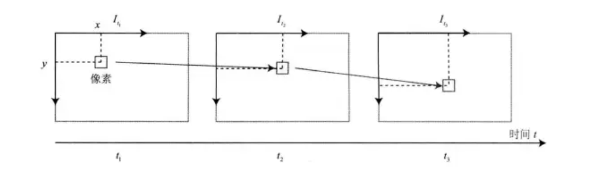
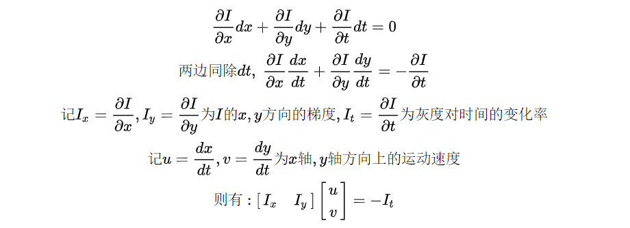
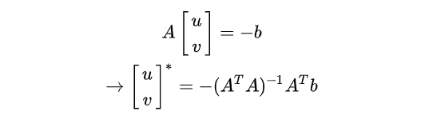
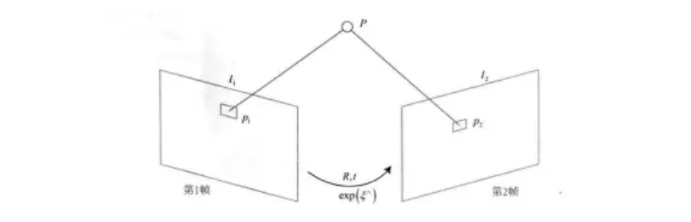
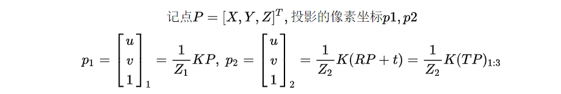
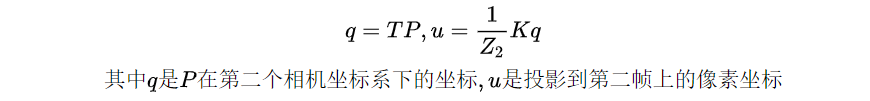
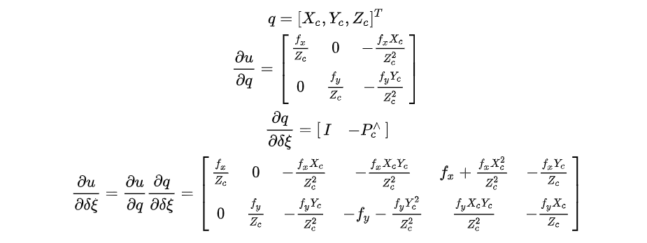

# WEEK9：SLAM学习——视觉里程计

## 9.1 光流法和直接法

### 9.1.1 光流法

光流是一种描述像素随时间在图像之间运动的方法。计算部分像素运动的称为稀疏光流，计算全部像素运动的称为稠密光流。

用于SLAM的主要就是稀疏光流，其中最经典的是**LK(Lucas-Kanade)** 光流。

LK光流认为相机的图像会随时间变化，图像可以看作时间的函数，其中$I$表示灰度，$(x,y)$表示像素坐标，$t$表示时间。函数为：$I(x,y,t)$

现在考虑一个固定的空间点，在t时刻时图像投影在$(x,y)$，显而易见，随着相机的运动，投影位置会发生变化，现在希望估计出这个空间点在下一时刻的投影在何处。这里需要先提出光流法的基本假设：

**①灰度不变假设：** 同一空间点的像素灰度值，在各个图像中是固定不变的。即

对上式左侧进行泰勒展开并保留一阶项

基于之前的灰度不变假设，有

现在，计算的目标正是像素的运动速度u,v。但是目前仅有一个方程，无法完成这个两变量方程的求解。这就要引入第二个假设。

**②相同运动假设：** 同一窗口的所有像素具有相同的运动。即选定一个窗口，其内的所有像素运动是一致的。

据此，可以构建下面的方程组。

记

则有

### 9.1.2 直接法
考虑空间点$P$和两个时刻的相机及其投影

目标是求解第一帧到第二帧的位姿变换，以第一帧为参考系，求出第二帧的$R，t$。数学建模如下

采用直接法，无法知道第二帧的哪个像素对应到第一帧的这个投影点，理应寻找一个合适的位姿变换，使得第一帧的投影点经过这样的欧式变换后，对应的第二帧上的点与第一帧的投影点的灰度误差最小。定义下面这个误差项为光度误差。

对于多个点，可以构建最小二乘问题

优化的目标是得到使光度误差最小的位姿T。根据惯例，需要求解误差项关于位姿的一阶导数。

首先，先定义两个中间变量，以便采用链式法则来简化求导的过程。

仍然采用李代数的左扰动模型，先列出待求导的关系式

则有

结果如下

第一项则是光流法中提到的对于位置u的灰度像素梯度。综上所述，雅可比矩阵为

这里提到的空间点P是深度已知的，可以把它当做是RGB-D或是双目相机获得的数据。对于P的选取，有三种方式：

①P选取自稀疏关键点，通过关键点提取完成，速度非常快。
②P选取自具有像素梯度的像素，可以完成半稠密重建。
③P来自所有像素，消耗资源大，可以完成稠密重建，但一般不用在SLAM中，在三维重建中也许更为合适。

